# Лекция 11 — Disaster Recovery и отказоустойчивость

> 👥 **Лекция второго преподавателя.** Ниже — авторский текст лекции, он приведён без изменений.
>
> Внутри текста автор пользуется своей сквозной нумерацией — это его лекция №5. Соответствие номеров и общий план — в [README курса](../README.md). Правила сдачи и оформления отчётов в двух половинах курса различаются: см. [«Регламент курса»](../COURSE-RULES.md).

**Лабораторная:** [Лаба 11 — Разработка стратегии Disaster Recovery и обеспечение отказоустойчивости](lab.md)

---

## Вступление (5 минут)

Здравствуйте, коллеги. Это пятая лекция курса «Организация и управление облачной инфраструктурой». Сегодня мы говорим о том, что происходит, когда всё идёт не так, — об отказоустойчивости и планах аварийного восстановления, или Disaster Recovery (DR).

До этого мы строили сеть, настраивали балансировщики, распределяли затраты. Всё это прекрасно работает… пока работает. Но облако — это не волшебство. Сервера перегреваются, дата-центры теряют связь, люди удаляют не те таблицы, на код прилетают атаки. И вопрос не в том, случится ли сбой, а в том, когда он случится и насколько сильно вас «простит» бизнес.

Сегодня мы разберём, как заранее подготовиться к катастрофе и пережить её с минимальными потерями.

**За 90 минут мы пройдём пять блоков:**

- **Модели восстановления** — Backup & Restore, Pilot Light, Warm Standby, Active-Active.
- **RPO и RTO** — проектирование целей восстановления, о которых все говорят, но мало кто понимает.
- **Multi-AZ и Multi-Region** — как построить архитектуру, которая переживает падение целой зоны и даже региона.
- **Стратегии и автоматизация** — runbooks, тестирование, переключение (failover/failback).
- **Chaos Engineering** — принципы и инструменты: Chaos Monkey, Litmus.

Такая логическая карта лекции:

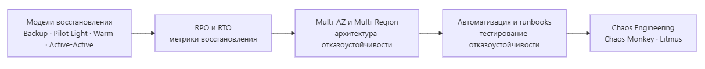

Исходник диаграммы (Mermaid)

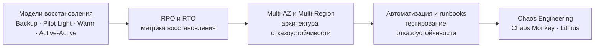
```mermaid
flowchart LR
A[Модели восстановления<br/>Backup · Pilot Light · Warm · Active-Active] --> B[RPO и RTO<br/>метрики восстановления]
B --> C[Multi-AZ и Multi-Region<br/>архитектура отказоустойчивости]
C --> D[Автоматизация и runbooks<br/>тестирование отказоустойчивости]
D --> E[Chaos Engineering<br/>Chaos Monkey · Litmus]
```

Начнём с главного вопроса: что вообще означает «система отказоустойчива»?

## Часть 1. Модели восстановления (25 минут)

### Что такое отказоустойчивость — и что такое катастрофа

Прежде чем говорить о моделях, давайте разделим два понятия, которые часто путают.

**Отказоустойчивость** — это способность системы продолжать работать при отказе отдельного компонента: упал сервер, отвалился диск, порвался канал. Мы маскируем сбой продублированными компонентами, и пользователь ничего не замечает.

**Disaster Recovery** — это план и заранее отработанный процесс восстановления после катастрофы: падение целой зоны доступности, отключение региона, серьёзная атака, человеческая ошибка, уничтожившая данные. Здесь одной репликой уже не обойтись — нужен продуманный план.

**Вопрос аудитории:** как думаете, сколько времени ваша компания может прожить без бэкенда, пока клиенты не уйдут к конкурентам? (пауза) Вот это время и есть ваш целевой бюджет.

Ключевая идея DR — это **не технология, а процесс**. Это заранее написанные сценарии, проверенные на практике, а не «надежда, что прокатит».

### Четыре модели: от самой дешёвой к самой надёжной

Индустрия выделяет четыре классические модели DR. Они отличаются тем, **сколько времени занимает восстановление (RTO)** и **сколько данных вы готовы потерять (RPO)**. По ходу рассказа запоминайте: сперва идёт самая дешёвая и медленная модель, и каждая следующая стоит дороже, но быстрее восстанавливает.

**Модель 1: Backup & Restore (резервная копия).**

Самая простая и дешёвая. Мы периодически снимаем резервные копии данных и складываем их в надёжное хранилище (S3, Glacier, Яндекс.Объектное хранилище). При катастрофе мы берём бэкап, разворачиваем окружение с нуля и восстанавливаем данные.

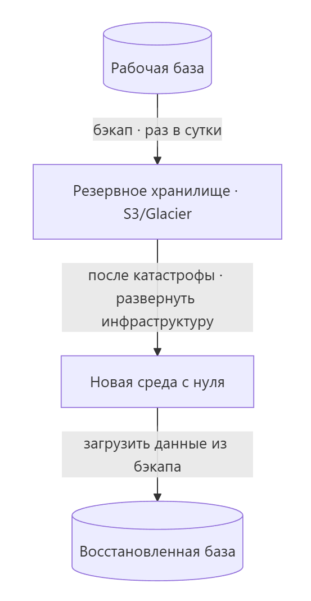

Исходник диаграммы (Mermaid)

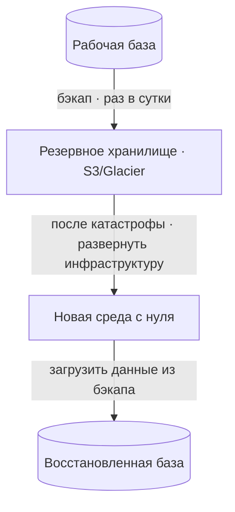
```mermaid
flowchart TB
DB[(Рабочая база)] -->|"бэкап · раз в сутки"| S3[Резервное хранилище · S3/Glacier]
S3 -->|"после катастрофы · развернуть инфраструктуру"| NEW[Новая среда с нуля]
NEW -->|"загрузить данные из бэкапа"| REST[(Восстановленная база)]
```

Плюсы: самая дешёвая, быстро проектируется, не требует постоянно работающих резервных мощностей.

Минусы: **самое долгое восстановление** — часы или даже сутки, потому что всё надо разворачивать с нуля. И самая большая потеря данных — всё, что изменилось с последнего бэкапа, потеряно.

Когда годится: некритичные системы, аналитические хранилища, сервисы, где допустим простой в несколько часов.

**Контрольная точка.** Запомните: Backup & Restore отвечает вашим SLA, только если вывод из строя на несколько часов и потеря данных за сутки — приемлемы для бизнеса.

**Модель 2: Pilot Light (пилотный огонёк).**

Идея заимствована из авиации: в газовой турбине всегда горит маленький пилотный огонёк, чтобы в любой момент можно было мгновенно разжечь большую турбину.

Мы держим в резервном регионе **минимальное постоянно работающее ядро**: самая маленькая копия базы данных, реплики, базовая инфраструктура сети. При катастрофе это ядро «раздувается» до полного масштаба.

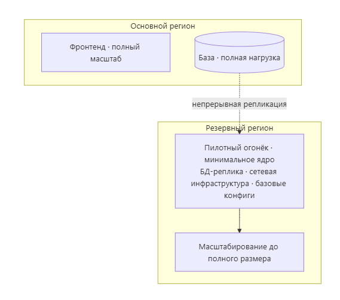

Исходник диаграммы (Mermaid)

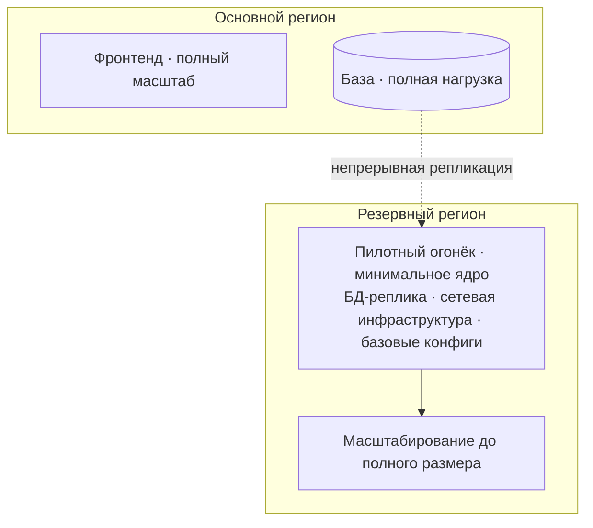
```mermaid
flowchart TB
subgraph Main [Основной регион]
WEB1[Фронтенд · полный масштаб]
DB1[(База · полная нагрузка)]
end
subgraph DR [Резервный регион]
CORE[Пилотный огонёк · минимальное ядро<br/>БД-реплика · сетевая инфраструктура · базовые конфиги]
CORE --> SCALE[Масштабирование до полного размера]
end
DB1 -.->|"непрерывная репликация"| CORE
```

Плюсы: заметно дешевле полного резерва — вы платите только за маленькое ядро, а не за полный дата-центр. Восстановление быстрее, чем с нуля, — минуты или час.

Минусы: всё же требуется ручной запуск масштабирования. Фронтенд не работает постоянно в резерве, поэтому до полного переключения пройдёт время.

Когда годится: метод умного баланса — компании, которым нужна «золотая середина» между ценой и скоростью.

**Модель 3: Warm Standby (тёплый резерв).**

Уже ближе к полноценному резервированию. В резервном регионе постоянно развёрнута **уменьшенная, но полностью работающая копия всей системы**: и база, и бэкенд, и фронтенд. Она принимает трафик, но в сниженном масштабе.

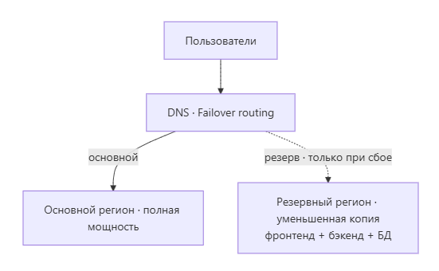

Исходник диаграммы (Mermaid)

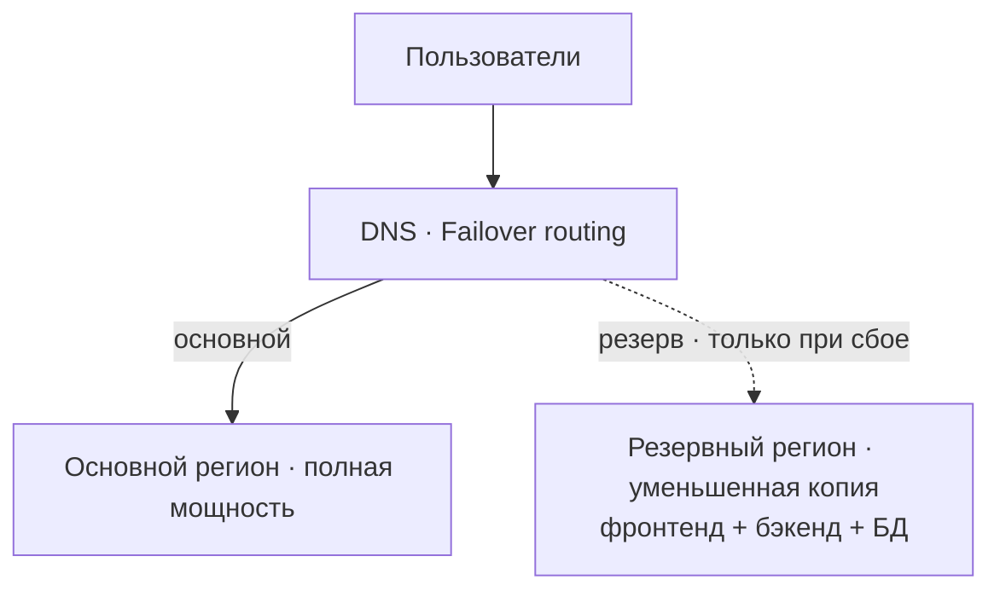
```mermaid
flowchart TB
User[Пользователи] --> DNS[DNS · Failover routing]
DNS -->|"основной"| MainReg[Основной регион · полная мощность]
DNS -.->|"резерв · только при сбое"| StandbyReg[Резервный регион · уменьшенная копия<br/>фронтенд + бэкенд + БД]
```

Плюсы: восстановление за минуты — нужно лишь переключить DNS и увеличить масштаб. Потеря данных минимальна, потому что база постоянно реплицируется.

Минусы: дороже, чем Pilot Light, — вы платите за реально работающие (хоть и уменьшенные) мощности.

Когда годится: критичные системы с жёсткими RTO — банки, платёжные шлюзы, высоконагруженные сервисы электронной коммерции.

**Модель 4: Active-Active (активно-активная).**

Вершина отказоустойчивости. **Трафик распределяется между несколькими регионами одновременно с самого начала** — никакого «основного» и «резервного» нет. Все регионы работают, обслуживают пользователей, и если один падает, остальные мгновенно принимают его нагрузку.

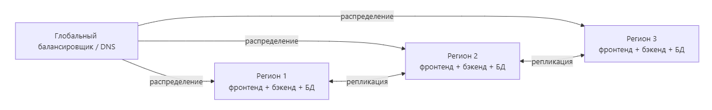

Исходник диаграммы (Mermaid)

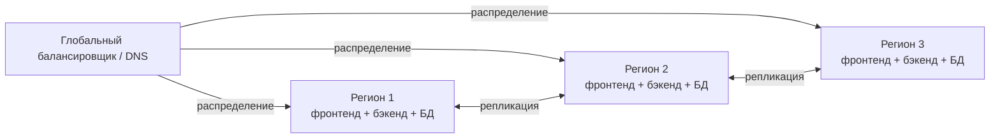
```mermaid
flowchart LR
Global[Глобальный балансировщик / DNS]
Global -->|"распределение"| R1[Регион 1<br/>фронтенд + бэкенд + БД]
Global -->|"распределение"| R2[Регион 2<br/>фронтенд + бэкенд + БД]
Global -->|"распределение"| R3[Регион 3<br/>фронтенд + бэкенд + БД]
R1 <-->|"репликация"| R2
R2 <-->|"репликация"| R3
```

Плюсы: мгновенное переключение — **секунды**, практически нулевой простой. Потеря данных минимальна (обычно минуты на задержку репликации). Плюс вы эффективно используете мощности — все регионы полезны.

Минусы: это самая сложная и дорогая архитектура. Нужна глобальная синхронизация данных, обработка конфликтов записи, согласованные сессии между регионами. Об этом мы подробнее поговорим в части про Multi-Region.

Когда годится: глобальные сервисы (соцсети, стриминг, крупные маркетплейсы), где секунда простоя — огромные потери.

### Сравнительная таблица моделей

| **Модель** | **Время восстановления (RTO)** | **Потеря данных (RPO)** | **Стоимость** | **Сложность** |
| --- | --- | --- | --- | --- |
| Backup & Restore | часы–сутки | до суток | низкая | низкая |
| Pilot Light | минуты–часы | минуты–часы | средняя | средняя |
| Warm Standby | минуты | минуты | высокая | высокая |
| Active-Active | секунды | почти ноль | очень высокая | очень высокая |

**Итог по части 1:** эти четыре модели — это, по сути, ось «цена ↔ скорость восстановления». Чем быстрее вы хотите восстановиться и чем меньше данных готовы потерять, тем дороже и сложнее модель. Выбор всегда компромисс, и он определяется метриками, о которых пойдёт речь дальше.

## Часть 2. RPO и RTO — проектирование целей (15 минут)

Теперь самый практичный блок. RPO и RTO — две метрики, на которых строится весь план восстановления. Без них ваша архитектура — просто «потраченные деньги».

### RPO — Recovery Point Objective

**RPO** — это **максимально допустимый объём потерянных данных**, который бизнес согласен пережить. Или, иначе: «на сколько назад во времени вы готовы откатить данные».

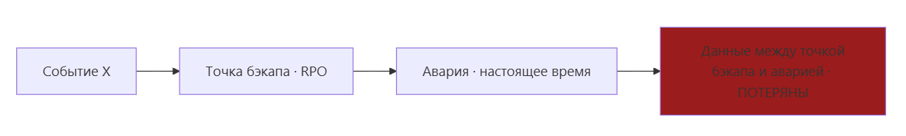

Исходник диаграммы (Mermaid)

```mermaid
flowchart LR
T1[Событие X] --> T2[Точка бэкапа · RPO]
T2 --> T3[Авария · настоящее время]
T3 --> T4[Данные между точкой<br/>бэкапа и аварией · ПОТЕРЯНЫ]
style T4 fill:#9b1c1c
```

Пример: если RPO = 1 час, значит, при катастрофе вы потеряете максимум изменения за последний час. Если RPO = 24 часа (суточный бэкап) — потеряете сутки работы.

**Интуитивная подсказка:** RPO отвечает на вопрос «**какую часть данных вы потеряете?**». Чем строже RPO, тем чаще надо делать бэкапы или репликацию.

### RTO — Recovery Time Objective

**RTO** — это **максимально допустимое время простоя** системы, которое бизнес готов терпеть. «За сколько времени мы должны вернуть сервис в строй».

Исходник диаграммы (Mermaid)

```mermaid
flowchart LR
A1[Начало аварии] --> A2[Простой · RTO] --> A3[Сервис восстановлен]
style A2 fill:#1c3a9b
Пример: если RTO = 15 минут, значит, после аварии система обязана начать работать не позже чем через 15 минут. Если RTO = 4 часа — можно спокойно восстанавливаться полдня.
**Интуитивная подсказка:** RTO отвечает на вопрос «**как долго вы будете лежать**». RTO напрямую ограничивает, какую модель DR вы можете использовать — если RTO = 1 минута, то Backup & Restore отпадает сразу.
```

### Как проектировать цели

Проектирование RPO и RTO — это **всегда разговор с бизнесом**, а не только с архитекторами. Вот шаги:

- **Классифицируйте системы по критичности.** CRM одна, аналитический склад — другой. Не ко всем нужен одинаковый подход.
- **Спросите бизнес про допустимые потери и простой.** Не навязывайте «идеальные» нули — они стоят миллионы. Найдите реальный порог терпимости.
- **Выберите модель DR под требования** (см. таблицу выше).
- **Измеряйте фактическое RPO/RTO** — на практике, через регулярные тесты, а не «на бумаге».
- **Регулярно пересматривайте** — цели бизнеса меняются, а вместе с ними должны меняться и планы.

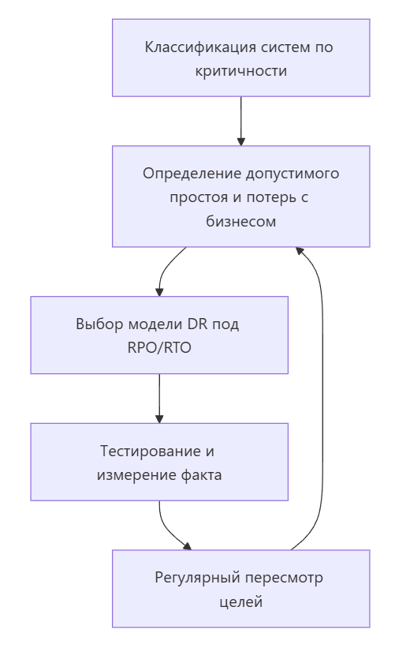

Исходник диаграммы (Mermaid)

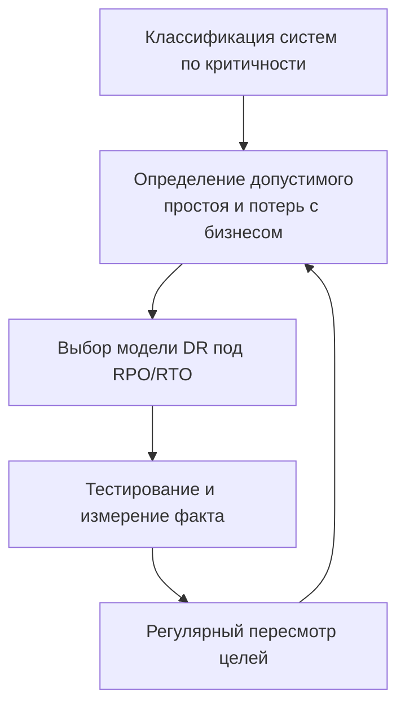
```mermaid
flowchart TB
KB[Классификация систем по критичности] --> TOL[Определение допустимого<br/>простоя и потерь с бизнесом]
TOL --> MODEL[Выбор модели DR под RPO/RTO]
MODEL --> TEST[Тестирование и измерение факта]
TEST --> REV[Регулярный пересмотр целей]
REV --> TOL
```

**Вопрос аудитории:** у нас в примере — интернет-магазин. Какой RPO и RTO вы бы задали для каталога с заказами? (пауза) Правильно: каталог можно восстановить быстро, а вот заказы и транзакции — это критично, здесь RPO должен быть минимальным (минуты), а RTO — тоже минуты, иначе магазин встанет в пик продаж.

### Важный нюанс: RPO и RTO — это контракт, а не пожелание

Запомните главное: RPO и RTO — это **обязательства**, зафиксированные в SLA. Если вы написали RTO = 15 минут, то обязаны доказать, что реально восстанавливаетесь за 15 минут, — регулярными учениями. На бумаге «красиво» — на практике сложно. Тестирование восстановления — обязательная часть дисциплины DR, и к нему мы вернёмся.

**Итог по части 2:** RPO отвечает «сколько потеряете», RTO — «сколько будете лежать». Обе метрики задаёт бизнес, и они определяют, какую модель DR и какое резервирование вам строить. Не пропустите этот шаг — он же определяет бюджет.

## Часть 3. Multi-AZ и Multi-Region архитектуры (20 минут)

Теперь переходим к конкретике архитектуры. Мы уже касались зон доступности в первой лекции. Сейчас — как зоны и регионы используются именно для отказоустойчивости.

### Уровни резервирования

В облаке есть несколько уровней, на каждом из которых мы можем закладывать отказоустойчивость:

**Уровень 1: внутри зоны (компонентный).** Дублируем отдельные сервисы: два инстанса приложения, балансировщик, реплика БД. Это маскирует отказ одиночных компонентов.

**Уровень 2: Multi-AZ.** Раскидываем компоненты по нескольким зонам доступности в одном регионе. Зоны — физически изолированные дата-центры, между ними быстрая связь. Это защита от падения целой зоны.

**Уровень 3: Multi-Region.** Дублируем систему в другом регионе (например, Москва + Санкт-Петербург / Стамбул, или Frankfurt + Ireland). Это защита от падения целого региона и покрытие географических требований.

### Multi-AZ: надёжность внутри региона

Multi-AZ — это **базовый уровень отказоустойчивости**, который обязан быть у любого production-решения. Суть: размещаем компоненты минимум в трёх зонах доступности.

**Как это выглядит для типичного трёхзвенного приложения:**

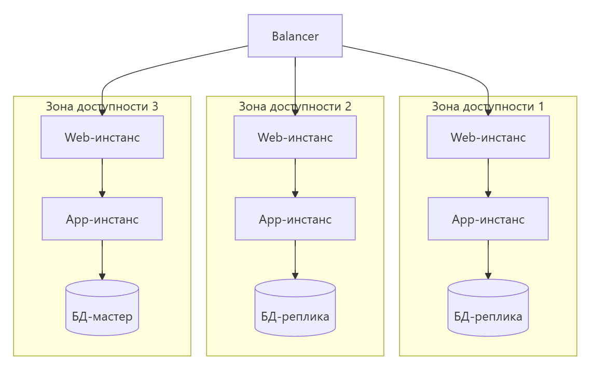

Исходник диаграммы (Mermaid)

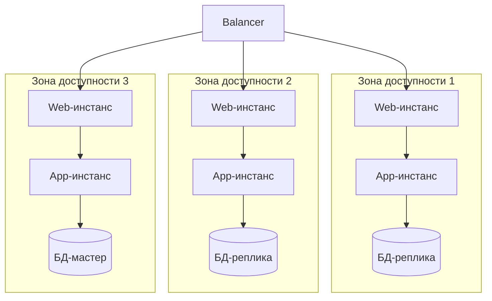
```mermaid
flowchart TB
subgraph AZ1 [Зона доступности 1]
W1[Web-инстанс] --> A1[App-инстанс]
A1 --> D1[(БД-реплика)]
end
subgraph AZ2 [Зона доступности 2]
W2[Web-инстанс] --> A2[App-инстанс]
A2 --> D2[(БД-реплика)]
end
subgraph AZ3 [Зона доступности 3]
W3[Web-инстанс] --> A3[App-инстанс]
A3 --> D3[(БД-мастер)]
end
ALB[Balancer] --> W1
ALB --> W2
ALB --> W3
```

Ключевые компоненты Multi-AZ:

- **Автомасштабирование групп** — в каждой зоне есть группы экземпляров, балансировщик распределяет между ними трафик.
- **Управляемая БД** (RDS Aurora, PostgreSQL Managed) — держит реплики в каждой зоне и умеет автоматически переключать мастер.
- **NAT Gateway в каждой зоне** — без этого в приватных подсетях при падении зоны встанет весь исходящий трафик (мы говорили об этом в лекции 1).
- **Распределение по азиду** — балансировщик выравнивает нагрузку между зонами, чтобы не перегрузить одну.

Важно! Многие считают, что «я в облаке, значит, автоматически отказоустойчив». Нет.

Если вы поставили одну ВМ без группы масштабирования — зона упала, сервис встал.

Отказоустойчивость — это вы, архитектор, её создали. Облако просто даёт инструменты.

### Multi-Region: выживание при падении региона

Multi-AZ защищает от падения зоны, но не от катастрофы, которая выводит из строя **целый регион** (природные бедствия, масштабные сбои). Для этого нужен второй регион — Multi-Region.

Здесь и работают модели DR, о которых мы говорили в части 1: Pilot Light, Warm Standby, Active-Active — всё это про второй регион.

**Главные вызовы Multi-Region:**

- **Репликация данных между регионами.** База должна передаваться в резервный регион. Обычно через асинхронную репликацию — но это значит, что при катастрофе есть небольшая задержка (и, возможно, небольшой RPO).
- **Доступ к данным без идемпотентности.** Если два региона пишут в одну базу — конфликты. Нужны стратегии: активная запись только в одном регионе, либо распределённые БД (Aurora Global Database, CockroachDB).
- **Управление DNS.** Нужен failover — автоматическое переключение пользователей на резервный регион при падении основного.

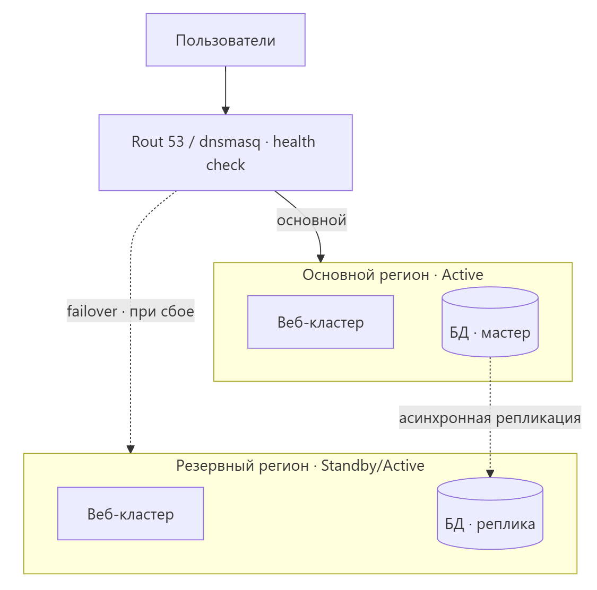

Исходник диаграммы (Mermaid)

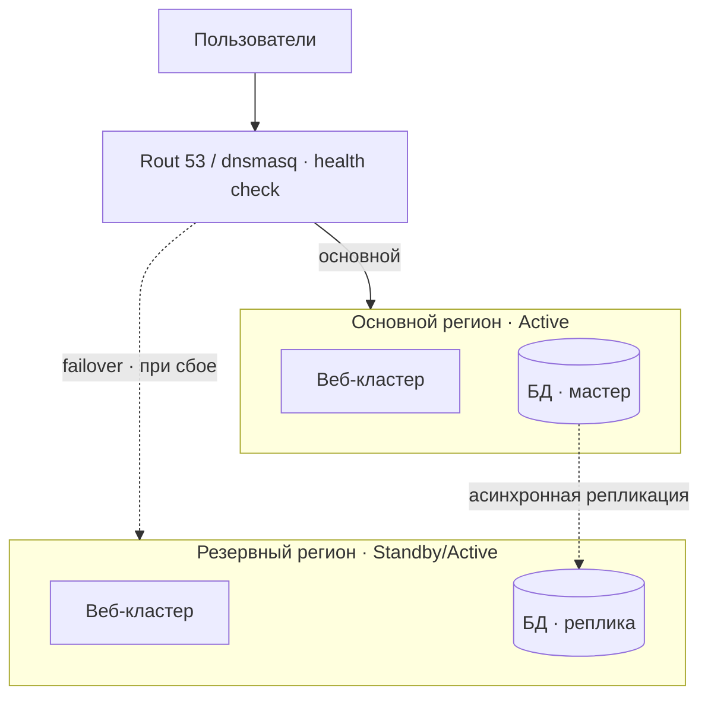
```mermaid
flowchart TB
subgraph R1 [Основной регион · Active]
W1[Веб-кластер]
DB1[(БД · мастер)]
end
subgraph R2 [Резервный регион · Standby/Active]
W2[Веб-кластер]
DB2[(БД · реплика)]
end
USERS[Пользователи] --> DNS
DNS[Rout 53 / dnsmasq · health check] -->|"основной"| R1
DNS -.->|"failover · при сбое"| R2
DB1 -.->|"асинхронная репликация"| DB2
```

### Как выбрать: AZ vs Region

Практическое правило для выбора уровня резервирования:

- Если RTO в минутах и система критичная — **Multi-AZ обязателен**.
- Если нужна защита от потери целого региона, или требования «данные в двух независимых дата-центрах» — добавляем **Multi-Region** (как правило, Warm Standby или Active-Active).
- Если RPO/RTO строгие и бюджет позволяет — **Active-Active** на нескольких регионах.

**Вопрос аудитории:** заказчик — региональный интернет-магазин, работает в одном регионе РФ. Регион какой выбрать — один регион с трёх-AZ или два региона? (пауза) Правильно: достаточно одного региона с трёх зон — это дёшево и надёжно. Второй регион имеет смысл, только если бизнес работает глобально или есть законодательные требования.

### Итог по части 3

Multi-AZ — ваш базовый уровень отказоустойчивости, без которого не бывает production. Multi-Region — следующий уровень, который защищает от катастрофы целого региона, но стоит дороже и требует решения вопросов репликации, конфликтов и DNS-переключения. Выбор всегда определяется всё теми же RPO и RTO.

## Часть 4. Стратегии и автоматизация отказоустойчивости (10 минут)

Окей, мы спроектировали архитектуру, выбрали модель DR. Но плана на бумаге недостаточно. Теперь — как сделать, чтобы восстановление реально работало и не превращалось в хаос в момент аварии.

### Runbooks — инструкции на случай аварии

**Runbook** — это пошаговая инструкция, что делать в каждой типовой аварийной ситуации. Пока у вас нет runbook'а — ваш «план восстановления» — это паника и импровизация.

Что должно быть в runbook:

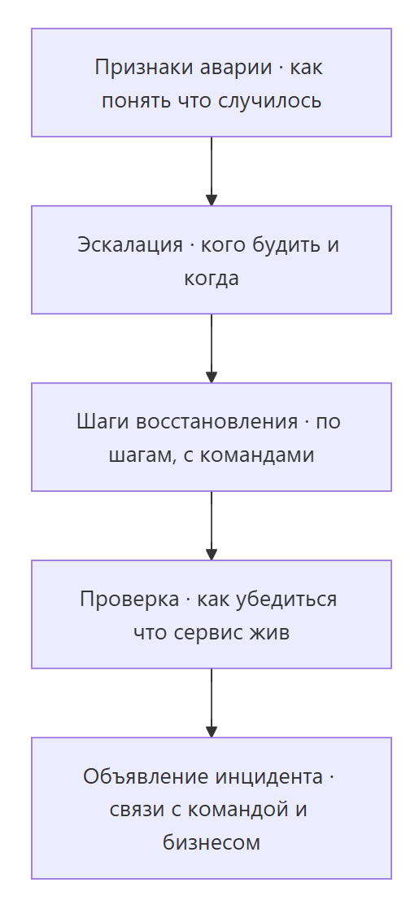

Исходник диаграммы (Mermaid)

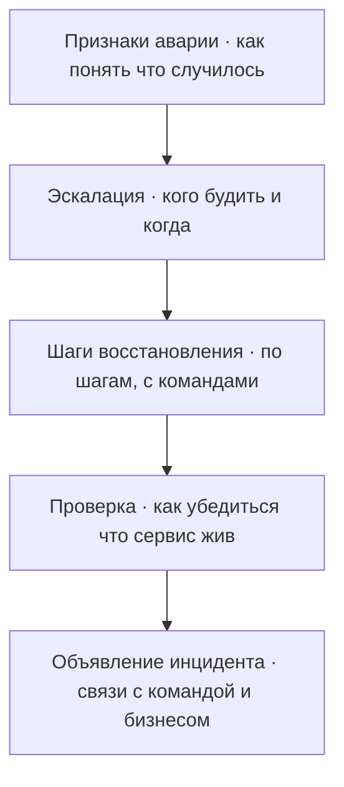
```mermaid
flowchart TB
S1[Признаки аварии · как понять что случилось] --> S2[Эскалация · кого будить и когда]
S2 --> S3[Шаги восстановления · по шагам, с командами]
S3 --> S4[Проверка · как убедиться что сервис жив]
S4 --> S5[Объявление инцидента · связи с командой и бизнесом]
```

- **Признаки аварии** — что сигнализирует о проблеме (алерты, метрики, жалобы пользователей).
- **Эскалация** — кого будить, в каком порядке, через какое время после срабатывания алерта.
- **Шаги восстановления** — точные действия с командами, чтобы любой дежурный мог их выполнить без раздумий.
- **Проверка восстановления** — как убедиться, что сервис действительно работает и данные на месте.
- **Объявление** — как и кому сообщить о статусе (запрос статуса, канал для людей).

### Автоматизация DR

Ручной runbook — уже хорошо, но автоматизация — лучше. Чем больше шагов автоматизировано, тем меньше шанс человеческой ошибки и тем быстрее восстановление. Типовые инструменты автоматизации:

- **Infrastructure as Code** (Terraform, CloudFormation, Pulumi) — вся инфраструктура описана кодом, её можно быстро пересоздать в другом регионе одной командой.
- **Automated failover** — управляемые базы (Aurora, RDS Multi-AZ) сами переключают мастер; DNS с health checks сам перенаправляет трафик.
- **Балансировщики с health checks** — сами выводят мёртвые инстансы из ротации.
- **Резервная база/объектное хранилище с репликацией** — данные дублируются автоматически.

**Простой пример кода Terraform** (показать на экране, не углубляясь):

resource "aws_autoscaling_group" "web" {

min_size         = 2

max_size         = 10

desired_capacity = 3

availability_zones = ["eu-central-1a", "eu-central-1b", "eu-central-1c"]

...

}

Этот блок — за одно описание создаёт группу автомасштабирования сразу в трёх зонах. Код = воспроизводимость = быстрое восстановление.

### Failover и Failback

**Failover** — переключение на резервный регион при аварии. **Failback** — возвращение в основной регион после того, как авария устранена.

Важная ловушка: люди делают failover, а про failback забывают. После того как основной регион снова в строю, нужно аккуратно вернуть нагрузку обратно — и это часто более сложная операция, чем сам переезд. План failback должен быть прописан с той же тщательностью.

### Регулярное тестирование — обязательство

Самый большой грех в DR — **не тестировать план**. На листе бумаги любое восстановление выглядит идеальным. Реальность вносит свои поправки: забытые зависимости, несовместимость версий, недоступные API.

Индустриальный стандарт — регулярные учения (DR drills / tabletop exercises):

- **Tabletop-тест** — команда «прогоняет» аварию на бумаге, шаг за шагом, без реальных действий. Дёшево, выявляет пробелы в логике.
- **Реальный тест восстановления** — раз в квартал реально разворачиваемся в резервном регионе и проверяем, что сервис работает. Это и есть способ доказать фактический RTO и RPO.

Именно здесь рождается следующий блок — Chaos Engineering.

**Итог по части 4:** план восстановления — это не документ, а практика. Runbooks задают порядок, автоматизация ускоряет, failback продумывается заранее, а регулярные тесты превращают «план на бумаге» в «работающий процесс».

## Часть 5. Chaos Engineering: принципы и инструменты (15 минут)

Последний и, пожалуй, самый интересный блок. Как убедиться, что система выдержит хаос, если вы никогда в него не попадали? Ответ радикальный: **специально устраивать хаос — контролируемо.**

### Что такое Chaos Engineering

**Chaos Engineering** — это дисциплина проведения контролируемых экспериментов, в которых мы искусственно вносим сбои в систему, чтобы проверить её устойчивость и найти слабые места **до** того, как отказ случится сам.

Это не «накрошим всё на живую и посмотрим». Это наука, и у неё есть строгий процесс.

### Принципы Chaos Engineering (по образцу принципов Netflix)

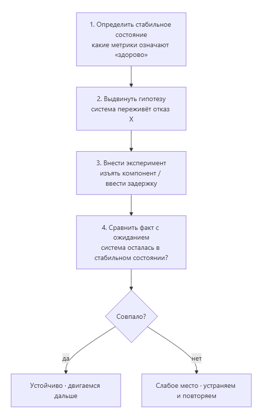

Исходник диаграммы (Mermaid)

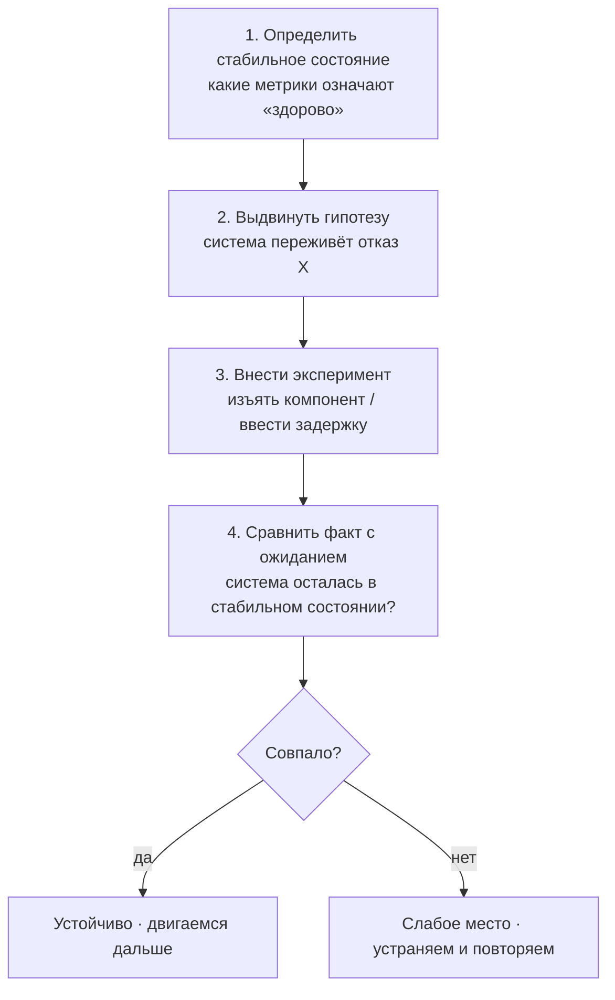
```mermaid
flowchart TB
A[1. Определить стабильное состояние<br/>какие метрики означают «здорово»] --> B[2. Выдвинуть гипотезу<br/>система переживёт отказ X]
B --> C[3. Внести эксперимент<br/>изъять компонент / ввести задержку]
C --> D[4. Сравнить факт с ожиданием<br/>система осталась в стабильном состоянии?]
D --> E{Совпало?}
E -->|да| F[Устойчиво · двигаемся дальше]
E -->|нет| G[Слабое место · устраняем и повторяем]
```

- **Определить стабильное состояние.** Что для системы значит «работать нормально»? Обычно набор метрик: latency, error rate, throughput, active users. Фиксируем «базовую линию».
- **Выдвинуть гипотезу.** «Убив лидер базы, система подхватит реплику за 10 секунд и не потеряет ни одного запроса».
- **Внести эксперимент.** Аккуратно, в контролируемой среде (staging или медленно в production) изъять один компонент: погасить экземпляр, потянуть сеть, эмулировать задержку.
- **Сравнить факт с гипотезой.** Совпало — система устойчива. Не совпало — нашли слабое место, чиним его и повторяем тест.

**Ключевое:** сначала в staging, в малом масштабе. В production — только после того, как методология отлажена и компании осознанно пошли на контролируемый риск.

### Главный принцип: «играем не с удачей, а с детерминизмом»

📌 Принципы Netflix, ставшие каноном:

- **Hypothesis-driven** — каждый эксперимент начинается с конкретной гипотезы.
- **Minimize blast radius** — минимизировать «зону поражения»: начать с изоляции одного экземпляра, а не всей зоны сразу.
- **Experiment continuously** — хаос-инжиниринг — это непрерывный процесс, а не разовая акция.
- **Run in production** (аккуратно) — только живые эксперименты дают правдивую картину, потому что staging никогда не повторяет production на 100%.

### Инструменты

Разберём два инструмента, которые заявлены в теме лекции, — они же два главных в индустрии.

**Chaos Monkey** — исторический первопроходец от Netflix. Это сервис, который **случайным образом «убивает» (terminate) экземпляры** в production-окружении. Звучит безумно — но именно так Netflix заставил свои команды строить архитектуры, в которых падение любого инстанса незаметно.

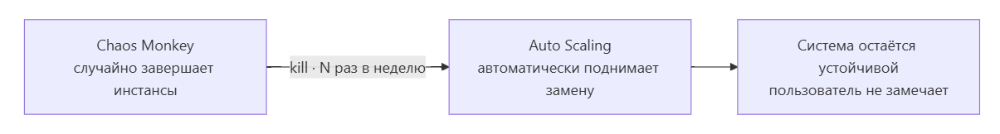

Исходник диаграммы (Mermaid)

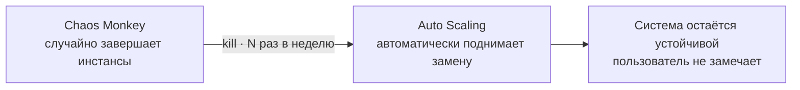
```mermaid
flowchart LR
CM[Chaos Monkey<br/>случайно завершает инстансы] -->|"kill · N раз в неделю"| AUTOSCALE[Auto Scaling<br/>автоматически поднимает замену]
AUTOSCALE --> TEST[Система остаётся устойчивой<br/>пользователь не замечает]
```

Постоянно «убивая» ВМ, Chaos Monkey гарантирует: команда никогда не забывает про отказоустойчивость, потому что она проверяется автоматически, каждый день. Если упавший инстанс не пережили — завтра то же случится уже по-настоящему.

Часть семейства **Chaos Gorilla** (падает целая зона) и **Chaos Kong** (падает целый регион) — масштабированные версии для проверки зональной и региональной отказоустойчивости.

**Litmus** — современный инструмент, специально для Kubernetes. Он запускает **обширный набор контролируемых «инъекций сбоев»**: убивает поды, симулирует нехватку памяти/CPU, сетевые разрывы и задержки, отказы DNS, потерю диска. Работает через кастомные Kubernetes Custom Resources (ChaosEngine и ChaosExperiment) и умеет интегрироваться с мониторингом (Prometheus) и CI/CD.

Исходник диаграммы (Mermaid)

```mermaid
flowchart TB
LIT[LitmusChaos<br/>для Kubernetes] -->|"ChaosExperiments"| EXP[Инъекции сбоев<br/>поды · CPU · сеть · диск · DNS]
EXP -->|"генерирует"| LOAD[Нагрузка в кластере]
LIT --> MON[Интеграция с Prometheus / мониторинг]
LIT --> CI[Интеграция с CI/CD · гейт релиза]
Почему Litmus удобен: вы описываете эксперимент декларативно (какой сбой, для какого подмножества подов, в течение какого времени) и «зашиваете» его в пайплайн — например, как обязательную проверку перед выкатом релиза.
```

### Другие инструменты эко-System

Кратко упомяну ещё несколько, чтобы у вас была картина:

| **Инструмент** | **Платформа** | **Назначение** |
| --- | --- | --- |
| Chaos Monkey | AWS (Netflix) | Случайное завершение инстансов |
| Litmus | Kubernetes | Широкий набор инъекций сбоев |
| Gremlin | Кросс-платформенная | Платформа chaos-экспериментов с панелью управления |
| Chaos Mesh | Kubernetes | Инъекции сбоев + графический интерфейс |
| Pumba / tc | Docker / Linux | Разрывы и задержки сети в контейнерах |

**Контрольная точка.** Запомните разницу: **Chaos Monkey** — «убить инстанс», проверка на падение отдельных компонентов. **Litmus** — расширенный набор сбоев внутри Kubernetes, с декларативными экспериментами и CI-интеграцией. Оба решают одну задачу: найти слабое место, пока это безопасно.

### Вопрос аудитории

Проведём мысленный эксперимент. Представьте, что ваша команда вносит в production, в рабочее время, эксперимент: убивает один из трёх экземпляров приложения. Что должно произойти, чтобы эксперимент считался успешным? (пауза) Правильно: остальные два экземпляра должны принять нагрузку на себя, никто из пользователей ничего не заметил, метрики не вышли за пределы. Если же что-то «поплыло» — вы нашли реальную уязвимость, и это ценнейший результат эксперимента.

**Итог по части 5:** Chaos Engineering превращает «надеюсь, выдержит» в «мы это проверили». Через контролируемые эксперименты с гипотезой и минимизацией зоны поражения вы выковываете по-настоящему отказоустойчивые системы. Инструменты — от Chaos Monkey у Netflix до Litmus и Gremlin в Kubernetes — автоматизируют этот процесс и встраивают его в ежедневную практику.

## Часть 6. Практика и резюме (5 минут)

И финальный блок — как применить всё это на практике и не наступить на грабли.

### Чек-лист проектирования DR-архитектуры

Когда проектируете систему с отказоустойчивостью, пройдитесь по списку:

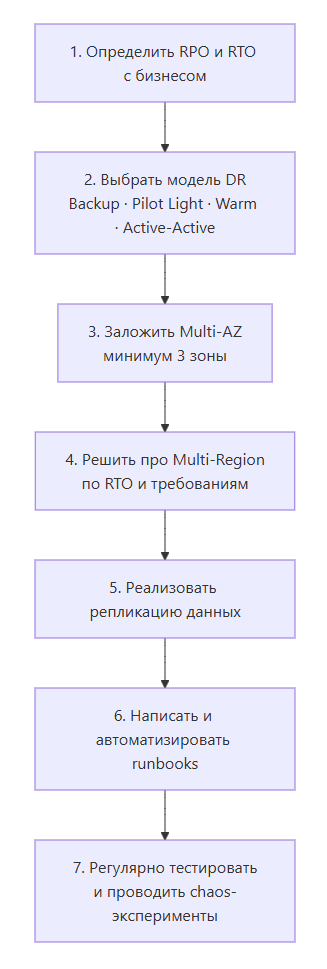

Исходник диаграммы (Mermaid)

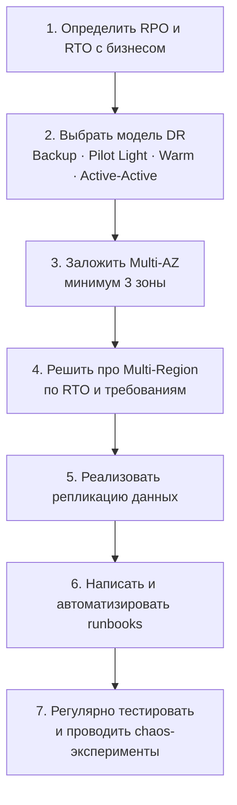
```mermaid
flowchart TD
A[1. Определить RPO и RTO с бизнесом] --> B[2. Выбрать модель DR<br/>Backup · Pilot Light · Warm · Active-Active]
B --> C[3. Заложить Multi-AZ<br/>минимум 3 зоны]
C --> D[4. Решить про Multi-Region<br/>по RTO и требованиям]
D --> E[5. Реализовать репликацию данных]
E --> F[6. Написать и автоматизировать runbooks]
F --> G[7. Регулярно тестировать<br/>и проводить chaos-эксперименты]
```

- **Определить RPO и RTO вместе с бизнесом** — фундамент всего, не пропускать.
- **Выбрать модель DR** под жёсткость целей и бюджет (таблица моделей).
- **Заложить Multi-AZ** — минимум три зоны, автомасштабирование, реплики БД.
- **Решить про Multi-Region** — если RTO минутный или есть требования по гео-резервированию.
- **Реализовать репликацию данных** между зонами/регионами, учесть конфликты записи.
- **Написать и автоматизировать runbooks** — Terraform, failover DNS, health checks.
- **Регулярно тестировать** восстановление и проводить chaos-эксперименты.

### Типичные ошибки

Теперь — классика, на которой команды получают дорогие выводы:

| **№** | **Ошибка** | **Последствие** |
| --- | --- | --- |
| 1 | Нет RPO/RTO — «просто сделаем бэкапы» | Непонятно, сколько потеряем и когда восстановимся |
| 2 | Одна ВМ без группы масштабирования | Падение — сервис встал, хотя «мы же в облаке» |
| 3 | Один NAT / одна реплика в одной зоне | Single Point of Failure |
| 4 | План DR не тестировался | При настоящей аварии план не работает |
| 5 | Нет failback-плана | Не могут вернуться в основной регион |
| 6 | Бэкап в том же регионе, что и данные | Катастрофа региона уничтожает и бэкап |
| 7 | Chaos-эксперименты «по-крупному» на живую | Сломали production без контроля |

Разберём каждую вкратце:

**Нет метрик RPO/RTO.** Самая частая ошибка. Без целей нельзя выбрать модель DR, и результат получается случайным.

**Одна ВМ.** «У меня облако, значит, надёжно» — заблуждение. Надёжность создаёте вы: группы масштабирования, реплики.

**Один NAT в одной зоне.** Упала зона — встал весь исходящий трафик приватных подсетей. Это мы разбирали в лекции 1.

**Нетестированный план.** План восстановления, который не репетировали, при настоящей аварии обычно «умирает» в первый же час.

**Нет failback.** Переехали в резерв, а вернуться не могут — перманентный кризис.

**Бэкап рядом с данными.** Если регион сгорел, сгорел и бэкап. Бэкап должен быть в другом регионе/объектном хранилище с репликацией.

**Хаос «по-крупному».** Запустили Chaos Monkey на всё сразу без staging — уронили всё. Сначала маленькие контролируемые шаги.

### Итоги лекции

Давайте соберём главное из сегодняшнего занятия.

**Модели DR** выстроены по оси «цена ↔ скорость»: Backup & Restore (дёшево, но медленно), Pilot Light (ядро + раздувание), Warm Standby (уменьшенная копия), Active-Active (секунды, но сложно и дорого).

**RPO и RTO** — это язык, на котором вы разговариваете с бизнесом: RPO — «сколько данных потеряем», RTO — «как долго будем лежать». Обе метрики задаются бизнесом и определяют всю архитектуру.

**Multi-AZ** — обязательный базовый уровень отказоустойчивости (группы масштабирования, реплики БД, NAT в каждой зоне). **Multi-Region** — следующий уровень для защиты от катастрофы целого региона, он дороже и требует решения вопросов репликации и DNS-переключения.

**Автоматизация и runbooks** превращают план в практику: Terraform пересоздаёт инфраструктуру кодом, failover DNS перенаправляет трафик, регулярные тесты доказывают реальные RPO/RTO.

**Chaos Engineering** — это способ проверить устойчивость, специально внося контролируемые сбои: гипотеза → эксперимент → сравнение факта с ожиданием. Инструменты: Chaos Monkey («убить инстанс»), Litmus (Kubernetes, декларативные инъекции сбоев), Gremlin и Chaos Mesh.

**Ключевая мысль сегодня:** отказоустойчивость — это не технология и не «флаг» в облаке. Это процесс: вы задаёте цели, строите резервирование, автоматизируете восстановление и **туда и обратно** тестируете его. Система считается отказоустойчивой, только когда вы **доказали это на практике**, а не когда вы в неё верите.

На следующей лекции мы поговорим о мониторинге и алертинге — как увидеть, что система начинает деградировать, до того как она упадёт.

## Вопросы для самопроверки (раздать аудитории в конце)

- Назовите четыре модели DR и расположите их по возрастанию стоимости и убыванию RTO.
- Что такое RPO и RTO? Приведите пример: RPO = 1 час и RTO = 15 минут.
- Почему RPO и RTO должны определяться совместно с бизнесом, а не только архитектором?
- Какая модель DR — минимально достаточная, если RTO = минуты, а бюджет ограничен?
- Что отличает Multi-AZ от Multi-Region? Когда достаточно AZ, а когда нужен Region?
- Почему NAT Gateway должен стоять в каждой зоне доступности?
- Что такое runbook и почему план DR без runbook'а обычно не работает при реальной аварии?
- Что такое failover и failback? Почему про failback часто забывают, и чем это опасно?
- Каковы четыре принципа Chaos Engineering? Почему сначала эксперименты проводят в staging?
- Чем Chaos Monkey отличается от Litmus? Опишите сценарий применения каждого.
- Почему бэкап нельзя хранить в том же регионе, что и данные?
- Что значит «минимизировать зону поражения» в chaos-эксперименте? Приведите пример.
