# Лекция 3 — Сетевая архитектура облака

> 👥 **Лекция второго преподавателя.** Ниже — авторский текст лекции, он приведён без изменений.
>
> Внутри текста автор пользуется своей сквозной нумерацией — это его лекция №1. Соответствие номеров и общий план — в [README курса](../README.md). Правила сдачи и оформления отчётов в двух половинах курса различаются: см. [«Регламент курса»](../COURSE-RULES.md).

**Лабораторная:** [Лаба 3 — Проектирование сетевой архитектуры облака (VPC, балансировщики, связность)](lab.md)

---

## Вступление (5 минут)

Здравствуйте, коллеги. Это первая лекция курса «Организация и управление облачной инфраструктурой». Сегодня мы говорим о фундаменте — о том, на чём держится любое облако, то есть о **сетевой архитектуре**.

Облако — это не просто «сервера в чужих стойках». Это огромная виртуальная сеть, которая живёт по своим законам. И если вы не понимаете, как она устроена, вы будете настраивать её наугад — а это дорого и опасно.

За 60 минут мы пройдём пять блоков:

- **Виртуализация сетей** — VLAN, VPC, VxLAN.
- **Балансировщики нагрузки** — ALB и NLB.
- **Глобальная маршрутизация** — DNS, CDN, Anycast, Socket Saving.
- **Связь с внешним миром** — шлюзы, NAT, VPN, Transit Gateway.
- **Практика** — чек-лист, типичные ошибки, итоги.

Такая логическая карта лекции:

Исходник диаграммы (Mermaid)

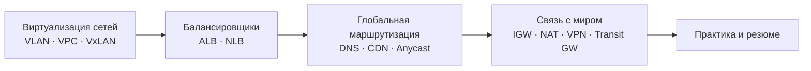
```mermaid
flowchart LR
A[Виртуализация сетей<br/>VLAN · VPC · VxLAN] --> B[Балансировщики<br/>ALB · NLB]
B --> C[Глобальная маршрутизация<br/>DNS · CDN · Anycast]
C --> D[Связь с миром<br/>IGW · NAT · VPN · Transit GW]
D --> E[Практика и резюме]
```

Начнём с главного вопроса: зачем нам вообще виртуальные сети?

## Часть 1. Виртуализация сетей (15 минут)

### Проблема физических сетей

Представьте себе классическую сеть в 2010-м. У вас есть стойки, коммутаторы, кабели, и вы физически протягиваете сеть между серверами. Хотите добавить новую изолированную сеть? Идёте коммутировать кабели заново, переписываете VLAN-теги на коммутаторах. Это медленно, хрупко и недешёво.

А теперь представьте облако, где один провайдер создаёт **миллионы изолированных сетей для разных клиентов** — одновременно, мгновенно и без единого движения кабеля. Физический подход тут физически невозможен.

Поэтому облаком управляет **SDN — Software-Defined Networking, программно-определяемые сети**. Ключевая идея SDN: мы отделяем **управляющую плоскость** (где всё решается, контролируется централизованно) от **плоскости данных** (где пакеты реально летят по железу):

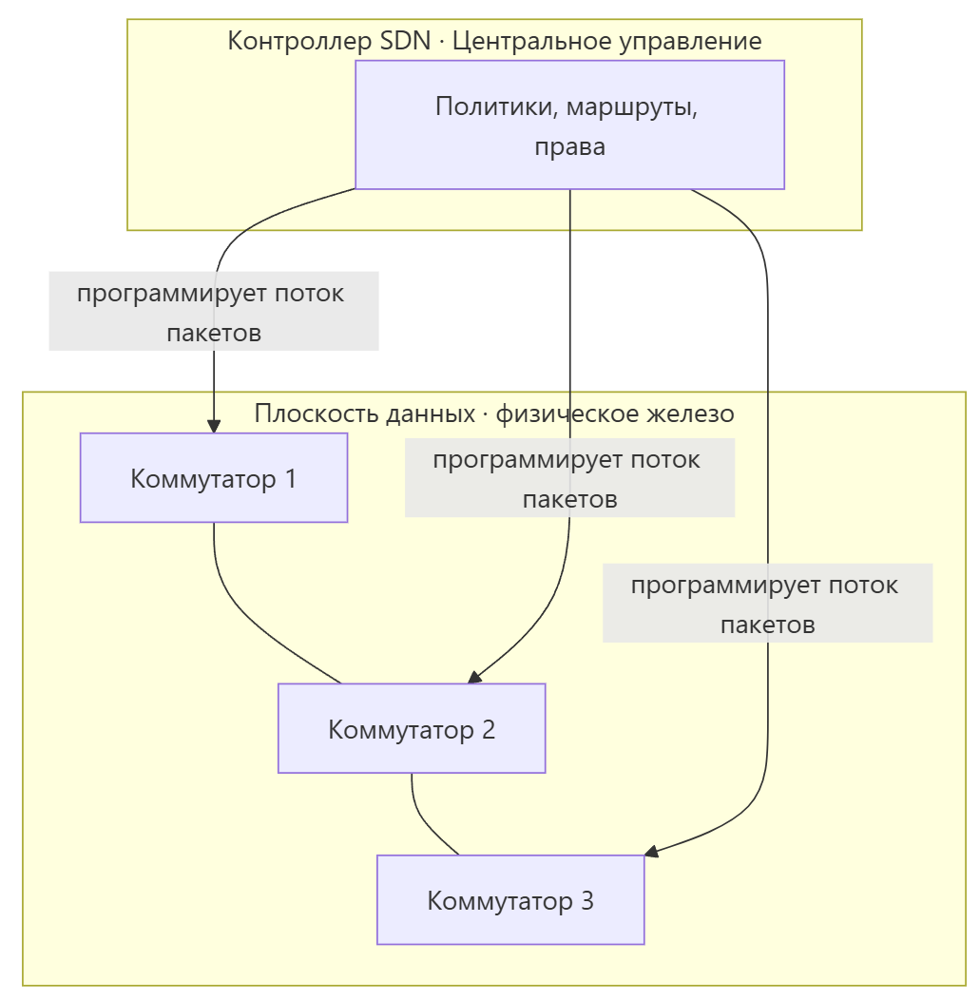

Исходник диаграммы (Mermaid)

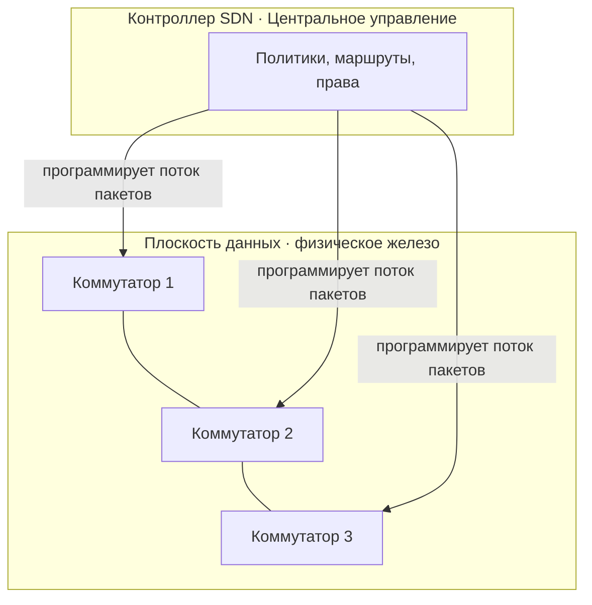
```mermaid
flowchart TB
subgraph Контроллер SDN [Контроллер SDN · Центральное управление]
C[Политики, маршруты, права]
end
subgraph Underlay [Плоскость данных · физическое железо]
S1[Коммутатор 1] --- S2[Коммутатор 2] --- S3[Коммутатор 3]
end
C -- "программирует поток пакетов" --> S1
C -- "программирует поток пакетов" --> S2
C -- "программирует поток пакетов" --> S3
```

Управление стало программным — появилась виртуализация сетей.

### VLAN — первый шаг

Самый старый инструмент виртуализации на уровне L2 — **VLAN**, стандарт IEEE 802.1Q. Идея простая: один физический коммутатор мы логически режем на несколько независимых сетей, помечая кадры тегом. Тег VLAN занимает 12 бит, поэтому таких сетей максимум **4094**.

VLAN изолирует broadcast-домены, это удобно. Но для облака VLAN не подходит — и вот почему:

- **4094 сетей — мало.** У провайдера клиентов больше.
- Всё завязано на один **L2-домен** и на протокол **Spanning Tree**, который блокирует избыточные пути и замедляет сеть.

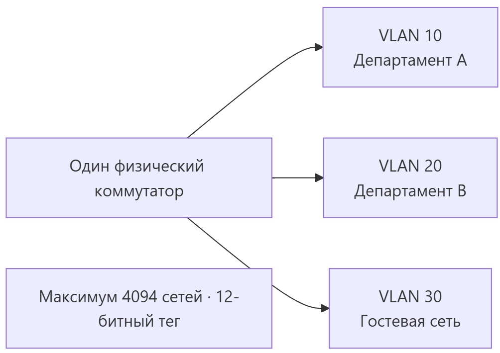

Исходник диаграммы (Mermaid)

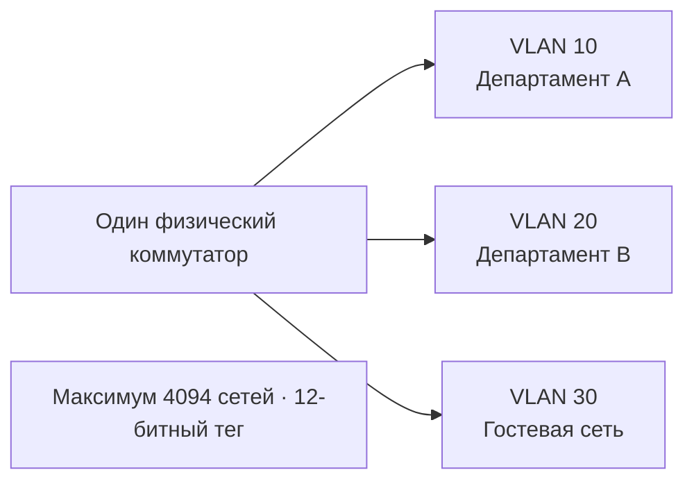
```mermaid
flowchart LR
SW[Один физический коммутатор]
SW --> V10[VLAN 10<br/>Департамент A]
SW --> V20[VLAN 20<br/>Департамент B]
SW --> V30[VLAN 30<br/>Гостевая сеть]
note[Максимум 4094 сетей · 12-битный тег]
```

То есть VLAN — это хороший внутренний инструмент провайдера для физической сегментации стоек, но не решение для мультитенатности облака. Переходим к следующему уровню.

**Вопрос аудитории:** как думаете, когда 4094 сетей — это много, а когда — катастрофически мало?

### VPC — Virtual Private Cloud

Следующая ступень — **VPC, Virtual Private Cloud**. Это уже логически изолированная частная сеть в пределах облака, которую заводит клиент. По сути, каждый клиент получает свой мини-датацентр, где сам управляет адресацией, маршрутизацией и правами доступа.

Важное отличие от VLAN: VPC работает на **Layer 3** — на уровне IP-адресов и маршрутов, а не на уровне кадров Ethernet. И она может растягиваться на несколько зон доступности.

Из чего состоит VPC? Запомните этот список — он встретится и в практических заданиях:

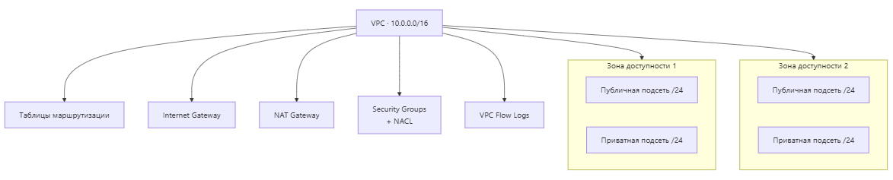

Исходник диаграммы (Mermaid)

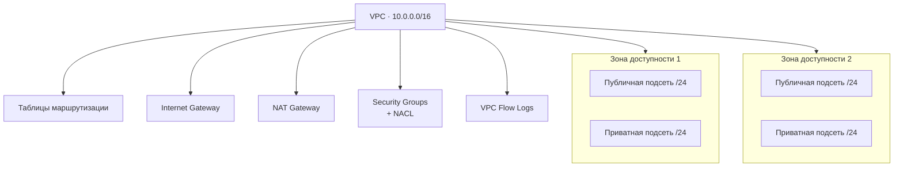
```mermaid
flowchart TB
VPC[VPC · 10.0.0.0/16]
VPC --> RT[Таблицы маршрутизации]
VPC --> IGW[Internet Gateway]
VPC --> NAT[NAT Gateway]
VPC --> SG[Security Groups<br/>+ NACL]
VPC --> FL[VPC Flow Logs]
subgraph AZ1 [Зона доступности 1]
PUB1[Публичная подсеть /24]
PRIV1[Приватная подсеть /24]
end
subgraph AZ2 [Зона доступности 2]
PUB2[Публичная подсеть /24]
PRIV2[Приватная подсеть /24]
end
VPC --> AZ1
VPC --> AZ2
```

- **CIDR-блок** — диапазон IP, например 10.0.0.0/16. Это «адресное пространство» вашей сети.
- **Подсети (subnets)** — вы нарезаете CIDR на куски и кладёте их в разные зоны доступности (AZ), чтобы получить отказоустойчивость.
- **Таблица маршрутизации** — определяет, куда пакет уходит дальше.
- **Интернет-шлюз (IGW)** — обеспечивает двусторонний доступ в интернет.
- **NAT-шлюз** — только исходящий доступ для приватных подсетей.
- **Security Groups и Network ACL** — фильтрация трафика.
- **VPC Flow Logs** — журналирование трафика для аудита.

### VxLAN — как облако решает главную проблему

И вот он, ключевой игрок — **VxLAN**, протокол из стандарта RFC 7348. Это туннельный протокол: он **инкапсулирует целый Ethernet-кадр внутрь UDP-пакета** на порту 4789 и отправляет его через IP-сеть. Внутри ставится 24-битный идентификатор сети — **VNI**. А 24 бита — это **до 16 миллионов виртуальных сетей**. Сравните с 4094 у VLAN.

Как это работает: физическая сеть — это **underlay** (базовая транспортная среда на IP), а поверх неё строится **overlay** — виртуальные L2-сети клиентов. На границе работают устройства **VTEP** — они и делают инкапсуляцию и деинкапсуляцию кадров:

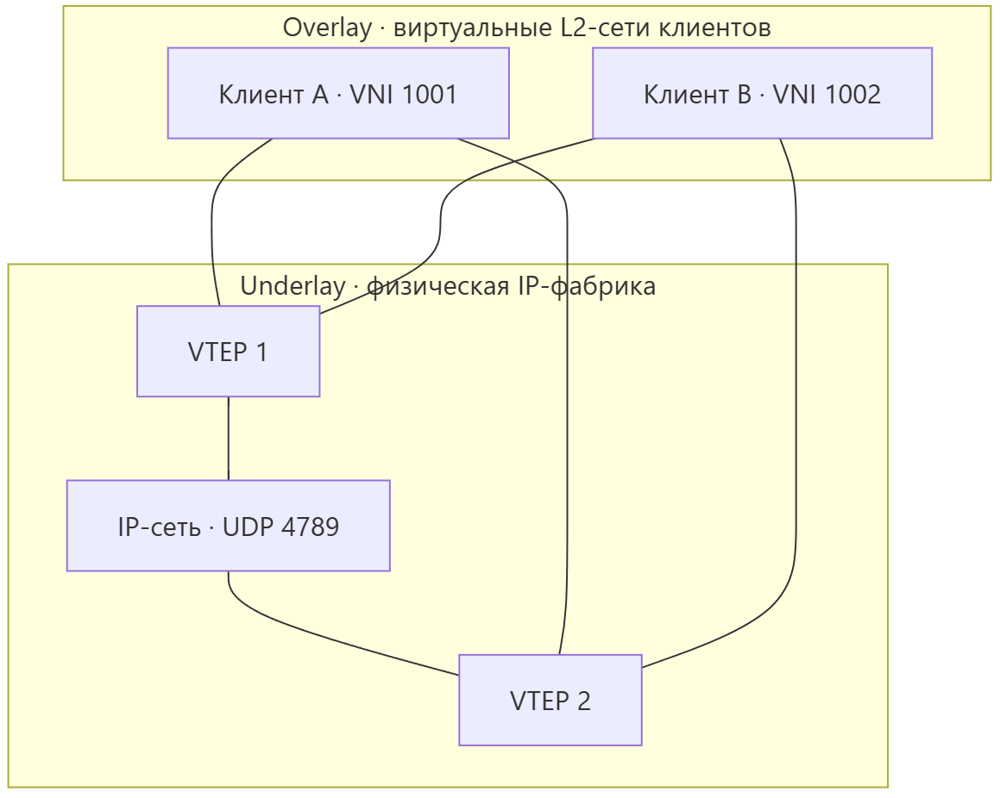

Исходник диаграммы (Mermaid)

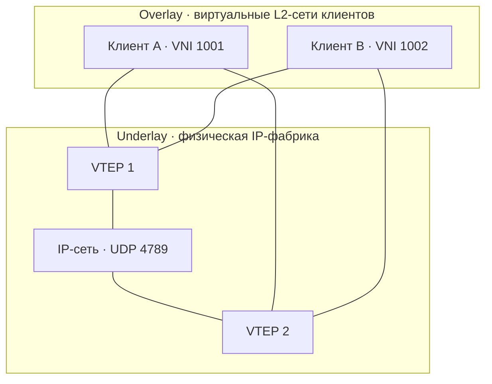
```mermaid
flowchart TB
subgraph Overlay [Overlay · виртуальные L2-сети клиентов]
C1[Клиент A · VNI 1001]
C2[Клиент B · VNI 1002]
end
subgraph UnderlayNet [Underlay · физическая IP-фабрика]
VT1[VTEP 1] --- SWF[IP-сеть · UDP 4789] --- VT2[VTEP 2]
end
C1 --- VT1
C1 --- VT2
C2 --- VT1
C2 --- VT2
```

Зачем Всё это в облаке:

- **Нативная мультитенатность** — миллионы клиентов, каждый в своей виртуальной сети.
- Не нужен Spanning Tree, потому что L2 теперь живёт поверх IP, а значит, можно строить топологию **Spine-Leaf** без блокировок.
- Можно расширять L2-домен через всю IP-фабрику.

| **Технология** | **Уровень** | **Макс. сетей** | **Использование** |
| --- | --- | --- | --- |
| **VLAN** | L2 | 4094 | Малые сети, сегментация стоек |
| **VPC** | L3 | до миллионов | Сеть клиента в облаке |
| **VxLAN** | L2 over L3 | 16 млн (VNI 24 бит) | Мультитенатность облака |

**Итог по части 1:** VLAN — для небольших сетей, VPC — для клиента облака, VxLAN — технология, которая делает облако возможным. Запомните эту тройку.

## Часть 2. Балансировщики нагрузки (15 минут)

Сеть у нас есть. Теперь возникает вопрос: как распределить огромный трафик между множеством одинаковых серверов? На помощь приходят балансировщики нагрузки. Их два главных типа — и они работают на разных уровнях.

### ALB — Application Load Balancer

**ALB работает на Layer 7** — на уровне приложения, то есть понимает не только IP и порты, но и содержимое запроса: путь, заголовки, хост, тело.

Что он умеет:

- **Content-based routing** — распределение по содержимому запроса.
- **Path-based routing**: например, всё, что идёт на /api/*, — в одну группу серверов, а /static/* — в другую.
- **Host-based routing**: app1.example.com на один кластер, app2.example.com — на другой.
- **SSL/TLS termination** — снимает шифрование, разгружая бэкенд.
- Работает с WebSocket, HTTP/2, HTTP/3, gRPC.

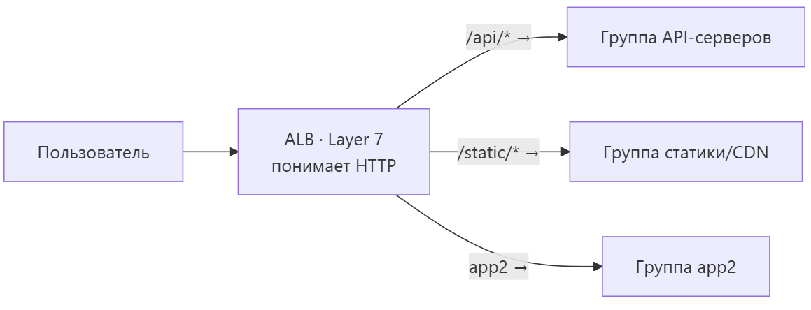

Исходник диаграммы (Mermaid)

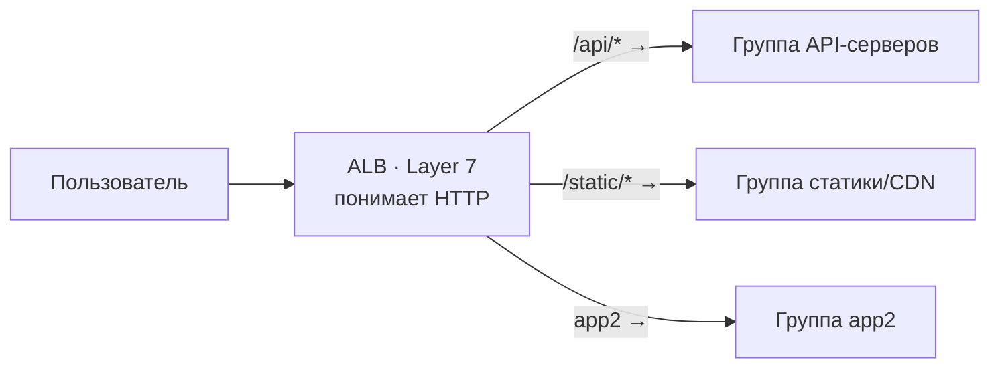
```mermaid
flowchart LR
User[Пользователь] --> ALB[ALB · Layer 7<br/>понимает HTTP]
ALB -->|"/api/* →"| G1[Группа API-серверов]
ALB -->|"/static/* →"| G2[Группа статики/CDN]
ALB -->|"app2 →"| G3[Группа app2]
```

Пример правила, которое вы будете настраивать на практике:

IF host = api.myshop.com AND path = /orders/*

THEN forward to target-group 1

Когда выбирать ALB? Веб-приложения, API-шлюзы, микросервисы с разными endpoints. Запомните: задержка ALB — порядка единиц миллисекунд, это нормально.

### NLB — Network Load Balancer

**NLB работает на Layer 4** — на уровне TCP/UDP. Он не смотрит на содержимое, ему хватает IP-адресов и портов.

Сильные стороны NLB:

- Гигантская производительность — **до миллионов запросов в секунду**.
- Минимальная задержка — порядка **100 микросекунд**.
- **Сохраняет исходный IP клиента** — важно для whitelist и логирования.
- Может иметь **статический Elastic IP** — фиксированный адрес, который не меняется.

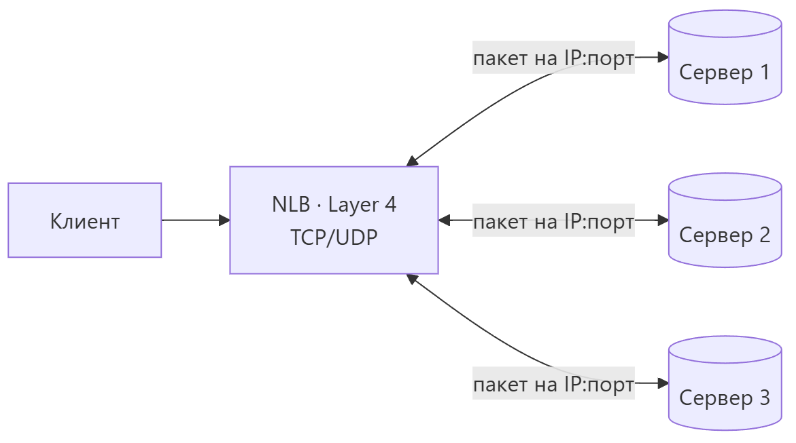

Исходник диаграммы (Mermaid)

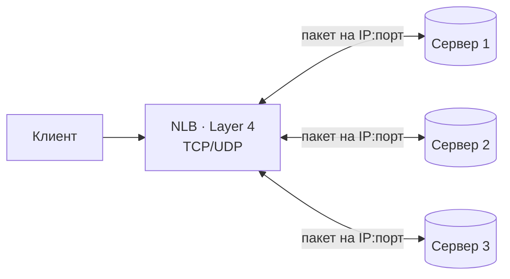
```mermaid
flowchart LR
U[Клиент] --> NLB[NLB · Layer 4<br/>TCP/UDP]<-->|"пакет на IP:порт"| S1[(Сервер 1)]
NLB <-->|"пакет на IP:порт"| S2[(Сервер 2)]
NLB <-->|"пакет на IP:порт"| S3[(Сервер 3)]
```

Когда выбирать NLB? Для TCP/UDP-протоколов, gRPC, WebSocket, игровых серверов, raw TCP (MySQL-репликация). Нужен фиксированный IP для белых списков — это NLB.

**Быстрый опрос:** gRPC — к какому балансировщику понесём? (пауза) Правильно, к NLB на L4. А веб-приложение с путями — к ALB. Запомните правило: нужно **«видеть» HTTP-содержимое — берите ALB, нужна скорость и порты — берите NLB.**

#### Сравнение ALB и NLB

| **Характеристика** | **ALB** | **NLB** |
| --- | --- | --- |
| Уровень | Layer 7 (приложение) | Layer 4 (транспорт) |
| Производительность | до сотен тыс. rps | до миллионов rps |
| Задержка | единицы мс | ~100 мкс |
| Понимает HTTP/URL/хост | да | нет |
| Сохраняет IP клиента | нет (по умолч.) | да |
| Статический Elastic IP | нет | да |

### Стратегии распределения

Какой бы балансировщик вы ни взяли, ему нужна стратегия отправки запросов:

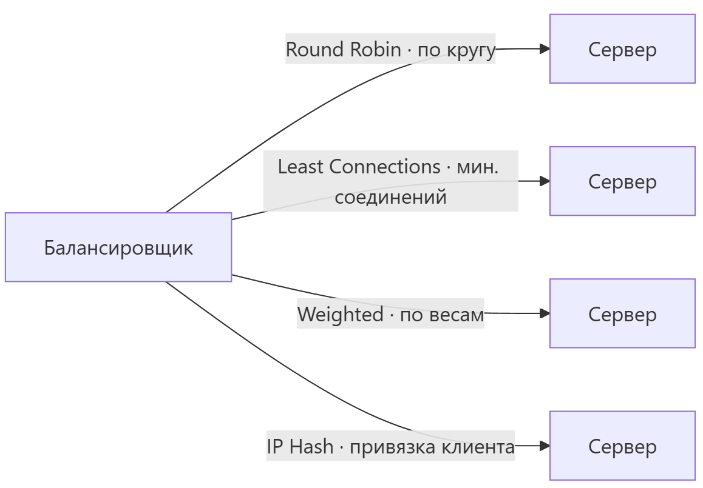

Исходник диаграммы (Mermaid)

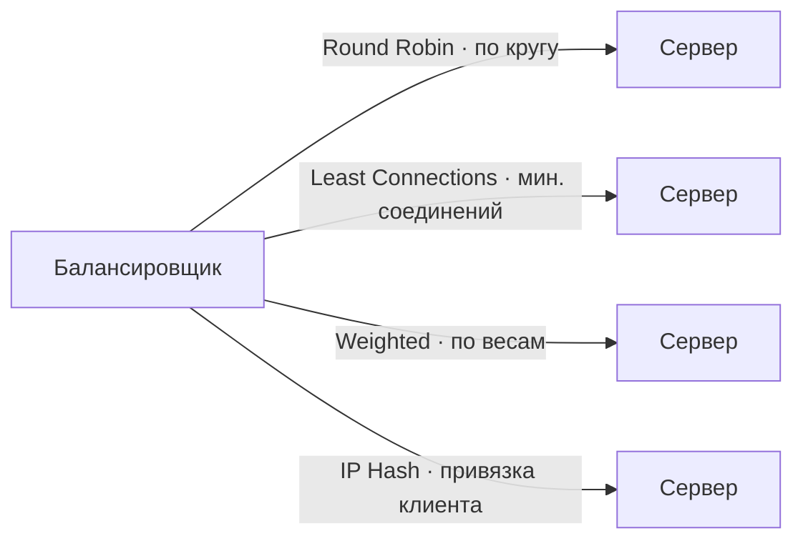
```mermaid
flowchart LR
LB[Балансировщик]
LB -->|"Round Robin · по кругу"| R1[Сервер]
LB -->|"Least Connections · мин. соединений"| R2[Сервер]
LB -->|"Weighted · по весам"| R3[Сервер]
LB -->|"IP Hash · привязка клиента"| R4[Сервер]
```

- **Round Robin** — по кругу, просто и без учёта нагрузки.
- **Least Connections** — на сервер с наименьшим числом активных соединений.
- **Least Outstanding Requests** — на сервер с наименьшей очередью (актуально для HTTP/2).
- **Weighted** — с весами, когда сервера разной мощности.
- **IP Hash** — привязка клиента к серверу по хэшу его IP (для липких сессий).

На практике чаще всего используют **Least Connections в сочетании с весами**.

## Часть 3. DNS, CDN, Anycast, Socket Saving (12 минут)

Теперь поднимемся на глобальный уровень. Сеть мы построили, трафик распределили, — но как пользователь из другого континента вообще попадает к нам, и почему сайт грузится быстро?

### Продвинутый облачный DNS

DNS — это телефонная книга интернета, но облачный DNS умеет гораздо больше простого «домен → IP»:

- **Latency-based routing** — отдаём IP ближайшего по задержке кластера.
- **Geolocation routing** — по стране или региону. Например, пользователь из ЕС получает наш сервер в ЕС, чтобы соблюдать GDPR.
- **Weighted routing** — для A/B-тестирования: например, 5% трафика на новую версию сервиса.
- **Failover routing** — если основной сервер недоступен, DNS автоматически отдаёт резервный IP.
- Интеграция с **health checks** — DNS не отдаёт IP мёртвого сервера.

### CDN — Content Delivery Network

Зачем нужен CDN? Проблема в том, что задержка растёт с расстоянием. Если сервер в Москве, а пользователь во Владивостоке, каждый запрос идёт тысячи километров.

CDN решает это **географическим кэшированием**. DNS отдаёт пользователю ближайший **edge-сервер** (точку присутствия, PoP). Edge проверяет свой кэш:

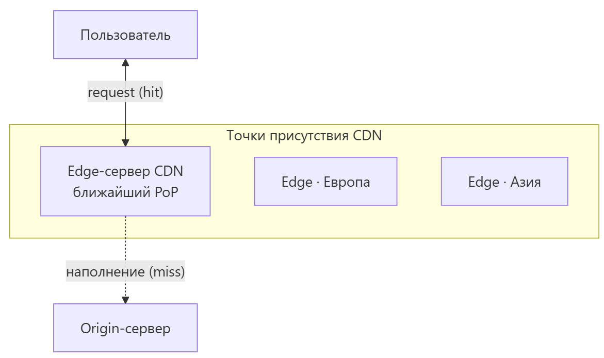

Исходник диаграммы (Mermaid)

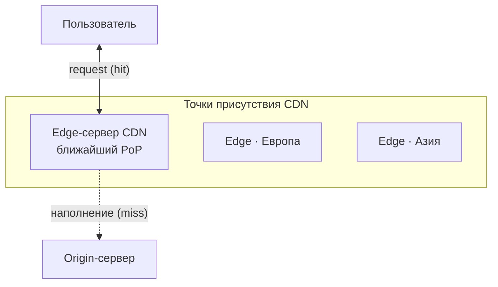
```mermaid
flowchart TB
User[Пользователь]<-->|"request (hit)"| E[Edge-сервер CDN<br/>ближайший PoP]
E -.->|"наполнение (miss)"| O[Origin-сервер]
subgraph Global [Точки присутствия CDN]
E
E2[Edge · Европа]
E3[Edge · Азия]
end
```

- Если контент есть и не истёк — **отдаёт сразу, быстро (hit)**.
- Если кэша нет (**miss**) — идёт к **origin**-серверу, забирает и кэширует.

Тонкость с **TTL**: у разных типов контента разное время жизни в кэше. Статика и видео кэшируются долго, а API — очень коротко, иначе пользователи будут получать устаревшие данные. Управляется это заголовком Cache-Control.

Провайдеры, которые вы встретите: CloudFront, Cloudflare, Akamai, G-Core, Yandex CDN.

### Anycast-сети

Ещё один мощный инструмент — **Anycast**. Идея: множество серверов по всему миру объявляют через BGP **один и тот же IP-адрес**. Маршрутизаторы направляют пакет к **топологически ближайшему** серверу.

Сравним с обычным unicast: там один IP = один сервер. В anycast один IP = десятки серверов, и каждый пользователь попадает к ближайшему.

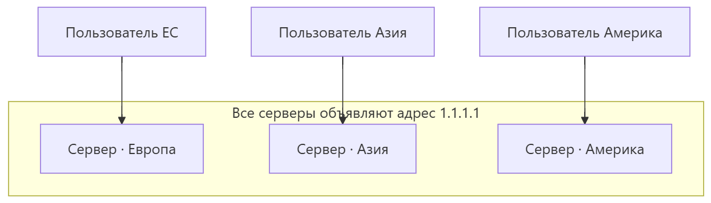

Исходник диаграммы (Mermaid)

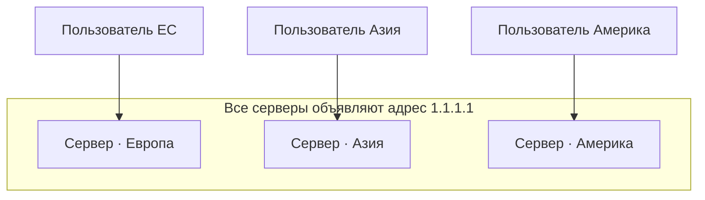
```mermaid
flowchart TB
subgraph Anycast_net [Все серверы объявляют адрес 1.1.1.1]
A1[Сервер · Европа]
A2[Сервер · Азия]
A3[Сервер · Америка]
end
U1[Пользователь ЕС] --> A1
U2[Пользователь Азия] --> A2
U3[Пользователь Америка] --> A3
```

Где это работает:

- **DNS** (вспомните 1.1.1.1 от Cloudflare),
- **edge-серверы CDN**,
- **API-шлюзы**,
- **защита от DDoS** — атака распределяется по всем точкам присутствия, и ни одна не перегружается.

### Socket Saving

Последняя тема блока — сбережение сокетов. Звучит загадочно, но важно. Каждое TCP-соединение занимает на сервере память и дескрипторы. При миллионах пользователей число одновременных соединений растёт линейно, и сервер задыхается.

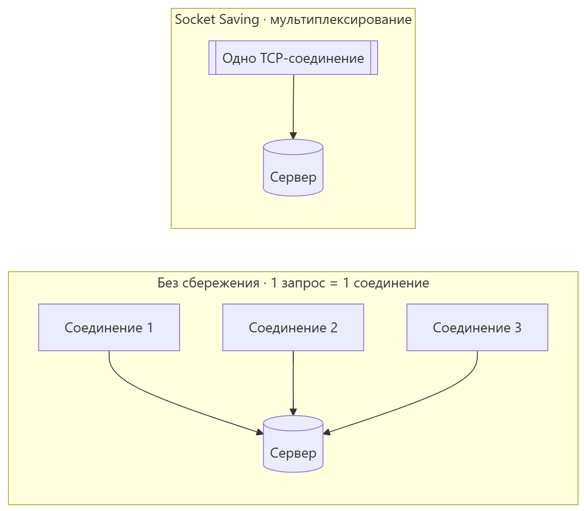

Исходник диаграммы (Mermaid)

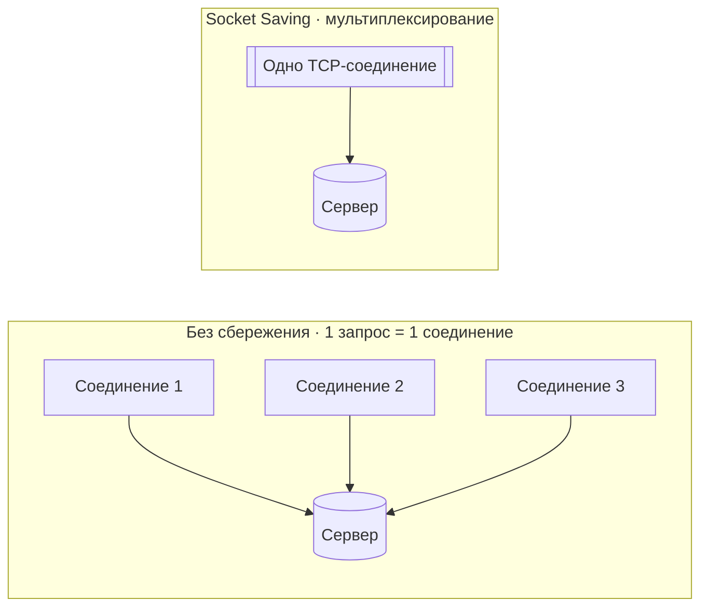
```mermaid
flowchart LR
subgraph Obychno [Без сбережения · 1 запрос = 1 соединение]
M1[Соединение 1] --> S[(Сервер)]
M2[Соединение 2] --> S
M3[Соединение 3] --> S
end
subgraph Sberezhenie [Socket Saving · мультиплексирование]
O1[[Одно TCP-соединение]]
O1 --> S2[(Сервер)]
end
```

Как с этим бороться:

- **Connection Multiplexing** — одно TCP-соединение обслуживает много параллельных запросов. Это делают HTTP/2, HTTP/3, gRPC.
- **Keep-Alive на балансировщике** — соединение не закрывается, а возвращается в пул и переиспользуется.
- **Connection Pooling на приложении** — например, pgbouncer для баз данных, чтобы не плодить новые соединения на каждый запрос.

**Итог блока:** DNS направляет, CDN кэширует, Anycast ускоряет и защищает, а Socket Saving не даёт серверу захлебнуться соединениями.

## Часть 4. Пограничные шлюзы, NAT, VPN (10 минут)

Сеть построена, трафик распределён, контент кэшируется. Теперь важный момент — как облачная сеть связана с внешним миром: с интернетом и с on-premise инфраструктурой компании.

### Интернет-шлюз (IGW) и NAT Gateway

У каждой VPC есть два инструмента выхода во внешний мир:

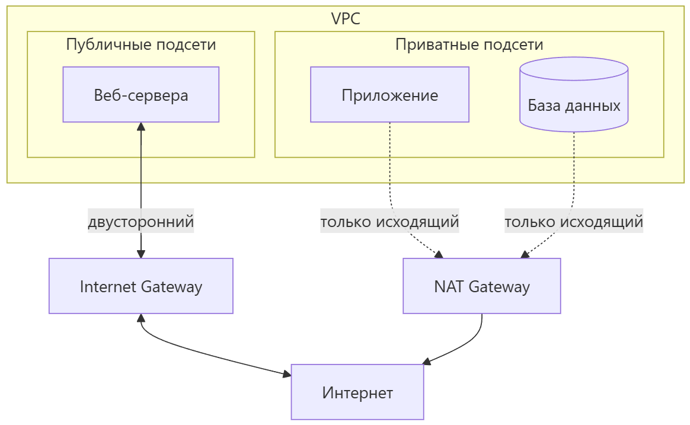

Исходник диаграммы (Mermaid)

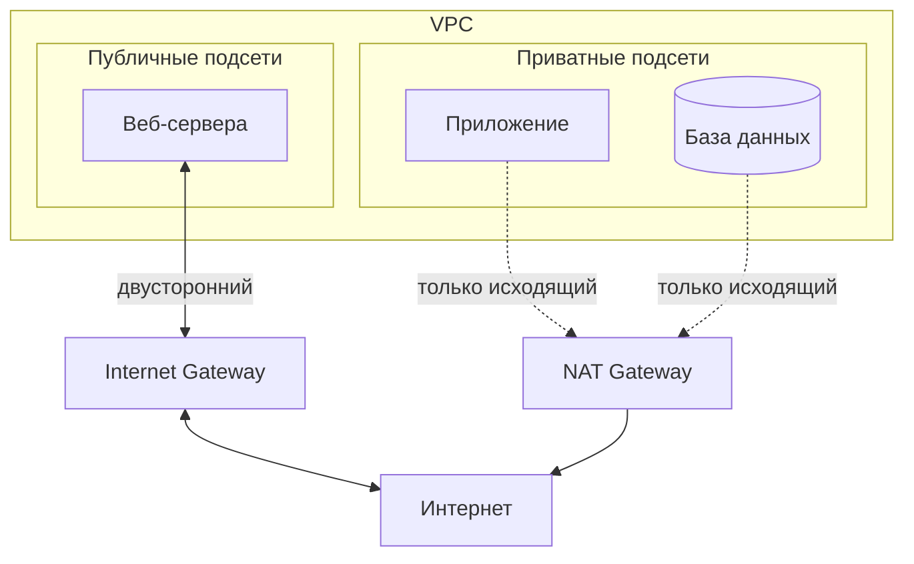
```mermaid
flowchart TB
subgraph VPC [VPC]
subgraph PUB [Публичные подсети]
WEB[Веб-сервера]
end
subgraph PRIV [Приватные подсети]
DB[(База данных)]
APP[Приложение]
end
end
WEB <-->|"двусторонний"| IGW[Internet Gateway]
APP -.->|"только исходящий"| NAT[NAT Gateway]
DB -.->|"только исходящий"| NAT
IGW <--> Internet[Интернет]
NAT --> Internet
```

- **IGW, Internet Gateway** — **двусторонний** доступ: и входящий, и исходящий. Его цепляют к публичным подсетям. IGW горизонтально масштабируется и не создаёт узких мест.
- **NAT Gateway** — **только исходящий** доступ для приватных подсетей. Внутренние сервера могут ходить в интернет (обновляться, качать образы), но из интернета к ним попасть нельзя.

Почему это важно: NAT **не принимает входящие соединения**. Это защита приватных сервера — их никто не «видит» из интернета.

**Критический совет:** в production ставьте **NAT Gateway в каждую зону доступности**. Если поставить один NAT в одной AZ — и эта AZ упадёт, весь исходящий трафик встанет. Это Single Point of Failure, мы к нему вернёмся в ошибках.

Есть и дешёвая альтернатива — **NAT Instance** (обычная виртуальная машина с настроенной трансляцией адресов). Но за него надо вручную обновлять и настраивать HA — как правило, это не стоит выгоды.

### VPN-подключения

Второй способ связи с внешним миром — VPN. Тут два сценария:

- **Site-to-Site VPN** — связывает on-premise датацентр компании с облачной VPC. Работает по протоколу IPsec (IKEv1/IKEv2), с шифрованием AES-256 и SHA-256. Правильный вариант резервирования — создавать **два туннеля, по одному в каждую зону доступности**. Также обычно включают Perfect Forward Secrecy — чтобы компрометация одного ключа не вскрыла всю переписку.
- **Client VPN** — для удалённых сотрудников. Это OpenVPN или готовые решения вроде AWS Client VPN.

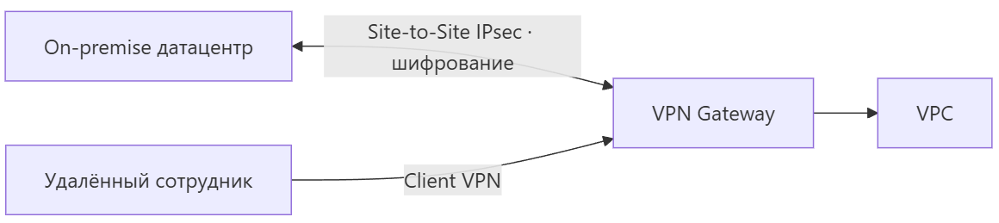

Исходник диаграммы (Mermaid)

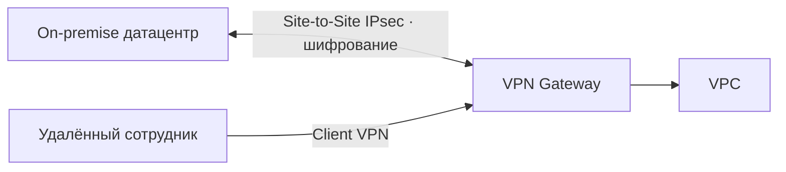
```mermaid
flowchart LR
OnPrem[On-premise датацентр] <-->|"Site-to-Site IPsec · шифрование"| VPN[VPN Gateway]
VPN --> VPC
Mobile[Удалённый сотрудник] -->|"Client VPN"| VPN
```

### Direct Connect / ExpressRoute

А если нужно больше, чем VPN? Если нужна **стабильная задержка и гигабитные скорости** — есть выделенное физическое волокно, **Direct Connect** (в Azure — ExpressRoute). Оно не идёт через публичный интернет, скорость — сотни гигабит. Но это дорого, а настройку согласуют неделями.

Правильная архитектура резервирования:

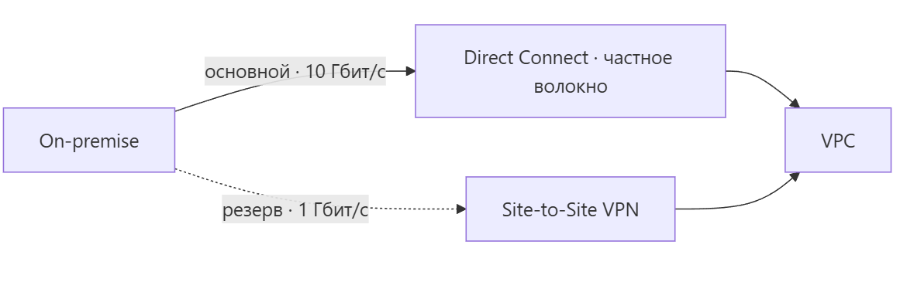

Исходник диаграммы (Mermaid)

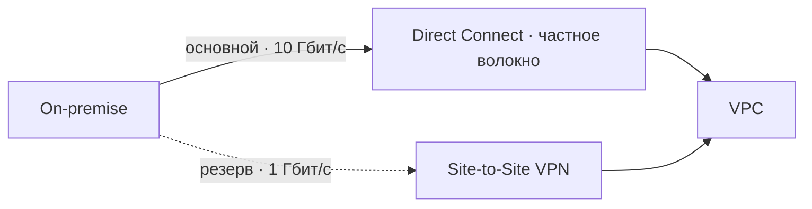
```mermaid
flowchart LR
OnPrem2[On-premise] -->|"основной · 10 Гбит/с"| DC[Direct Connect · частное волокно]
OnPrem2 -.->|"резерв · 1 Гбит/с"| VPN2[Site-to-Site VPN]
DC --> VPC2[VPC]
VPN2 --> VPC2
```

- Основной канал — **Direct Connect на 10 Гбит/с**.
- Резервный — **Site-to-Site VPN на 1 Гбит/с**.

Так вы получаете стабильность основного и дешевизну резерва.

### Transit Gateway — центральный хаб

И последнее в этом блоке. Когда у компании много VPC, если связывать их попарно пирингами, получится «паутина» из сотен соединений — неразбериха. Решение — **Transit Gateway**, единый центральный узел-концентратор.

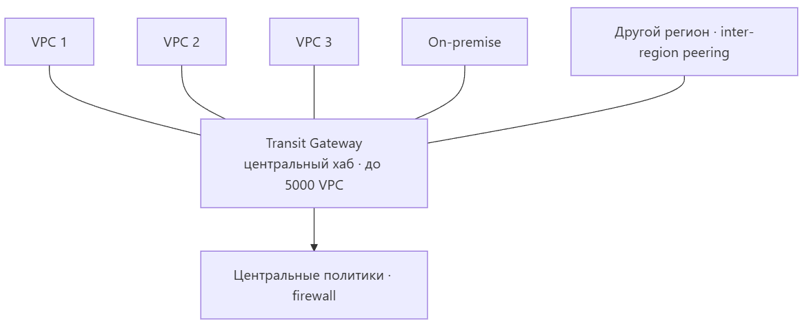

Исходник диаграммы (Mermaid)

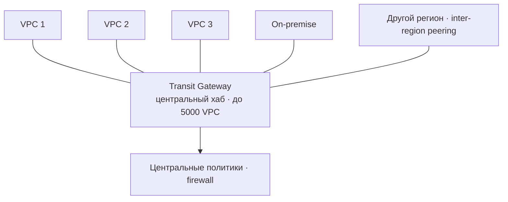
```mermaid
flowchart TB
VPC1[VPC 1] --- TGW[Transit Gateway<br/>центральный хаб · до 5000 VPC]
VPC2[VPC 2] --- TGW
VPC3[VPC 3] --- TGW
ONP[On-premise] --- TGW
REG[Другой регион · inter-region peering] --- TGW
TGW --> FW[Центральные политики · firewall]
```

Он поддерживает до **5000 подключений VPC**, умеет **inter-region peering** (связать регион Москвы и Стамбула), и главное — **централизует сетевые политики и firewall**. Всё управление маршрутами — в одном месте, через route tables.

**Итог блока:** IGW и NAT — выход в интернет, VPN и Direct Connect — связь с on-premise, Transit Gateway — централизация сети.

## Часть 5. Практика и резюме (8 минут)

И финальный блок — как применить всё это на практике и не наступить на грабли.

### Чек-лист проектирования сети

Когда проектируете сеть под production, пройдитесь по этому списку:

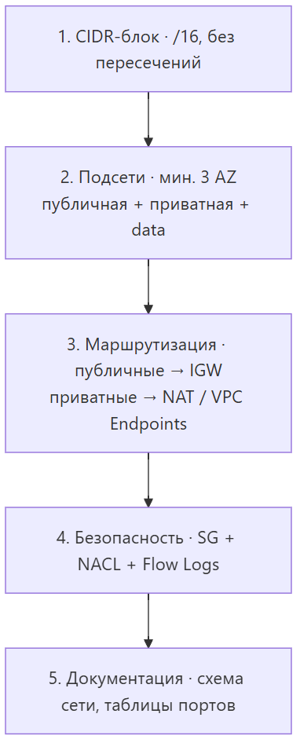

Исходник диаграммы (Mermaid)

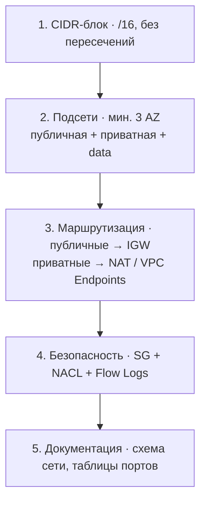
```mermaid
flowchart TD
A[1. CIDR-блок · /16, без пересечений] --> B[2. Подсети · мин. 3 AZ<br/>публичная + приватная + data]
B --> C[3. Маршрутизация · публичные → IGW<br/>приватные → NAT / VPC Endpoints]
C --> D[4. Безопасность · SG + NACL + Flow Logs]
D --> E[5. Документация · схема сети, таблицы портов]
```

- **CIDR-блок**: берите /16 — стандарт, /20 — минимум. И обязательно проверьте, что он не пересекается с существующими сетями компании, — иначе маршруты «съедят» друг друга.
- **Подсети**: минимум три зоны доступности, и в каждой — публичная подсеть /24, приватная /24 и data /24.
- **Маршрутизация**: публичные подсети → IGW; приватные → NAT Gateway или VPC Endpoints.
- **Безопасность**: Security Groups (stateful-фильтрация), NACL (stateless), и обязательно включите VPC Flow Logs.
- **Документация**: нарисуйте схему сети, сведите таблицы маршрутизации и список открытых портов. Без документации через месяц вы сами не вспомните, почему в маршруте так.

### Типичные ошибки

Теперь — классика, на которой ломаются новички:

| **#** | **Ошибка** | **Последствие** |
| --- | --- | --- |
| 1 | Слишком большой CIDR, например /8 | Раздут маршрут, сложно нарезать подсети |
| 2 | Одна подсеть на все зоны | Нет отказоустойчивости и резерва |
| 3 | Один NAT Gateway в одной AZ | Упадёт зона — встанет весь исходящий трафик |
| 4 | Нет VPC Flow Logs | «Слепые» — не видно, кто/куда ходит |
| 5 | **БД в публичной подсети** | База видна из интернета → компрометация |

- **Слишком большой CIDR**, например /8. Не надо. /16 достаточно почти всегда.
- **Одна подсеть на все зоны доступности.** Это убивает отказоустойчивость — нет резерва.
- **Один NAT Gateway в одной зоне.** Упадёт зона — встанет весь исходящий трафик.
- **Нет VPC Flow Logs.** Вы «слепые» — не видите, кто и куда ходит в вашей сети.
- И самое опасное — **БД в публичной подсети.** База видна из интернета. Это прямой путь к компрометации.

### Итоги лекции

Давайте соберём главное. Мы выяснили, что облако держится на виртуализации сетей: VLAN — для небольших сетей, VPC — для клиента, VxLAN — технология мультитенатности. Трафик распределяют ALB (уровень приложения) и NLB (уровень сети). Глобально нас ускоряют DNS-маршрутизация, CDN-кэш и Anycast, а не дают захлебнуться — Socket Saving. Связь с миром строят IGW, NAT, VPN, Direct Connect и Transit Gateway.

**Ключевая мысль сегодня:** хорошая сетевая архитектура — это когда каждая функция имеет резерв, у каждого запроса есть понятный путь, а у вас есть журналы и документация.

## Вопросы для самопроверки (раздать аудитории в конце)

- Чем VxLAN отличается от VLAN? Какие ограничения VLAN решает VxLAN?
- ALB или NLB для gRPC? А для WebSocket? Аргументируйте через уровень работы.
- Что будет с CDN, если не выставить Cache-Control? Какие данные пользователь начнёт получать?
- Сколько NAT-шлюзов нужно в production на 3 зоны доступности и почему?
- Чем Security Group отличается от Network ACL? (stateful vs stateless)
