# Лекция 5 — Хранилища данных в облаке

> 👥 **Лекция второго преподавателя.** Ниже — авторский текст лекции, он приведён без изменений.
>
> Внутри текста автор пользуется своей сквозной нумерацией — это его лекция №2. Соответствие номеров и общий план — в [README курса](../README.md). Правила сдачи и оформления отчётов в двух половинах курса различаются: см. [«Регламент курса»](../COURSE-RULES.md).

**Лабораторная:** [Лаба 5 — Хранилища данных в облаке (Block, File, Object: выбор и применение)](lab.md)

---

## Вступление
Здравствуйте, коллеги. Это вторая лекция курса «Организация и управление облачной инфраструктурой». На прошлом занятии мы построили сетевое ядро облака — разобрали виртуализацию сетей, балансировщики, шлюзы. Но сеть — это ещё не всё: по сети надо что-то передавать. И сегодня мы говорим о главном ресурсе любого облака — **о хранении данных**.

Любая компания, которая приходит в облако, рано или поздно задаёт один и тот же вопрос: а как тут хранить данные, чтобы было быстро, надёжно и дёшево? И честный ответ — это не одна технология, а целый спектр. Ошибка в выборе типа хранилища оборачивается либо переплатой в разы, либо потерянными данными. Поэтому сегодня мы навсегда разберёмся в этом вопросе.

Мы пройдём пять блоков:

- Три великих типа хранилищ — Block, File и Object.
- Конкретные сервисы и аналоги — EBS, EFS, S3.
- Производительность против стоимости — IOPS, пропускная способность, задержка.
- Распространённые сценарии — что и когда выбирать.
- Резюме, правило выбора и вопросы для самопроверки.

Вот карта лекции:

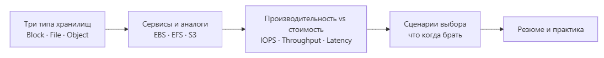

Исходник диаграммы (Mermaid)

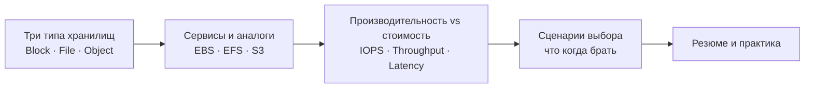

И сразу зафиксирую главную мысль на сегодня, которая пройдёт через всю лекцию: **типы хранилищ универсальны, у каждого провайдера меняются только названия.** Поймёте логику Block / File / Object — разберётесь в любом облаке, что бы там ни рекламировали.

Начнём с самого фундаментального вопроса: а какие вообще бывают типы хранилищ?

## Часть 1. Три типа хранилищ
### Block Storage — блочное хранилище

Начнём с самого низкоуровневого и производительного типа — **Block Storage**.

Представьте чистый лист бумаги, разлинованный на одинаковые квадратики-блоки. Данные разбиваются на блоки фиксированного размера, и каждый блок хранится и адресуется отдельно по своему номеру. А кто именно будет писать в эти квадратики и как их называть — решает не хранилище, а сама операционная система: она строит поверх диска файловую систему — ext4, xfs, NTFS, — создаёт таблицы файлов, индексы и права доступа.

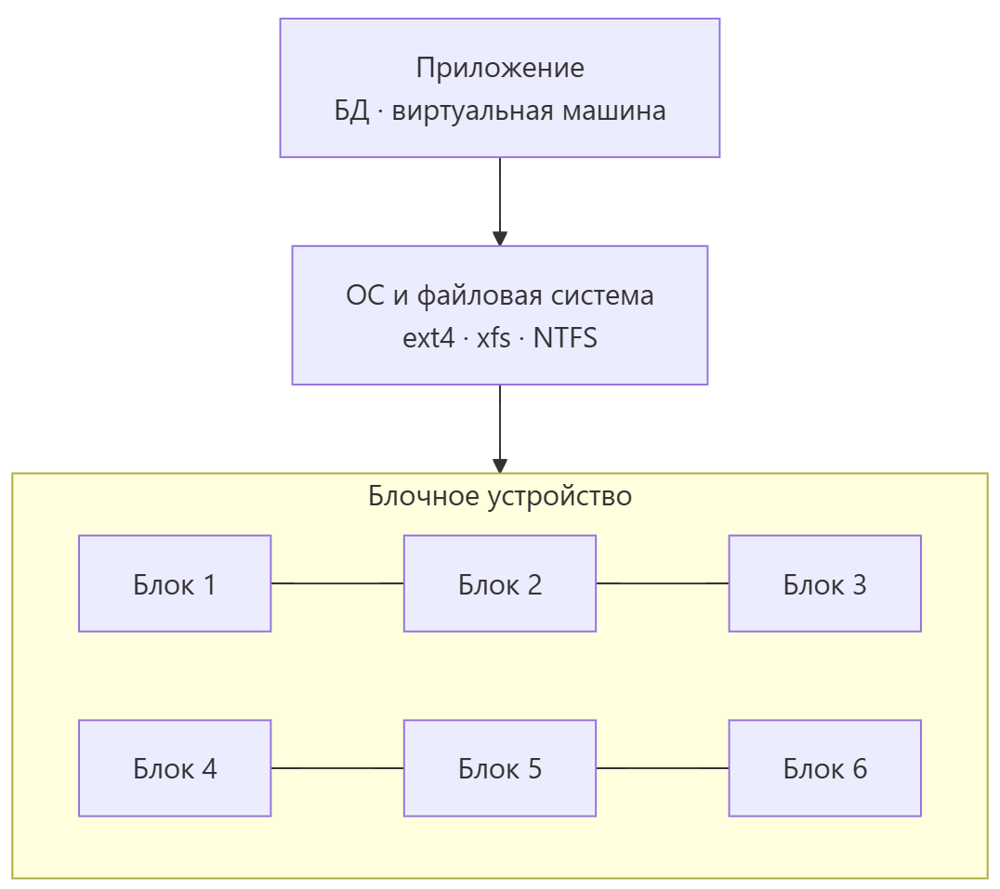

Исходник диаграммы (Mermaid)

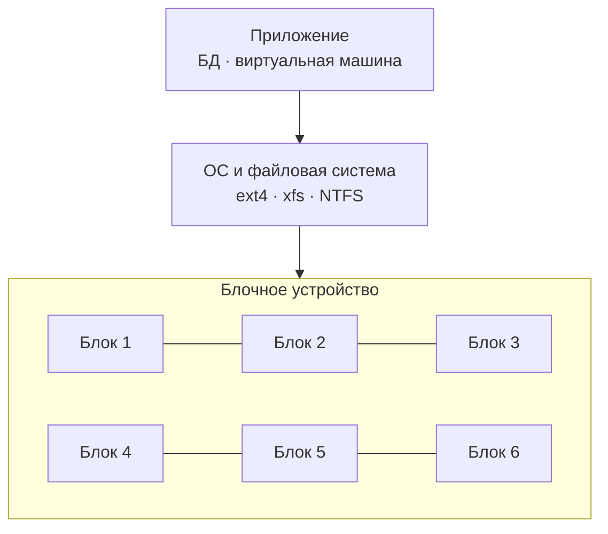

Из этого вытекают ключевые свойства блочного хранилища:

- **Низкая задержка и максимальная производительность.** Блоки адресуются напрямую, между ними нет лишнего «слоя» — ни папок, ни очередей сетевой файловой системы.
- Диск **форматируется под свою операционную систему** — без файловой системы пользоваться им нельзя.
- Он подключается **только к одной виртуальной машине**, к одному потребителю.
- Размер можно **увеличивать на лету**, без остановки виртуалки.

Когда берут блочное хранилище? Когда критична скорость и предсказуемая задержка: **базы данных, корневые диски виртуальных машин, приложения с интенсивным случайным доступом.** Конкретный сервис в AWS — **EBS**.

Но у блока есть важное ограничение: нельзя одновременно отдать один блочный диск нескольким машинам. Именно ради этого существует следующий тип.

**Вопрос аудитории:** почему один блочный диск нельзя примонтировать сразу к нескольким виртуальным машинам? (пауза) Потому что файловая система не умеет работать с общим диском без специальных кластерных решений — а для этого уже есть файловое хранилище.

### File Storage — файловое хранилище

**File Storage** поднимается на уровень выше. Данные здесь организованы как на обычном компьютере — иерархия «папка → подпапка → файл», — но доступ к ним получают **сразу несколько серверов по сети**. Стандартные протоколы доступа — **NFS** (для систем на Unix/Linux) и **SMB** (который раньше называли CIFS, популярен в Windows-среде).

Визуально это общая сетевая папка, к которой подключены сразу несколько машин, и все видят одни и те же файлы и папки.

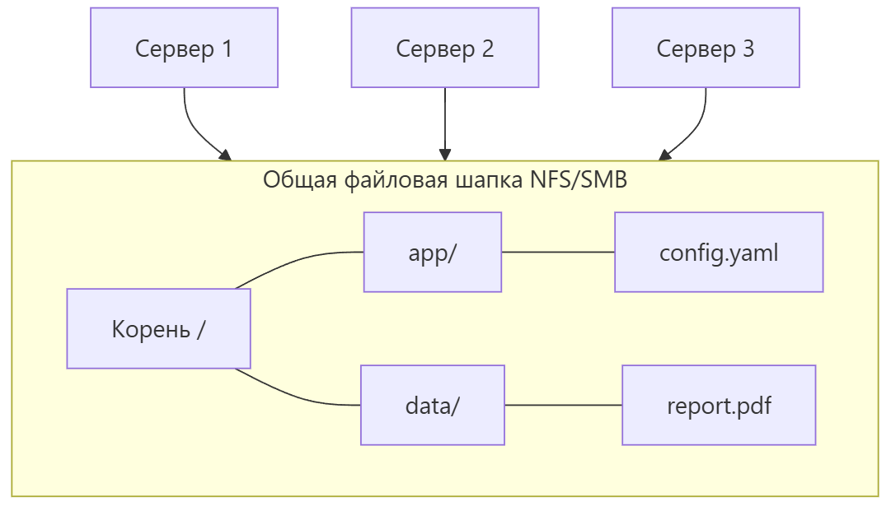

Исходник диаграммы (Mermaid)

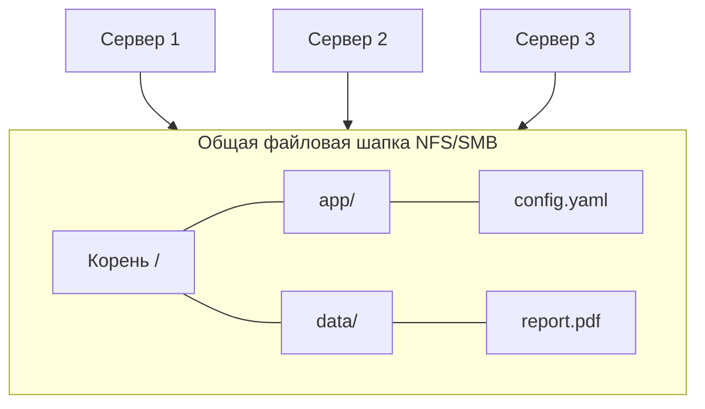

Свойства файлового хранилища:

- **Много потребителей одновременно** — несколько виртуальных машин монтируют одно хранилище.
- **Нативная интеграция** — сетевые файловые системы ОС поддерживают иерархию, права, блокировки, всё работает как с обычной папкой.
- Отлично подходит для **совместного доступа** между серверами.

Когда берут файловое хранилище? Общие каталоги приложений, веб-фермы, где несколько серверов обязаны видеть один каталог, контент общего доступа. Сервис в AWS — **EFS** на базе NFS.

Но и тут есть цена: иерархия папок и блокировки — это накладные расходы. Поэтому по производительности файловое хранилище уступает блочному, и его сложно масштабировать на петабайты с миллионами крошечных файлов. А вот для чего нужно именно такое гигантское масштабирование — про это третий тип.

### Object Storage — объектное хранилище

**Object Storage** — самый современный и по-настоящему масштабируемый тип. Здесь нет ни файловых систем, ни блочной адресации, ни папок. Вместо этого — **объекты**. Каждый объект — это три вещи: сами **данные**, уникальный **ключ** (имя, по которому его находят) и **метаданные** (описание — тип, размер, дата).

Представьте гигантскую библиотеку без полок и каталогизации в привычном смысле. Вместо «полка → тема → папка → файл» у каждого экземпляра есть уникальный номер — по этому ключу вы его достанете прямо через HTTP.

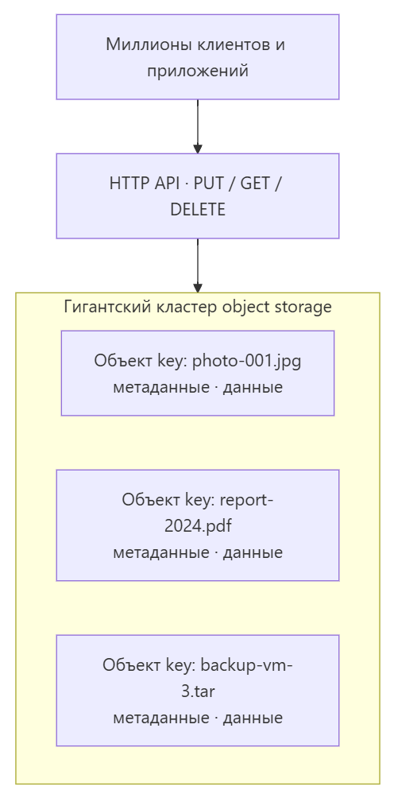

Исходник диаграммы (Mermaid)

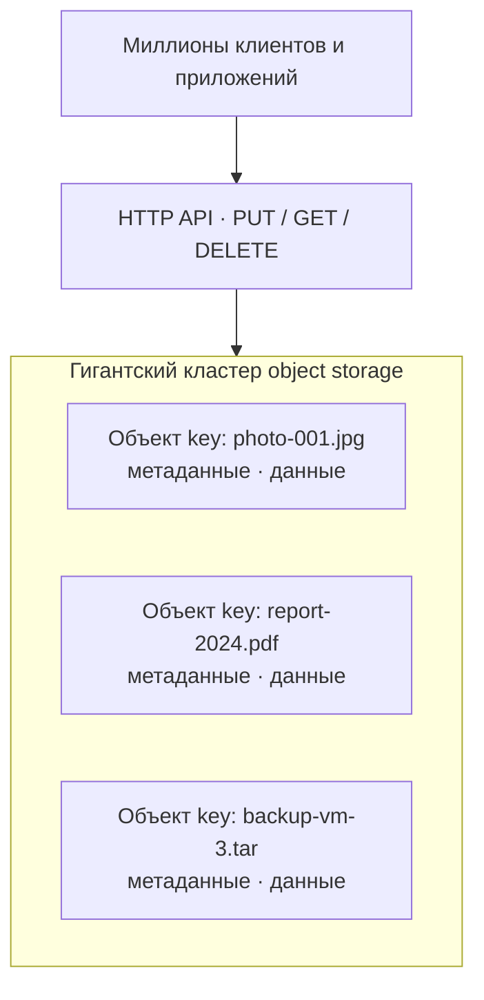

Свойства объектного хранилища:

- **Абсолютная масштабируемость** — петабайты и экзабайты, триллионы объектов. Это принципиально другое устройство, чем диск.
- Доступ идёт через **HTTP API** — по стандарту REST и совместимому с S3 протоколу.
- **Самая низкая стоимость на гигабайт** среди всех трёх типов.
- **Высокая надёжность** — данные реплицируются между зонами и даже регионами.

Честно скажем и о недостатках: **нет блокировок, нет транзакций**, а случайный доступ к конкретному объекту медленнее, чем к блоку. Поэтому объектное хранилище не заменяет EBS для базы данных — оно решает свои задачи.

Когда берут? Бэкапы, архивы, статические файлы для CDN, изображения, видео, логи, большие хранилища данных — Data Lake. Сервис в AWS — **S3**, у других провайдеров свои названия.

### Итог части 1 — сравнительная таблица

Сведём первую часть в одну таблицу — сохраните её как шпаргалку на всю практику.

| **Характеристика** | **Block Storage** | **File Storage** | **Object Storage** |
| --- | --- | --- | --- |
| Уровень | Низкий (блоки) | Средний (файлы+папки) | Высокий (объекты/HTTP) |
| Единица данных | Блок | Файл | Объект (ключ + метаданные) |
| Число потребителей | 1 виртуальная машина | Много машин (NFS/SMB) | Бесконечно (HTTP API) |
| Протокол | SCSI / NVMe | NFS / SMB | HTTPS / S3 API |
| Скорость | Максимальная | Средняя | Зависит от сценария |
| Стоимость | Высокая | Средняя | Самая низкая |
| Пример | EBS | EFS | S3 |

Обратите внимание на закономерность, к которой мы ещё вернёмся: **чем ниже уровень хранилища — Block, затем File, затем Object — тем выше производительность, но и выше цена за гигабайт.**

**Вопрос аудитории:** какой тип вы бы выбрали для бэкапов на петабайты, а какой — для высоконагруженной базы данных? (пауза) Для бэкапов — объектное, для базы — блочное. Запомните эту логику, она будет вести нас до конца лекции.

## Часть 2. Сервисы и аналоги: EBS, EFS, S3
Теория готова. Переходим к практике — к конкретным сервисам, которые вы будете выбирать и настраивать. Основной акцент — на экосистему AWS, там самая полная и понятная линейка. Но параллельно я называю аналоги в Yandex Cloud, VK Cloud, Azure и Google. И повторяю главное: **логика везде одна, меняются только названия.**

### EBS — Elastic Block Store

Начнём с блочного хранилища AWS — сервиса **EBS**, Elastic Block Store.

Каждый том EBS — это виртуальный диск, который подключается к одному EC2-инстансу. Для защиты от отказа оборудования данные внутри тома реплицируются в рамках зоны доступности.

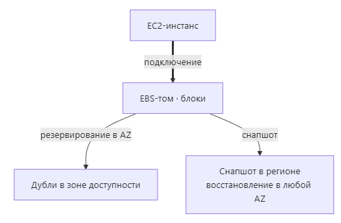

Исходник диаграммы (Mermaid)

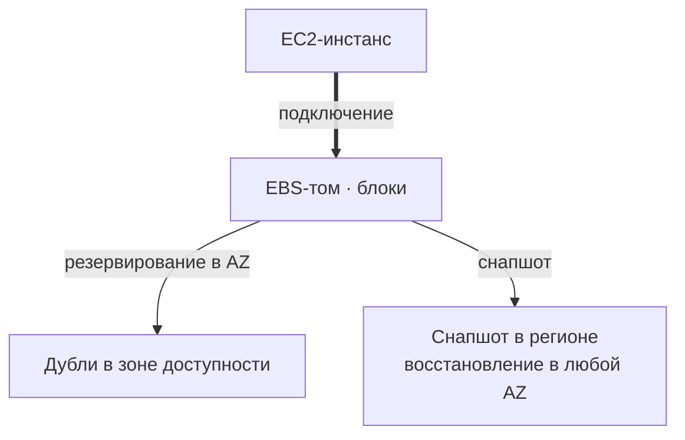

У EBS несколько типов томов под разные задачи:

- **gp3** — general purpose, третьего поколения. Базовый вариант: SSD-диск с 3000 IOPS и 125 мегабайт в секунду по умолчанию, показатели поднимаются до 16000 IOPS и 1000 мегабайт в секунду. Рабочий конь для большинства нагрузок.
- **io2 и io1** — provisioned IOPS, уровень ввода-вывода задаётся вручную и гарантируется, вплоть до сотен тысяч операций. Для mission-critical баз данных, где производительность должна быть предсказуемой.
- **st1 и sc1** — дешёвые HDD-диски большого объёма для последовательного чтения и архивов, которым скорость не критична.

Отдельно — про **снапшоты**. Это резервные копии томов на уровне AWS. Ключевое свойство: снапшот живёт не в зоне доступности, а **в регионе**, поэтому его можно использовать для восстановления инстанса в любой зоне доступности того же региона. Это основа аварийного восстановления.

Аналоги EBS у других провайдеров: в Yandex Cloud — **Compute Disks**, в VK Cloud — **Volumes**, в Azure — **Managed Disks**, в Google Cloud — **Persistent Disk**. Все это блоки, все подключаются к одной виртуальной машине.

### EFS — Elastic File System

Следующий уровень — сервис **EFS**, Elastic File System. Это файловое хранилище AWS на базе протокола **NFSv4**.

Главное отличие от EBS: EFS живёт внутри вашей VPC и монтируется **сразу на несколько EC2-инстансов одновременно**. Это и есть общая сетевая шапка.

Исходник диаграммы (Mermaid)

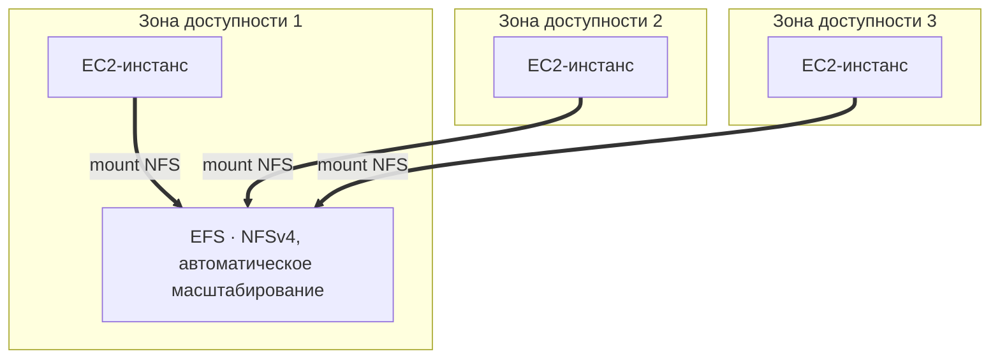

Ключевые черты EFS:

- **Автомасштабирование** — объём растёт и сжимается сам, вы платите только за фактически использованное пространство, ничего заранее выделять не нужно.
- **Хранится в нескольких зонах доступности** — высокая надёжность.
- Два класса производительности: **General Purpose** — стандартный, задержка около 10 миллисекунд; и **Max I/O** — производительнее, но запись идёт через прокси-ноду.

Кому нужен EFS? Веб-фермам, где несколько серверов обязаны видеть один общий каталог, контейнерным приложениям и любой системе, которой нужна общая файловая шапка.

Аналоги: в Azure — **Azure Files**, в Google — **Filestore**, в Yandex Cloud — файловые хранилища. Та же логика File, другое имя.

### S3 — Simple Storage Service

И наконец, флагман AWS и фактический мировой стандарт объектного хранения — **S3**, Simple Storage Service.

Принцип: вы создаёте **бакеты** (buckets), а внутри бакета лежат **объекты** — данные плюс ключ плюс метаданные. Всё работает через HTTP API и официальные SDK, поэтому S3 поддерживают практически все языки и платформы.

Что S3 даёт из коробки:

- **Шифрование** — серверное шифрование с ключами AWS (SSE-S3, SSE-KMS) или собственными клиентскими ключами (SSE-C). Данные хранятся зашифрованными без лишней возни.
- **Версионирование** — хранит всю историю версий объекта, защищает от случайного перезаписывания и удаления.
- **Мультизагрузка** — большие файлы режутся на части и загружаются параллельно; это ускоряет передачу и снижает риск прерывания.

А самое важное для практики — **классы хранения**. S3 умеет автоматически двигать объекты между уровнями по частоте доступа, и каждый следующий уровень дешевле предыдущего.

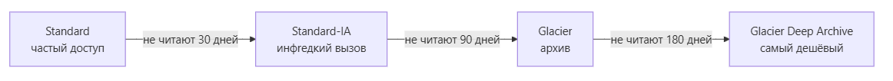

Исходник диаграммы (Mermaid)

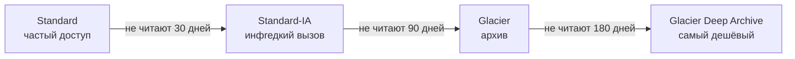

Прогуляемся по классам от горячего к холодному:

- **S3 Standard** — горячие данные, которые читают часто. Самая высокая цена за гигабайт, зато быстрый мгновенный доступ.
- **S3 Intelligent-Tiering** — умный уровень: сервис сам следит за частотой обращений и автоматически двигает объект между дорогим и дешёвым уровнями. Вы ничего не настраиваете.
- **S3 Standard-IA** — для инфrедко читаемых данных. Значительно дешевле, но есть небольшая плата за доступ к каждому объекту.
- **S3 Glacier** — архив. Доступ к объекту занимает несколько минут.
- **S3 Glacier Deep Archive** — самый дешёвый архив, доступ готовится до 12 часов. Всё ради максимальной экономии.

На этих классах строится **жизненный цикл данных**: вы задаёте правило — например, «если объект не читали 30 дней, перенести в Standard-IA; если 90 дней — в Glacier» — и S3 выполняет его автоматически, экономя деньги по мере «остывания» данных.

Плюс есть **S3 Select и Glacier Select** — выполнение SQL-запросов прямо внутри объекта, без скачивания целиком. Удобно, когда нужно выбрать несколько строк из огромного файла.

Аналоги S3 повсюду: в Yandex Cloud — **Object Storage**, в VK Cloud — **Cloud Storage**, в Azure — **Blob Storage**, в Google — **Cloud Storage (GCS)**, а для собственного кластера — **MinIO**. Все совместимы с S3 API, что упрощает перенос.

### Сравнение трёх сервисов

Сведём выбор трёх сервисов, чтобы зафиксировать.

|  | **EBS (Block)** | **EFS (File)** | **S3 (Object)** |
| --- | --- | --- | --- |
| Единица данных | Блок | Файл / папка | Объект (ключ + метаданные) |
| Потребителей | 1 EC2 | N EC2 | Безгранично / HTTP |
| Протокол | NVMe | NFSv4 | HTTP REST / S3 API |
| Масштабируемость | Вручную (том) | Автоматически | Петабайты+ |
| Стоимость на ГБ | Высокая | Средняя | Низкая |
| Задержка | Минимальная | ~10 мс | Зависит от класса |
| Резерв | Снапшот (в регионе) | Много зон AZ | Репликация в регионе |

**Вопрос аудитории:** какой сервис AWS вы возьмёте, чтобы несколько веб-серверов видели один и тот же каталог? (пауза) Верно, EFS. А чтобы сдать на хранение многолетний архив и платить минимум — S3 с классов Glacier. Логика складывается.

## Часть 3. Производительность vs стоимость
Краткий, но важный блок: как правильно балансировать между производительностью и ценой.

Хранилище оценивают по трём осям:

- **IOPS** — количество операций ввода-вывода в секунду. Важно для базы данных, где постоянно идут мелкие случайные чтения и записи.
- **Throughput** — пропускная способность, мегабайты в секунду при последовательной передаче. Важно для видеофайлов, бэкапов, передачи больших объёмов.
- **Latency** — задержка, миллисекунды от запроса до ответа. Критично для транзакционных приложений, где каждая миллисекунда на счету.

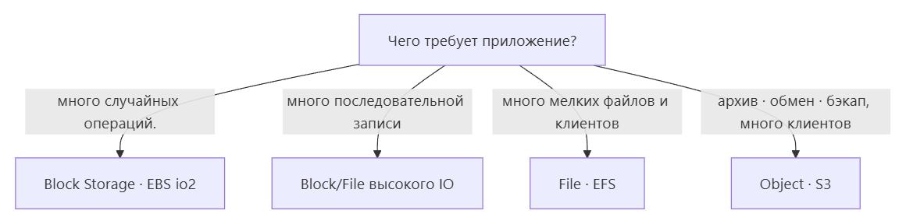

Исходник диаграммы (Mermaid)

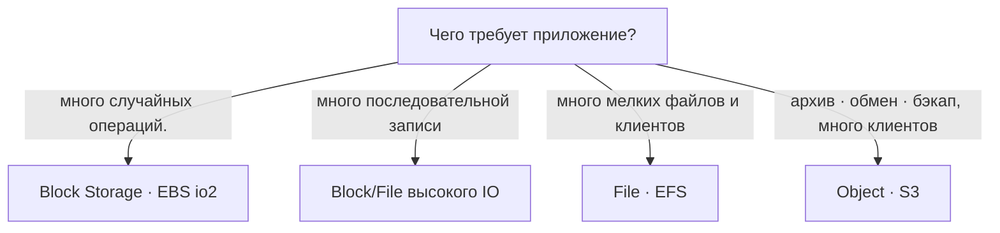

Правило, которое стоит запомнить раз и навсегда: **чем ниже уровень хранилища — Block, затем File, затем Object — тем дороже за терабайт, но тем выше производительность.** Block быстрее, но дороже; Object медленнее, но существенно дешевле.

Поэтому грамотная архитектура почти никогда не строится на одном типе. Это почти всегда **микс**: на активных данных — Block, для совместного доступа — File, для бэкапов и архивов — Object. Так вы платите ровно за то, что нужно, и не переплачиваете.

## Часть 4. Распространённые сценарии
Закрепим выбор на реальных задачах. Разберём четыре типовые.

### Веб-приложение с CDN

- Вся статика — изображения, стили, скрипты — идёт в **S3** и раздаётся через **CDN**. Это дёшево и масштабируется автоматически, какой бы всплеск трафика ни случился.
- А корневые диски виртуальных машин, которые выполняют логику, — на **EBS gp3**, чтобы системное хранилище работало быстро.

### Высоконагруженная база данных

- Лучший вариант — **EBS io2** с гарантированными provisioned IOPS, потому что для БД критична предсказуемая задержка.
- Либо готовый сервис **RDS** — Amazon Relational Database Service, с автоматическими бэкапами и управляемыми снапшотами. Снапшоты томов делаем регулярно.

### Совместная работа нескольких серверов с общим каталогом

- Здесь нужен **EFS** по NFS. Несколько EC2-инстансов монтируют один общий диск.

### Бэкапы и архивы на петабайты

- Это зона **S3** с жизненными циклами: горячий класс → Standard-IA → Glacier. Версионирование включаем обязательно — оно защитит от случайного удаления и сохранит историю версий.

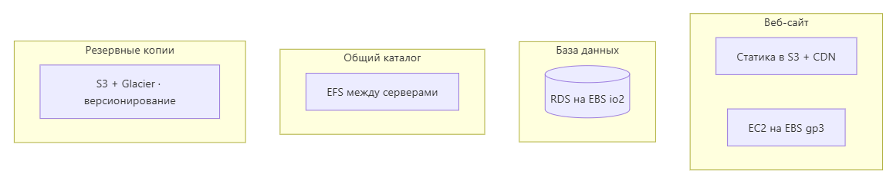

Исходник диаграммы (Mermaid)

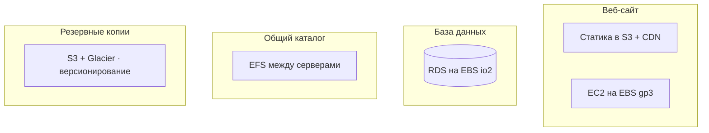

Если посмотреть на схему целиком: статика и бэкапы живут в объектных хранилищах, рабочие машины — на блочных дисках, общий каталог — на файловом хранилище. Ничего не лежит там, где ему не место.

## Часть 5. Резюме и правила выбора
Подводим итоги. Сегодня мы прошли путь от теории трёх типов до практических сервисов. Фиксируем главное.

**По типам:**

- **Block** — один диск на одну машину, максимальная скорость. Пример — EBS.
- **File** — общая шапка на много машин через NFS/SMB. Пример — EFS.
- **Object** — безграничный масштабируемый архив на петабайты, доступ через HTTP/S3 API, самый дешёвый. Пример — S3.

**По связке производительности и цены:** производительность и стоимость обратно пропорциональны. Быстрее — дороже, дешевле — медленнее. Для каждой задачи решаете, что важнее.

**По конкретному выбору:**

- Средняя нагрузка без жёстких требований → **EBS gp3**.
- База данных с гарантированными IOPS → **EBS io2**.
- Сетевой общий доступ между серверами → **EFS**.
- Архив, обмен, бэкапы, Data Lake → **S3**.

И короткая мнемоника, чтобы это никогда не забыть:

> **Блок — для скорости, Файл — для общего доступа, Объект — для масштаба и денег.**

Когда вы через месяц будете выбирать хранилище для реальной задачи, пройдитесь по чек-листу вопросов:

- Сколько потребителей будет читать и писать — один, несколько или бесконечно много?
- Какая задержка допустима — миллисекунды, сотни миллисекунд или секунды?
- Нужен ли случайный доступ к данным или это последовательная передача?
- Какой объём и какой класс хранения уместен?
- Есть ли требования к резервным копиям и архиву, нужен ли жизненный цикл?
- И главное — какой бюджет на гигабайт заложен?

**Вопросы для самопроверки (раздать аудитории в конце)**

- Назовите три типа хранилищ и какой уровень они обслуживают.
- Почему блочный диск нельзя отдать сразу нескольким виртуалкам, а файловое хранилище можно?
- Где хранится снапшот EBS — в зоне доступности или в регионе?
- Перечислите классы хранения S3 от горячего к холодному.
- Чем S3 Select и Glacier Select упрощают работу с данными?
- Назовите аналоги EBS, EFS и S3 в Yandex Cloud и VK Cloud.
- Сформулируйте правило выбора хранилища одной фразой.

На этом лекция завершена. Спасибо за внимание. Вопросы — сейчас или на следующем занятии. Практическое закрепление материала вас ждёт в лабораторной работе по облачным хранилищам.
