# Лекция 7 — Безопасность облачной инфраструктуры

**Лабораторная:** [Лаба 7 — Безопасность облачной инфраструктуры](lab.md)

---

## Вступление

Здравствуйте, коллеги. Это седьмая лекция курса «Облачная инфраструктура». В лекции 3 мы строили сетевую архитектуру, в лекции 5 — разбирались с хранилищами данных. Сегодня поговорим о том, что пронизывает всё это насквозь, — о безопасности облачной инфраструктуры.

Важно сразу договориться: безопасность в облаке — это НЕ ответственность только провайдера. Это разделённая ответственность. Вы не можете просто «включить облако и забыть». Если захостить базу данных в публичной подсети без ограничений — это не провайдер взломается, а вы потеряете данные. Поэтому сегодня мы разберём, на ком что лежит, как управлять доступом, где хранить секреты, как шифровать и как фильтровать трафик.

У нас пять блоков:

- Shared Responsibility Model — модель разделённой ответственности.
- IAM — роли, политики, сервисные аккаунты.
- Secrets Management — HashiCorp Vault и AWS Secrets Manager.
- Шифрование — in-transit / at-rest, KMS.
- Сетевая фильтрация — Security Groups, Network ACL, WAF.

Такая логическая карта лекции:

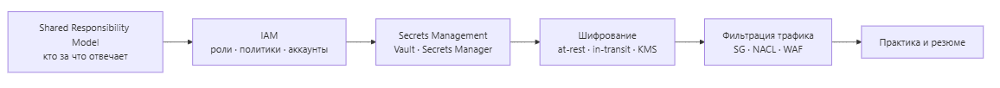

Исходник диаграммы (Mermaid)

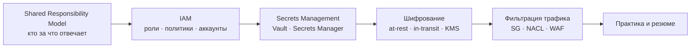
```mermaid
flowchart LR
A[Shared Responsibility Model<br/>кто за что отвечает] --> B[IAM<br/>роли · политики · аккаунты]
B --> C[Secrets Management<br/>Vault · Secrets Manager]
C --> D[Шифрование<br/>at-rest · in-transit · KMS]
D --> E[Фильтрация трафика<br/>SG · NACL · WAF]
E --> F[Практика и резюме]
```

Начнём с фундаментального вопроса: а кто вообще отвечает за безопасность?

## Часть 1. Shared Responsibility Model

### Проблема: «я просто заплатил за облако, кому что от меня нужно?»

Многие приходят в облако с мыслью «провайдер всё защитит». Это опасное заблуждение. Реальность такова: у вас и у провайдера есть **разные зоны ответственности**, и если провайдер не выполнит свою часть — рухнет вся инфраструктура, а если вы не выполните свою — утекут ваши данные.

### Суть модели

Идея простая: ответственность делится по принципу «**облако ОБЕСПЕЧИВАЕТ безопасность облака, клиент — безопасность В облаке**» (Security of the Cloud vs Security in the Cloud).

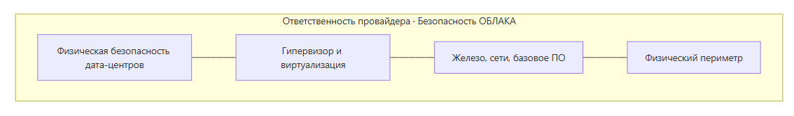

Исходник диаграммы (Mermaid)

```mermaid
flowchart TB
subgraph Provider ["Ответственность провайдера · Безопасность ОБЛАКА"]
P1["Физическая безопасность дата-центров"]
P2["Гипервизор и виртуализация"]
P3["Железо, сети, базовое ПО"]
P4["Физический периметр"]
end
subgraph Client ["Ответственность клиента · Безопасность В ОБЛАКЕ"]
C1["Данные и их классификация"]
C2["Доступы: IAM, пароли, ключи"]
C3["Настройка Security Groups и NACL"]
C4["Шифрование данных"]
C5["Конфигурация приложений"]
C6["ОС виртуальных машин и их патчи"]
end
P1 --- P2
P2 --- P3
P3 --- P4
C1 --- C2
C2 --- C3
C3 --- C4
C4 --- C5
C5 --- C6
```

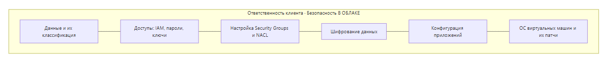

**Что на провайдере:** физическая безопасность дата-центров, гипервизор, железо, базовые сети, виртуализация.

**Что на клиенте:** данные, доступы, настройка групп безопасности, шифрование, конфигурация приложений и — важно — патчи операционной системы виртуальных машин. ОС — это ваша зона, провайдер лишь предоставляет железо.

### Ключевой провал — «И на чьей же стороне эта брешь?»

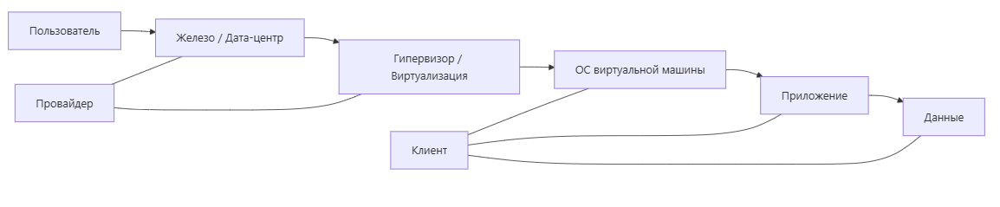

Исходник диаграммы (Mermaid)

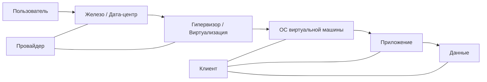
```mermaid
flowchart LR
U[Пользователь] --> HW[Железо / Датa-центр]
HW --> VT[Гипервизор / Виртуализация]
VT --> OS[ОС виртуальной машины]
OS --> APP[Приложение]
APP --> DATA[Данные]
P1[Провайдер] --- HW
P1 --- VT
C[Клиент] --- OS
C --- APP
C --- DATA
```

Обратите внимание: **граница ответственности проходит ровно посередине — на уровне гипервизора**. Всё, что ниже (железо, сеть, дата-центр) — провайдер. Всё, что выше (ОС, приложения, данные) — вы.

**Пример для разбора:** если произошёл сбой электроснабжения в дата-центре — это провайдер восстановит. Но если через вашу неправильно настроенную Security Group к вам в базу зашёл хакер — это ваша зона ответственности, и списать на провайдера не выйдет.

### Перечень обязанностей: быстрые таблицы для аудитории

**Провайдер:**

| **Зона** | **Что входит** |
| --- | --- |
| Физическая | Датa-центры, охлаждение, питание, охрана |
| Виртуализация | Гипервизор, изоляция клиентов |
| Аппаратная | Серверы, сети, хранилища |
| Облачные сервисы | S3, RDS, Lambda работают «из коробки» |

**Клиент:**

| **Зона** | **Что входит** |
| --- | --- |
| Данные | Классификация, доступ, шифрование |
| Доступы | Аккаунты, пароли, ключи, IAM-политики |
| Сеть в своей VPC | Security Groups, NACL, подсети |
| ОС | Патчи, настройка, пользователи VM |
| Приложения | Код, зависимости, конфигурация |

**Вопрос аудитории:** как думаете, кто отвечает за переустановку скомпрометированного сервера с вашей CMS? (пауза) Правильно — вы, клиент. Провайдер предоставит диск, а восстановить образ и поставить патчи вы обязаны сами.

### Три ошибки в распределении ответственности

- **«Провайдер всё защитит»** — клиент не настраивает безопасность, потом утечка.
- **«Я всё сам»** — клиент берёт на себя и защиту железа, думая, что сам владеет физикой.
- **Граница «провела» неправильно** — перекладывают ОС-патчи на провайдера и наоборот.

**Итог части 1:** запомните формулу — *Security of the Cloud* на провайдере, *Security in the Cloud* на клиенте. Граница — гипервизор.

## Часть 2. IAM: роли, политики, сервисные аккаунты

Для безопасности нужно в первую очередь управлять доступом — кто и что может делать. Этим занимается **IAM — Identity and Access Management** (в AWS — служба управления удостоверениями и доступом).

### Базовые понятия IAM

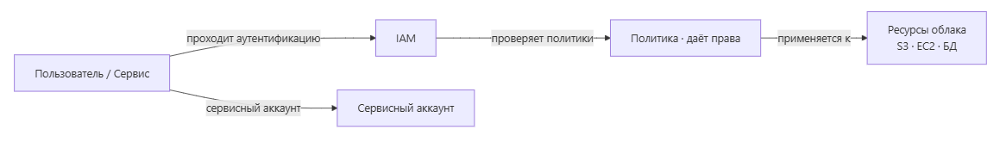

Исходник диаграммы (Mermaid)

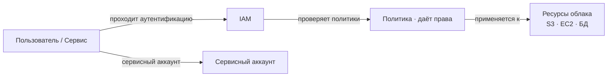
```mermaid
flowchart LR
U[Пользователь / Сервис] -->|"проходит аутентификацию"| IAM[IAM]
IAM -->|"проверяет политики"| POL[Политика · даёт права]
POL -->|"применяется к"| RES[Ресурсы облака<br/>S3 · EC2 · БД]
U -->|"сервисный аккаунт"| SA[Сервисный аккаунт]
```

- **User (пользователь)** — это либо человек, либо приложение (в облаке — сервисный аккаунт). Идентифицируется по логину/паролю или по ключам.
- **Group (группа)** — набор пользователей с общими правами. Например, группа «дев-инженеры».
- **Role (роль)** — временный набор прав, который «принимают» на себя пользователи или сервисы.
- **Policy (политика)** — правила, которые разрешают или запрещают действия над ресурсами.
- **Service Account (сервисный аккаунт)** — отдельный аккаунт для программ/подписок.

### Как устроена политика (Policy) — базовое правило в JSON

Политика — это JSON-документ, который описывает «кто (principal), что (action), над чем (resource) и при каком условии (condition)». Посмотрите на типовое правило:

{

"Version": "2012-10-17",

"Statement": [

{

"Effect": "Allow",

"Action": "s3:PutObject",

"Resource": "arn:aws:s3:::my-backup-bucket/*",

"Condition": {

"IpAddress": {"aws:SourceIp": "10.0.0.0/24"}

}

}

]

}

Разберём строку за строкой:

- Effect: Allow — разрешаем (либо Deny — запрещаем, Deny перекрывает Allow).
- Action: s3:PutObject — разрешаем действие «положить объект».
- Resource — только в бакет my-backup-bucket.
- Condition — только с IP из диапазона 10.0.0.0/24.

Ключевое правило IAM (правило «явного запрета»): **по умолчанию всё запрещено**, а разрешения добавляются явно. При этом если сработал Deny — он всегда главнее любого Allow. Запомните этот приоритет:

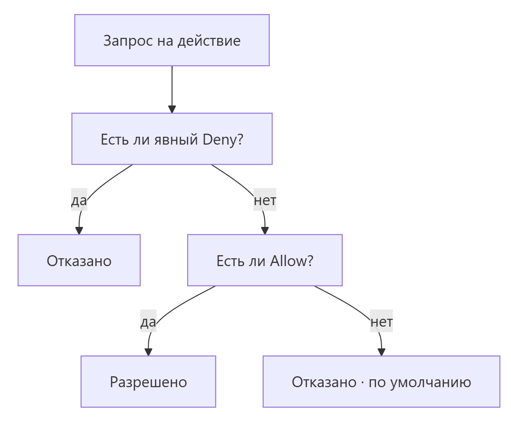

Исходник диаграммы (Mermaid)

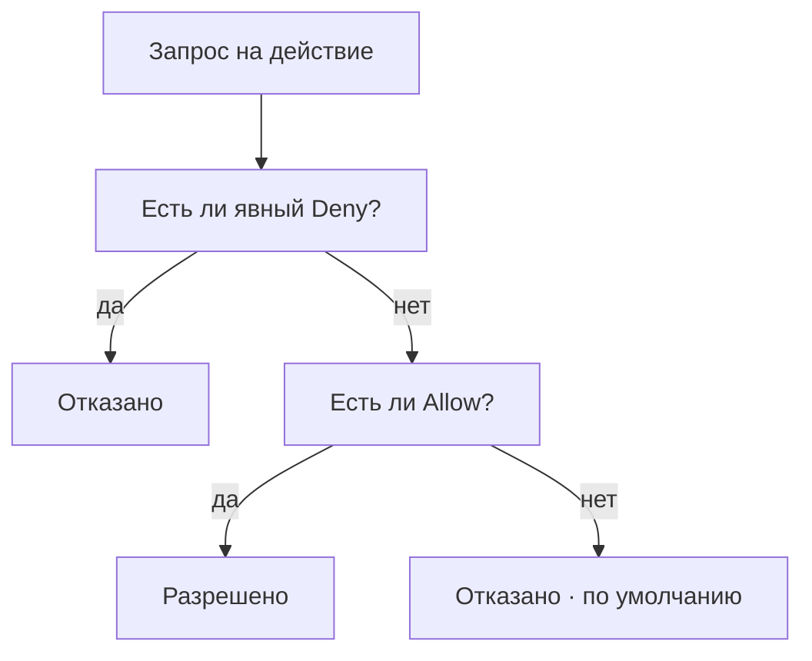
```mermaid
flowchart TD
Q[Запрос на действие] --> D[Есть ли явный Deny?]
D -->|да| NO[Отказано]
D -->|нет| A[Есть ли Allow?]
A -->|да| YES[Разрешено]
A -->|нет| NO2[Отказано · по умолчанию]
```

### Типы пользователей и сервисные аккаунты

**Сервисный аккаунт** — это не человек, а «машинная личность» для скриптов, приложений и DevOps-инструментов. У него есть секретные ключи (Access Key ID + Secret Access Key). Сервисный аккаунт и пользователь-человек — это разные сущности, их не стоит путать:

| **Сущность** | **Кто это** | **Как подтверждает личность** |
| --- | --- | --- |
| Пользователь (IAM User) | Человек | Пароль + MFA, или ключи |
| Сервисный аккаунт | Приложение / CI/CD | Секретные ключи |
| Роль (IAM Role) | Временные права | Принимается пользователем/сервисом |

**Практический совет:** для сервисных аккаунтов выдавайте **минимально необходимые права** (принцип least privilege) и **регулярно ротируйте ключи** — раз в 90 дней. Один затерявшийся ключ — потенциальная дыра.

### Роли и принцип минимальных привилегий

Принцип **least privilege** (минимальных привилегий) гласит: давайте ровно столько прав, сколько нужно для работы, — и ни граммом больше. Если скрипт лишь кладёт файлы в один бакет, не давайте ему праве администратора всего облака.

- **Отлично:** у каждого сервиса своя роль.
- **Плохо:** один ключ суперадминистратора на всё.

**Варианты в облаке:**

| **Решение** | **Описание** |
| --- | --- |
| AWS IAM Users | Люди и сервисы с паролями/ключами |
| IAM Roles | Временные права, безопаснее длинных ключей |
| Managed Policies | Готовые шаблоны политик от облака |
| Custom Policies | Свои JSON-политики |

### Сценарий на практике: как звучит «правильный» доступ

Представьте DevOps-задачу: «CI-серверу нужно публиковать в ваш S3-бакет». Плохой вариант — дать ключу суперпользователя. Правильный — создать сервисный аккаунт и прикрепить роль с точечной политикой:

{

"Effect": "Allow",

"Action": ["s3:PutObject", "s3:GetObject"],

"Resource": "arn:aws:s3:::artifacts-prod/*"

}

Только на один бакет, только два действия, без права на удаление и без доступа к другим ресурсам.

### Типичные ошибки IAM

- **Ключ суперадминистратора на каждый чих** — компрометация одного ключа = потеря всего учётного окружения.
- **Много долгоживущих ключей без ротации** — затерялись секреты в репозиториях.
- **Не используют роли** — держат длинные статичные ключи, хотя можно было взять временную роль.
- **Нет MFA** — доступ защищён только паролем.
- **Широкие * в ресурсах** — вместо конкретных бакетов пропитан доступ «куда угодно».

**Итог части 2:** IAM — это решающий инструмент контроля доступа: пользователи, группы, роли, политики и сервисные аккаунты. Ключевые принципы — минимальные привилегии, явный Deny, ротация ключей и MFA.

## Часть 3. Secrets Management: HashiCorp Vault и AWS Secrets Manager

Пароли, ключи API, токены, строки подключения к базам — всё это **секреты**. Если держать их прямо в конфиг-файле приложения или в коде — это бомба замедленного действия. Поэтому секреты выносят в **специализированные хранилища** — Secret Management.

### Проблема: секреты в коде — это плохо

Представьте: пароль от прод-базы лежит в config.js и закоммичен в git. Всё, репозиторий утёк или стал публичным — пароль ушёл. Автоматически его не отозвать, и всем придётся менять пароль вручную. Это классика.

Правильный подход — держать секреты отдельно, в защищённом хранилище, и выдавать приложению по запросу, с шифрованием и аудитом доступа.

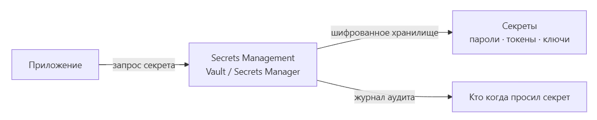

Исходник диаграммы (Mermaid)

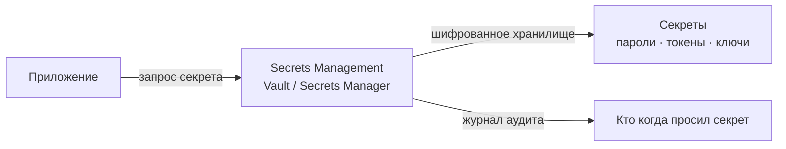
```mermaid
flowchart LR
App[Приложение] -->|"запрос секрета"| SM[Secrets Management<br/>Vault / Secrets Manager]
SM -->|"шифрованное хранилище"| KV[Секреты<br/>пароли · токены · ключи]
SM -->|"журнал аудита"| LOG[Кто когда просил секрет]
```

### Вариант 1: HashiCorp Vault — самодостаточный инструмент

Vault — это open-source решение от HashiCorp. Работает поверх любого секрета: умеет динамически генерировать секреты, выпускать временные токены, которые можно отозвать в любой момент.

**Особенности Vault:**

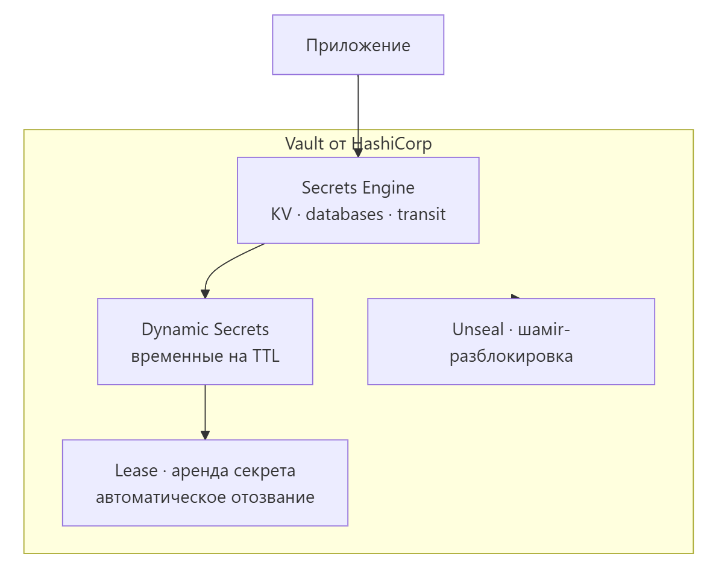

Исходник диаграммы (Mermaid)

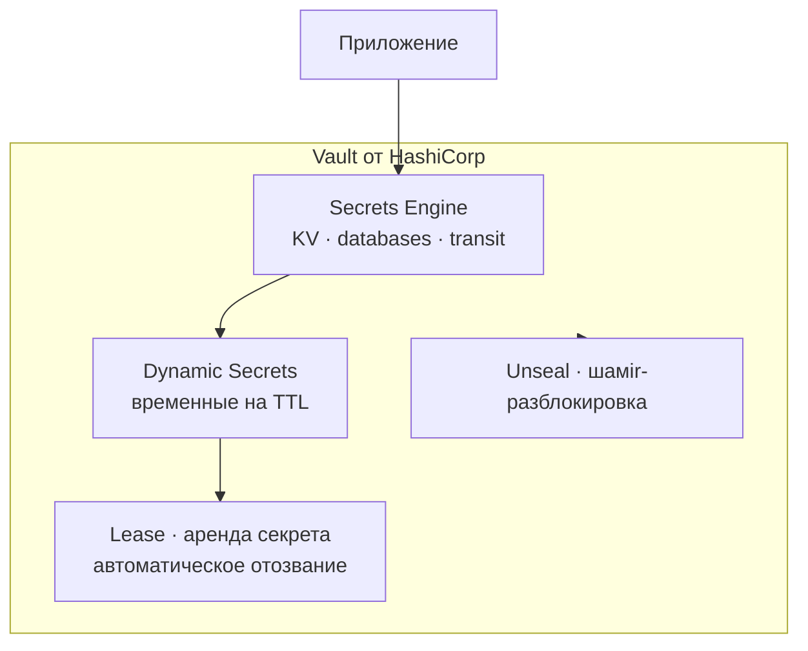
```mermaid
flowchart TB
subgraph Vault [Vault от HashiCorp]
S[Secrets Engine<br/>KV · databases · transit]
T[Dynamic Secrets<br/>временные на TTL]
L[Lease · аренда секрета<br/>автоматическое отозвание]
A[Unseal · шамir-разблокировка]
end
U1[Приложение] --> S
S --> T
T --> L
Vault --> A
```

- **Secrets Engine** — типизация секрета: ключ-значение, базы данных, шифрование данных (transit).
- **Dynamic Secrets** — Vault генерирует пароль для БД «на лету», со сроком жизни. Когда срок кончился (TTL) — секрет автоматически отзывается и больше не действителен. Это лучше статичных паролей: взломанный токен просто истекает.
- **Lease (аренда)** — каждый выданный секрет имеет срок аренды, после которого автоматически удаляется.
- **Unseal** — для доступа к хранилищу нужна «разблокировка» несколькими частями ключа (Shamir-секрет share). Это защита от кражи одного ключа.

**Когда выбирать Vault:** нужны гибкость, динамические секреты, работа с несколькими провайдерами и on-premise.

### Вариант 2: AWS Secrets Manager — нативный облачный сервис

AWS Secrets Manager — встроенный сервис AWS. Он полностью «из коробки» интегрирован с экосистемой облака: умеет **автоматически ротировать** секреты для RDS, выдаёт секрет приложению через SDK или Boto3, политики доступа задаются через IAM.

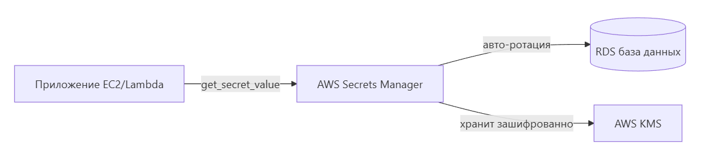

Исходник диаграммы (Mermaid)

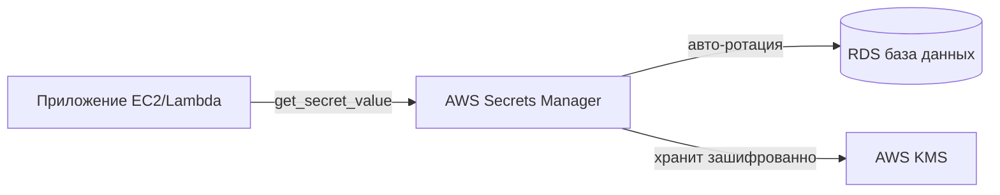
```mermaid
flowchart LR
App2[Приложение EC2/Lambda] -->|"get_secret_value"| SM2[AWS Secrets Manager]
SM2 -->|"авто-ротация"| RDS[(RDS база данных)]
SM2 -->|"хранит зашифрованно"| KMS2[AWS KMS]
```

- **Интеграция с RDS** — Secrets Manager сам меняет пароль базы по расписанию. Вам не нужно вручную генерировать и менять пароли.
- **Шифрование через KMS** — секреты хранятся зашифрованными с помощью AWS KMS.
- **Политики доступа через IAM** — кто может получить секрет, контролируется IAM.
- **API** — GetSecretValue возвращает секрет приложению.

**Когда выбирать Secrets Manager:** вы целиком в AWS, хотите авто-ротацию RDS и минимальную ручную работу.

### Сравнение двух подходов

| **Критерий** | **HashiCorp Vault** | **AWS Secrets Manager** |
| --- | --- | --- |
| Платформа | Агностик (любой облак) | Только AWS |
| Динамические секреты | Да (со сроком жизни) | Ограниченно |
| Авто-ротация | Своя логика | Из коробки для RDS |
| Unseal / самоуправление | Да, сам администрируете | Нет, управляется AWS |
| Цена | Бесплатно, но администрирование | Платный сервис |
| Интеграция с IAM | Свои ACL | Полная |

### Правила безопасного обращения с секретами (чек-лист)

- **Никогда не храните секреты в коде** и не коммитьте в git.
- Используйте специализированные хранилища — Vault или Secrets Manager.
- Применяйте **ротацию** секретов — автоматическую (Secrets Manager) или плановую (Vault).
- Храните секреты **зашифрованными** (мы к этому вернёмся в части про шифрование).
- Ограничивайте доступ IAM-политиками — по принципу минимальных привилегий.
- Ведите **аудит**: кто и когда запрашивал секрет.

**Итог части 3:** секреты — это не отдельные строки в конфиге, а управляемые записи в защищённом хранилище. Vault — гибкий, с динамическими секретами; Secrets Manager — нативный, с авто-ротацией. Главное правило — секрет живёт вне кода, шифруется и ротируется.

## Часть 4. Шифрование: in-transit / at-rest, KMS

Теперь о том, как защитить данные даже в том случае, если к ним кто-то получил доступ. Шифруются данные двумя способами: **в полёте (in-transit)** — при передаче по сети, и **в покое (at-rest)** — на диске.

### Шифрование in-transit (при передаче)

Когда данные летят по сети — между пользователем и сервером, между серверами — они должны быть защищены от перехвата. Тут работают протоколы TLS/SSL и HTTPS.

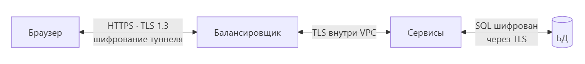

Исходник диаграммы (Mermaid)

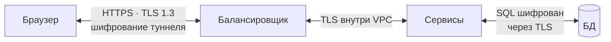
```mermaid
flowchart LR
Browser[Браузер] <-->|"HTTPS · TLS 1.3<br/>шифрование туннеля"| LB[Балансировщик]
LB <-->|"TLS внутри VPC"| APP[Сервисы]
APP <-->|"SQL шифрован<br/>через TLS"| DB[(БД)]
```

- **TLS/SSL** — криптографический протокол шифрования трафика. Вы видите HTTPS в адресной строке — значит, сайт шифрует.
- **Шифрование между сервисами** — внутри облака тоже шифруют: например, WebSocket, gRPC и связи с БД идут по TLS.
- **mTLS** — взаимное шифрование: и клиент, и сервер проверяют сертификаты друг друга.

**Практика:** запретите HTTP, отключите старые небезопасные версии (TLS 1.0/1.1), используйте TLS 1.2/1.3.

### Шифрование at-rest (в покое)

Данные «в покое» — это то, что лежит на дисках: тома виртуальных машин, объекты в S3, базы данных, бэкапы. Даже если физический диск украдут, без ключа данные — просто «шум».

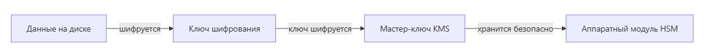

Исходник диаграммы (Mermaid)

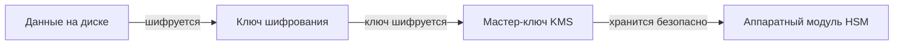
```mermaid
flowchart LR
DISK[Данные на диске] -->|"шифруется"| KEY[Ключ шифрования]
KEY -->|"ключ шифруется"| MASTER[Мастер-ключ KMS]
MASTER -->|"хранится безопасно"| HSM[Аппаратный модуль HSM]
```

**Ключевые понятия:**

- **EBS-тома** — шифруются при создании. Включайте шифрование по умолчанию.
- **S3 (bucket encryption)** — объекты шифруются на стороне S3 с помощью **SSE (Server-Side Encryption)**.
- **RDS** — базы данных и их снапшоты шифруются.

**Классический вопрос «кто держит ключи»:**

| **Подход** | **Кто хранит ключи** | **Когда используют** |
| --- | --- | --- |
| Client-side | Вы (в приложении) | Максимальный контроль |
| Server-side (SSE) | Облако с вашим KMS | Стандарт в облаке |
| Managed (SSE-S3) | Полностью провайдер | Простые кейсы |

### KMS — Key Management Service

Современное шифрование в облаке почти всегда строится вокруг **KMS — сервиса управления ключами** (в AWS — KMS, в Яндекс.Облаке — Key Management Service). KMS использует схему **envelope encryption** (конвертное шифрование), где есть два уровня ключей.

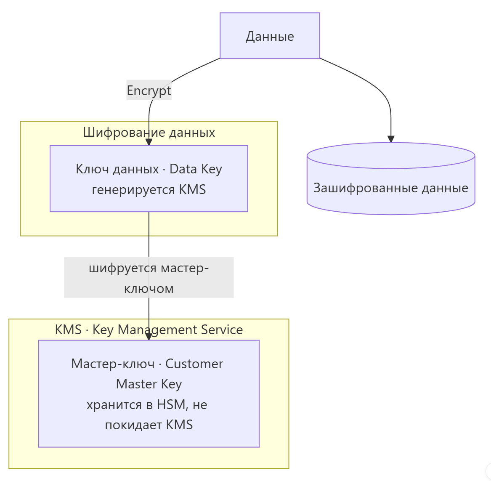

Исходник диаграммы (Mermaid)

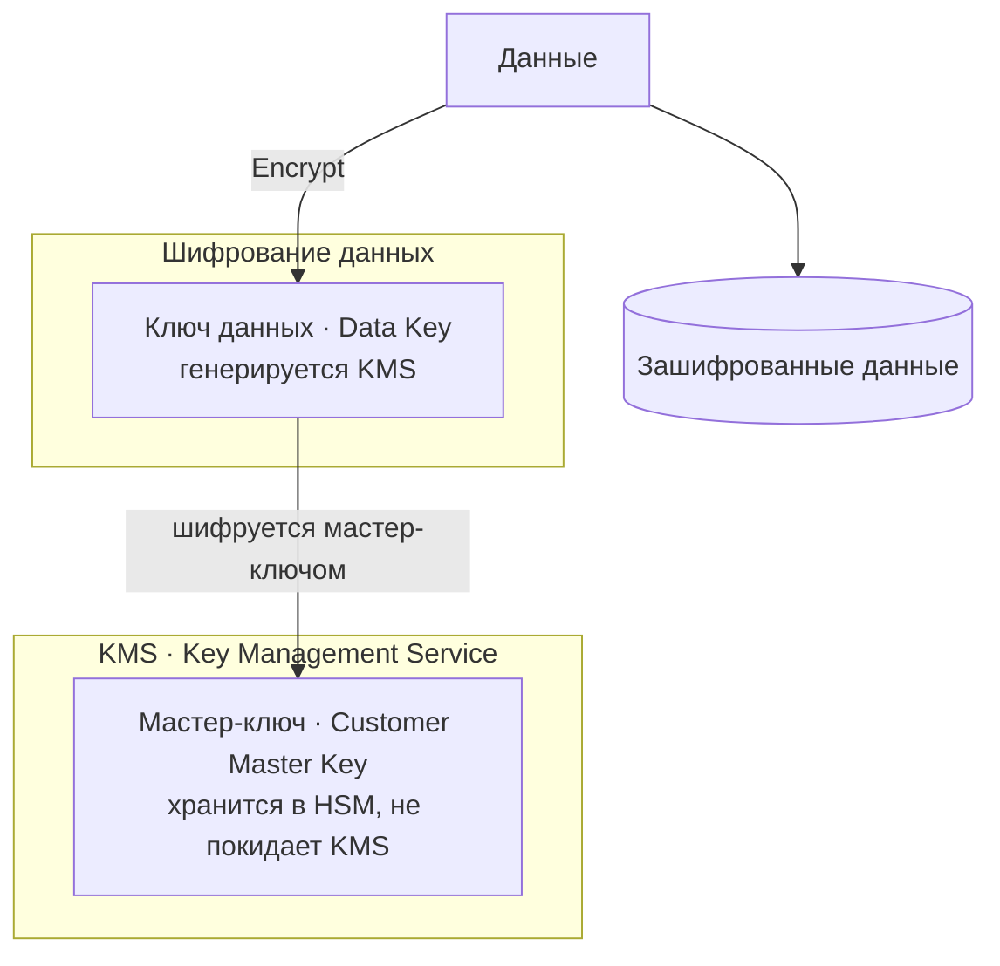
```mermaid
flowchart TB
subgraph KMS [KMS · Key Management Service]
MK[Мастер-ключ · Customer Master Key<br/>хранится в HSM, не покидает KMS]
end
subgraph Apply [Шифрование данных]
DK[Ключ данных · Data Key<br/>генерируется KMS]
end
DATA[Данные] -->|"Encrypt"| DK
DK -->|"шифруется мастер-ключом"| MK
DATA --> ENC[(Зашифрованные данные)]
```

**Как это работает (envelope encryption):**

- Когда нужно зашифровать данные, приложение просит у KMS **Data Key (ключ данных)**.
- KMS возвращает два ключа: открытый Data Key (им шифруют данные) и тот же Data Key, но **зашифрованный мастер-ключом**.
- Открытый Data Key удаляется после использования, а на диске остаются зашифрованные данные + зашифрованный Data Key.
- Когда нужно расшифровать — отправляют зашифрованный Data Key в KMS, тот расшифровывает его мастер-ключом и возвращает открытый Data Key.

**Ключевой момент:** мастер-ключ никогда не покидает KMS и хранится в аппаратном модуле **HSM (Hardware Security Module)** — программно его достать нельзя.

**Операции KMS:**

{

"Operations": [

"GenerateDataKey",

"Encrypt",

"Decrypt",

"ReEncrypt"

]

}

### Памятка по шифрованию

| **Что шифруем** | **Как** | **Сервис** |
| --- | --- | --- |
| Трафик (там летит) | TLS/HTTPS | ALB, Route53, сертификаты |
| Диски VM | EBS encryption | KMS |
| Объекты S3 | SSE-S3 / SSE-KMS | KMS |
| Базы данных | RDS encryption | KMS |
| Бэкапы | шифрование копий | KMS |

### Типичные ошибки в шифровании

- **Не включают шифрование дисков** — считают, что «облако и так защищено».
- **Используют один мастер-ключ на всё** — лучше разделять ключи по окружениям (dev/prod).
- **Отключают старое TLS** — оставляют дыру в шифровании трафика.
- **Хранят ключи в коде** — ключи сами по себе становятся секретами, их надо прятать в Vault/Secrets Manager.

**Итог части 4:** шифруем и в пути (TLS), и в покое (диски, S3, БД). Центральный элемент — KMS с конвертным шифрованием и мастер-ключом в HSM. Ключи никогда не должны покидать управляемый сервис шифрования.

## Часть 5. Security Group, Network ACL, WAF

И последняя большая тема — как фильтровать трафик и защищать сетевой периметр. У нас три уровня защиты: Security Groups, Network ACL и WAF. Они работают на разных уровнях.

### Security Groups (SG) — «лицо» виртуальной машины

**Security Group** — это виртуальный firewall на уровне экземпляра (EC2). Работает на Layer 4 — пропускает или блокирует трафик по портам и протоколам. Ключевые свойства:

- **Stateful (отслеживает состояние)** — если вы разрешили входящий запрос на порт 80, то ответ автоматически пройдёт обратно, его разрешать отдельно не нужно.
- Правила задаются **разрешениями** (allow-only), запретов нет — всё, что не разрешено, блокируется.

# Типичное правило Security Group (словесно)

Правило: Разрешить TCP/443 входящие от 0.0.0.0/0  →  для веб-терминала

Правило: Разрешить TCP/22 входящие от 10.0.1.0/24 → только для админов с внутренней сети

### Network ACL (NACL) — firewall уровня подсети

**Network ACL** — «статический внешний контур» сетевой безопасности. Действует на уровне **подсети** (VPC). В отличие от SG — **stateless (не отслеживает состояние)**: для ответного трафика нужно явно разрешать и входящее, и исходящее правило.

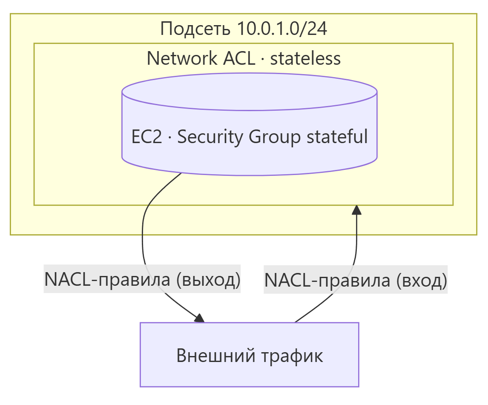

Исходник диаграммы (Mermaid)

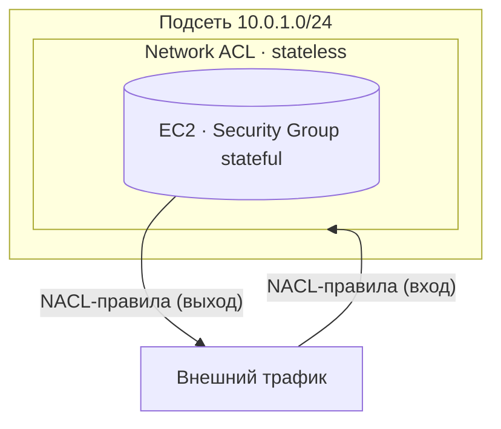
```mermaid
flowchart TB
subgraph Subnet [Подсеть 10.0.1.0/24]
subgraph NACL1 [Network ACL · stateless]
VM1[(EC2 · Security Group stateful)]
end
end
EXT[Внешний трафик] -->|"NACL-правила (вход)"| NACL1
VM1 -->|"NACL-правила (выход)"| EXT
```

**Важно различать:**

| **Свойство** | **Security Group** | **Network ACL** |
| --- | --- | --- |
| Уровень | Экземпляр (VM) | Подсеть |
| Состояние | Stateful | Stateless |
| Правила | Allow only | Allow + Deny |
| Порядок правил | Не важен | Оценивается по номеру (первым — по приоритету) |

### WAF — защита на уровне приложения

**WAF (Web Application Firewall)** — гораздо умнее: работает на Layer 7 (уровень приложения) и фильтрует HTTP-трафик по содержимому. Он защищает приложение от атак, которые невидимы на уровне портов:

- **SQL Injection** — попытки внедрить SQL-код в параметры запроса.
- **XSS (межсайтовый скриптинг)** — внедрение вредоносных скриптов.
- **DDoS на уровне приложения** — большое число «мусорных» запросов.
- **Ботов и скрейперов** — нежелательных переборщиков.

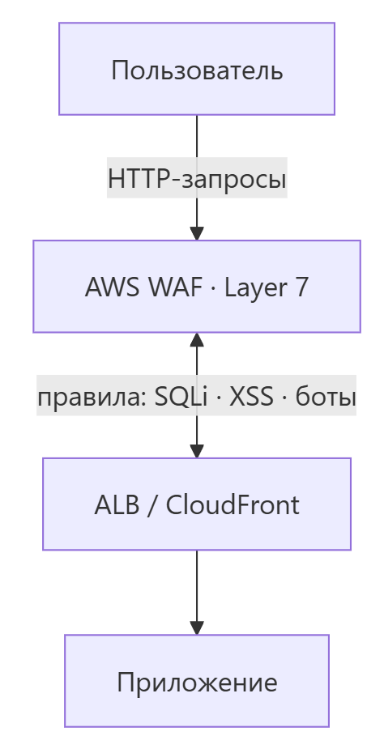

Исходник диаграммы (Mermaid)

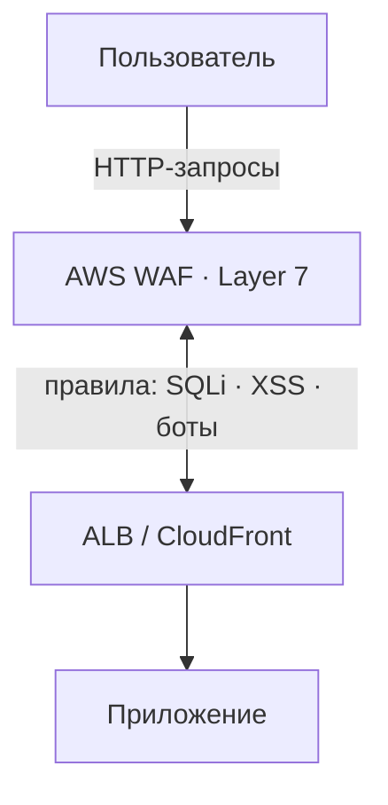
```mermaid
flowchart TB
User[Пользователь] -->|"HTTP-запросы"| WAF[AWS WAF · Layer 7]<-->|"правила: SQLi · XSS · боты"| LB[ALB / CloudFront]
LB --> APP2[Приложение]
```

**Пример WAF-правила:**

{

"Name": "Block-SQL-Injection",

"Statement": {

"ByteMatchStatement": {

"SearchString": "UNION SELECT",

"FieldToMatch": {"UriPath": {}},

"TextTransformations": [{"Priority": 0, "Type": "LOWERCASE"}]

}

},

"Action": {"Block": {}}

}

### Три уровня защиты — как их комбинировать

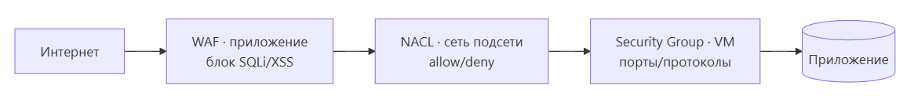

Исходник диаграммы (Mermaid)

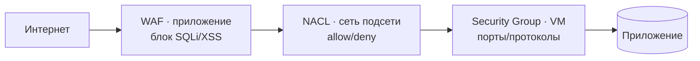
```mermaid
flowchart LR
INTERNET[Интернет] --> WAF2[WAF · приложение<br/>блок SQLi/XSS]
WAF2 --> NACL2[NACL · сеть подсети<br/>allow/deny]
NACL2 --> SG2[Security Group · VM<br/>порты/протоколы]
SG2 --> APP3[(Приложение)]
```

- **WAF** — самый внешний, понимает HTTP, отсекает атаки приложения.
- **NACL** — фильтр на уровне подсети, stateless, для «грубых» запретов.
- **Security Group** — точечный firewall каждой VM, stateful.

### Чек-лист сетевой защиты

- Разделите подсети: публичные (веб) и приватные (БД).
- Security Group для каждой группы серверов по принципу минимального доступа.
- Network ACL как второй рубеж на уровне подсети.
- WAF перед ALB/CloudFront — для защиты приложения.
- Не открывайте порты без необходимости (22 — только по VPN/белому списку).

**Итог части 5:** SG — firewall на уровне VM (stateful, allow-only), NACL — на уровне подсети (stateless, allow+deny), WAF — на уровне приложения (защита от атак приложений). Три уровня, дополняющие друг друга.

## Часть 6. Практика и резюме

### Чек-лист безопасности облачной инфраструктуры

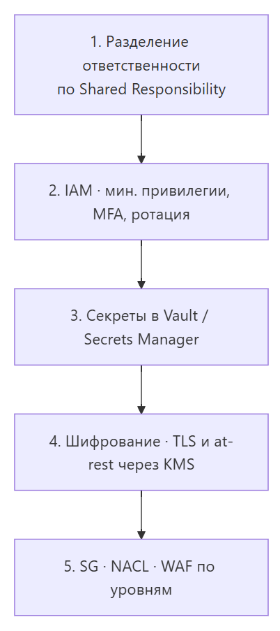

Исходник диаграммы (Mermaid)

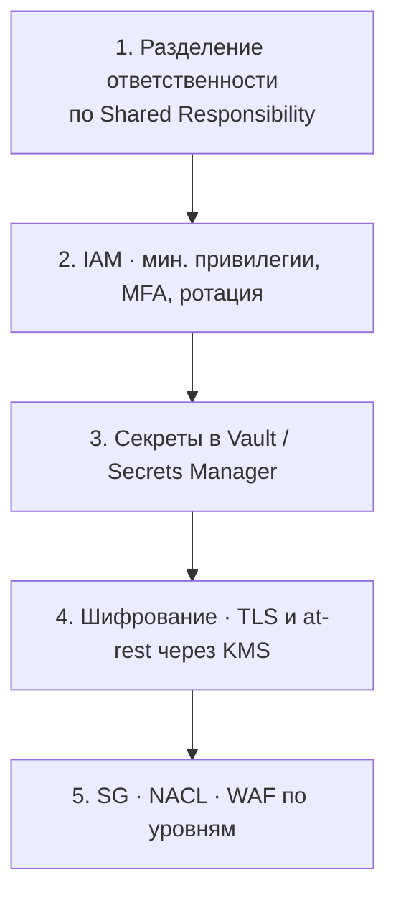
```mermaid
flowchart TD
A[1. Разделение ответственности<br/>по Shared Responsibility] --> B[2. IAM · мин. привилегии, MFA, ротация]
B --> C[3. Секреты в Vault / Secrets Manager]
C --> D[4. Шифрование · TLS и at-rest через KMS]
D --> E[5. SG · NACL · WAF по уровням]
```

- **Shared Responsibility** — поймите, что на клиенте, а что на провайдере.
- **IAM** — минимальные привилегии, сервисные аккаунты, MFA, ротация ключей.
- **Секреты** — в Vault или Secrets Manager, никогда в коде.
- **Шифрование** — TLS для трафика, KMS для данных в покое.
- **Фильтрация** — WAF + NACL + Security Groups по уровням.

### Типичные ошибки (сводная таблица)

| **#** | **Ошибка** | **Последствие** |
| --- | --- | --- |
| 1 | Считать, что облако защищает всё | Утечка данных из-за неправильных настроек клиента |
| 2 | Ключ суперадминистратора на всё | Компрометация одного ключа = потеря всего |
| 3 | Секреты в коде / git | Пароли и токены утекают, их сложно отозвать |
| 4 | Не шифруют диски и S3 | При краже носителя данные читаемы |
| 5 | БД в публичной подсети без SG | БД доступна из интернета |
| 6 | Нет MFA и ротации ключей | Доступ защищён одним паролем навсегда |

### Итоги лекции

Мы прошли весь контур безопасности облака. Ответственность делится по модели **Shared Responsibility**: провайдер защищает облако, клиент — данные внутри него. Управление доступом — это **IAM** с ролями, политиками и сервисными аккаунтами и принципом минимальных привилегий. Секреты живут не в коде, а в **Vault** или **Secrets Manager** — с шифрованием и ротацией. Данные мы шифруем **в пути (TLS)** и **в покое (KMS)**. А периметр фильтруется **WAF, NACL и Security Groups** — на трёх уровнях.

Ключевая мысль сегодня: **безопасность — это не отдельный сервис, а набор практик, распределённых между провайдером и вами**. Чем меньше секретов в открытом виде, чем уже привилегии и чем больше уровней шифрования и фильтрации — тем безопаснее ваша облачная инфраструктура.

## Вопросы для самопроверки (раздать аудитории в конце)

- Опишите модель Shared Responsibility: на ком «безопасность облака», а на ком «безопасность в облаке»? Где проходит граница?
- Что такое политика IAM и в чём суть правила «явного Deny»?
- В чём разница между пользователем IAM и сервисным аккаунтом? Когда используют каждый?
- Почему не стоит хранить секреты в коде? Какие проблемы решают Vault и Secrets Manager?
- Что означает принцип «минимальных привилегий» и как он применяется к сервисным аккаунтам?
- В чём разница между шифрованием in-transit и at-rest? Приведите примеры для каждого.
- Как работает envelope encryption в KMS? Где физически хранится мастер-ключ?
- Чем Security Group отличается от Network ACL? (stateful vs stateless)
- Что такое WAF и от каких атак приложения он защищает?
- Составьте порядок прохождения трафика через WAF → NACL → SG.
