# Lecture 9 — Cost management (FinOps)

> 👥 **Lecture by the co-instructor.** Below is the author's original lecture text, in Russian and unchanged.
>
> Inside the text the author uses their own numbering — this is their lecture No. 4. For the number mapping and the overall plan see the [course README](../README.md). Submission and report rules differ between the two halves of the course: see [Course rules](../COURSE-RULES.md).

**Lab:** [Lab 9 — Cloud cost management (FinOps): pricing, cost allocation, optimization](lab.md)

---

## Вступление
Здравствуйте, коллеги. Это четвёртая лекция курса «Организация и управление облачной инфраструктурой». Мы уже построили сеть (лекция №1), разобрались с хранилищами данных (лекция №2), обеспечили безопасность (лекция №3) — а сегодня разберём то, о чём любят забывать инженеры, но что чаще всего «валит» бюджеты стартапов и корпораций: **управление затратами в облаке**, или **FinOps**.

Важный тезис сразу: облако — это не «скидка». On-Demand цены в 5–10 раз выше Reserved. Неправильно проставленный тег — это «чёрная дыра» в отчёте. Забытая на ночь тестовая ВМ — это как минимум лишняя тысяча рублей в конце месяца. Если не управлять затратами, они растут экспоненциально вместе с инфраструктурой.

Мы пройдём четыре больших блока:

- **Модели ценообразования** — On-Demand, Reserved, Spot.
- **Cost allocation (распределение затрат)** — теги, проекты, центры затрат.
- **Инструменты** — AWS Cost Explorer, Azure Cost Management, Yandex Billing.
- **Оптимизация** — rightsizing, auto-scaling, S3 Intelligent-Tiering.

Такая логическая карта лекции:

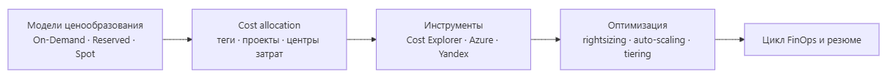

Исходник диаграммы (Mermaid)

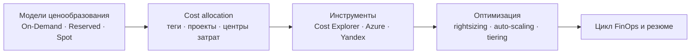

Начнём с главного вопроса: **почему вообще стоимость в облаке — это проблема?**

## Часть 1. Модели ценообразования
### Почему облако дорого само по себе

В классическом on-premise вы купили сервер один раз и забыли про него на 3–5 лет. В облаке вы платите **каждый час за каждую виртуальную машину**, даже если она простаивает. Цена складывается из множества компонентов: CPU, RAM, диск, сетевой трафик, IP-адреса, лицензии, сервисы.

Суть тезиса: **в облаке вы платите за время и за простаивающий ресурс одинаково.** Если ВМ не генерирует ценность — она всё равно генерирует расход. Именно поэтому нужны модели ценообразования, которые позволяют снизить ставку за тот же ресурс.

### On-Demand (по требованию)

**On-Demand** — это базовый режим «плати за то, что используешь, прямо сейчас». Никаких обязательств, никаких контрактов. Запустили ВМ — платите по часам, остановили — не платите.

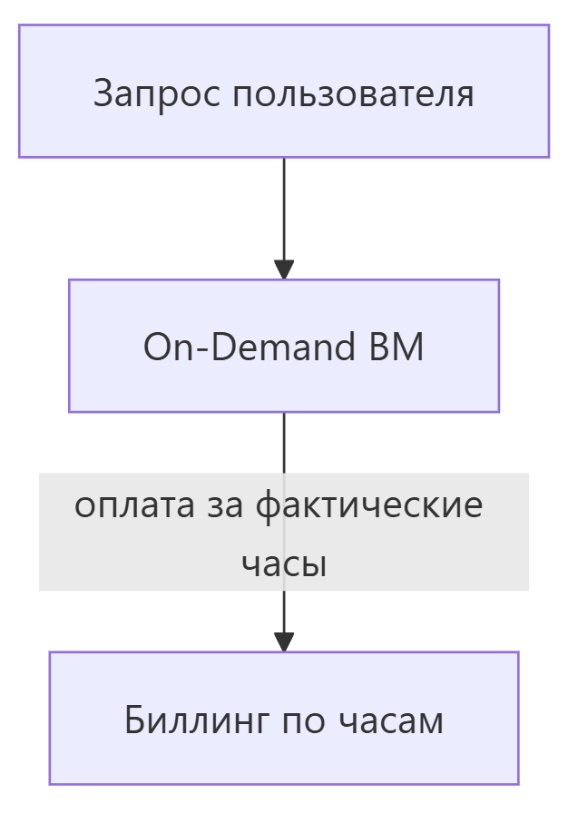

Исходник диаграммы (Mermaid)

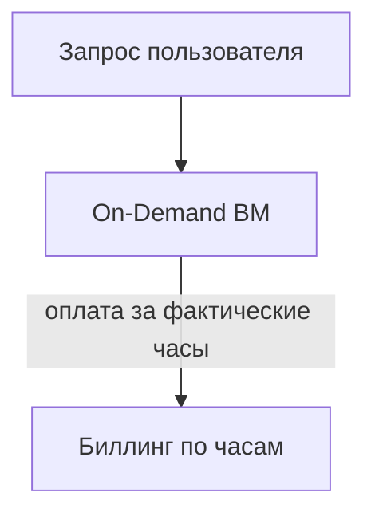

- **Цена:** максимальная — это тариф «по умолчанию».
- **Гибкость:** 100% — можно менять размер, останавливать, удалять в любой момент.
- **Риск:** нет — вы ничем не связаны.
- **Когда использовать:** пики, низкая предсказуемость нагрузки, тестовые среды, Proof-of-Concept, короткие задачи.

Вопрос аудитории: когда On-Demand — это плохой выбор? (пауза) Правильно: когда нагрузка стабильная 24/7 — вы переплачиваете в разы.

### Reserved (резервирование)

**Reserved instances (RI)** — это предоплата за гарантированную ёмкость. Вы «бронируете» ресурс заранее на срок 1 или 3 года и получаете **скидку от 40 до 72%** по сравнению с On-Demand.

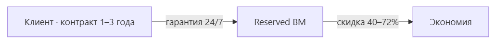

Исходник диаграммы (Mermaid)

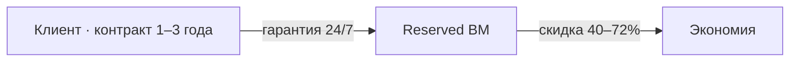

- **Цена:** ниже On-Demand на 40–72% (больше всего — при полной предоплате на 3 года).
- **Гарантия:** ёмкость резервируется, она не уйдёт «конкуренту» в пик.
- **Риск:** вы платите за зарезервированное даже если не используете — недоиспользование = переплата.
- **Когда использовать:** стабильная базовая нагрузка, постоянно работающие сервисы (БД, веб-ядра), прогнозируемый рост.

Важная деталь: RI бывают **standard** (жёсткая гарантия) и **convertible** (можно менять тип, но скидка чуть меньше). Выбирать нужно под тип нагрузки.

### Spot / Preemptible (прерываемые)

**Spot instances** (AWS) или **preemptible** (Azure, Яндекс.Облако) — это аренда **неиспользуемых остаточных мощностей** провайдера. Скидка достигает **60–90%**, но провайдер имеет право **прервать инстанс в любой момент** (обычно за 2 минуты предупреждения).

Исходник диаграммы (Mermaid)

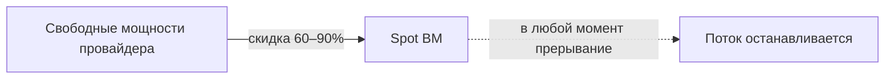

- **Цена:** минимальная.
- **Гарантия:** нет — инстанс может быть убит в любой момент.
- **Когда использовать:** пакетные (batch) задачи, тесты, render-фермы, обработка больших данных, эластичные stateless-нагрузки.
- **НЕ использовать:** критичные постоянные сервисы, базы данных, приложения без перезапуска.

### Сравнение и стратегия

| **Модель** | **Цена** | **Гибкость** | **Риск** | **Когда применять** |
| --- | --- | --- | --- | --- |
| **On-Demand** | высокая (базовая) | 100% | нет | пики, тесты, короткие задачи |
| **Reserved** | −40…−72% | низкая | переплата при простое | стабильная база 24/7 |
| **Spot** | −60…−90% | средняя | прерывание | batch, тесты, stateless |

Ключевая стратегия практика: **база — Reserved, пики и эластичность — On-Demand и Spot.** Смешивая модели, вы снижаете среднюю ставку за час при сохранении гибкости.

## Часть 2. Cost Allocation — распределение затрат
### Зачем распределять затраты

Модель ценообразования экономит «ставку за час». Но есть вторая половина проблемы: **непонятно, кто сколько потратил.** Без распределения затрат ежемесячный счёт — это «чёрный ящик», и винить в нём некого.

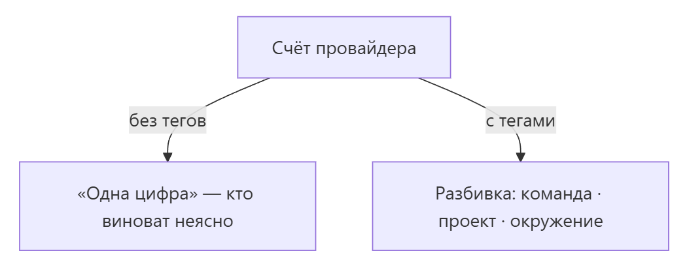

Исходник диаграммы (Mermaid)

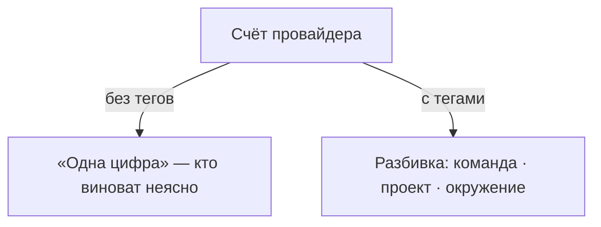

Зачем нужно распределение:

- знать, **какая команда и какой сервис** сколько тратят;
- **мотивировать владельцев** сервисов следить за своими расходами;
- обосновывать **бюджеты и внутренние списания** (chargeback);
- связывать **IT-затраты с бизнес-ценностью**.

Без распределения оптимизация невозможна: вы не знаете, где искать.

### Теги (Tags / Labels)

**Тег** — это метка вида ключ = значение, которую вешают на ресурс: env=prod, team=analytics, project=shop, cost_center=marketing.

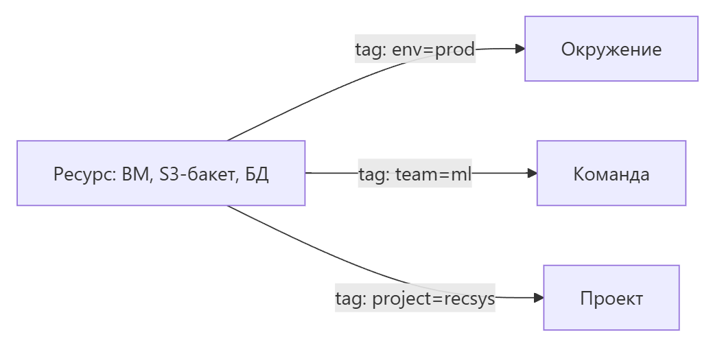

Исходник диаграммы (Mermaid)

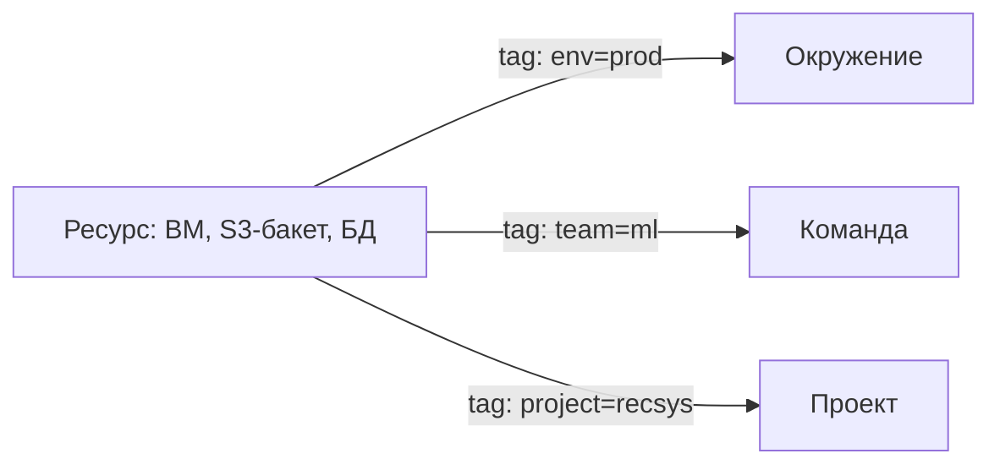

Правила дисциплины тегов:

- вводить **обязательные теги** для каждого ресурса при создании;
- автоматически **наследовать** теги (балансировщик → ВМ → диск);
- указывать теги в IaC (помним лекцию №2) — тогда они не потеряются;
- тег — основа фильтров в любом Cost-инструменте.

Пример обязательного набора: env, project, team, cost_center. Если ресурс без тега — его расходы попадают в «неизвестное», а это прямая дыра в отчёте.

### Проекты и центры затрат

- **Проект** — логическая группировка ресурсов под одну задачу (например, «интернет-магазин», «рекомендательная система»).
- **Центр затрат (cost center)** — организационная единица учёта (отдел, продуктовая команда, бизнес-юнит).

Логика иерархии: **ресурс → проект → центр затрат → отдел/бизнес-юнит**. Именно по такой схеме строятся отчёты в биллинге и выставляются внутренние счета.

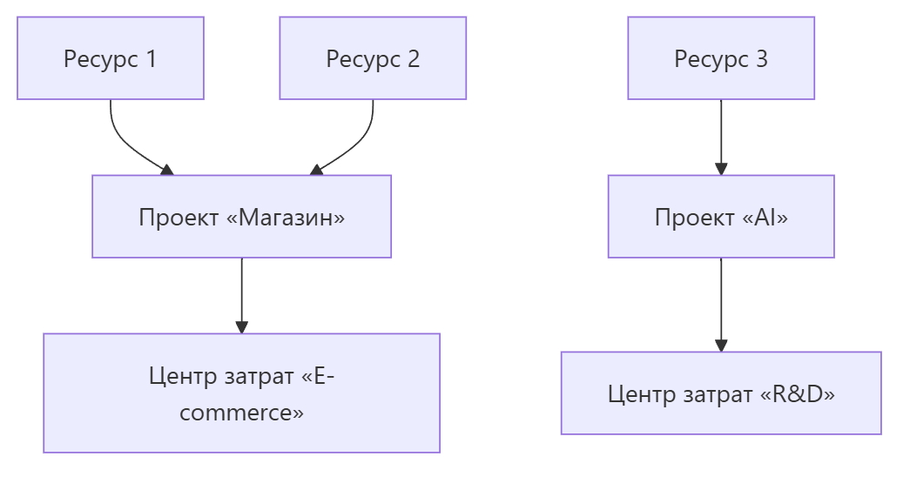

Исходник диаграммы (Mermaid)

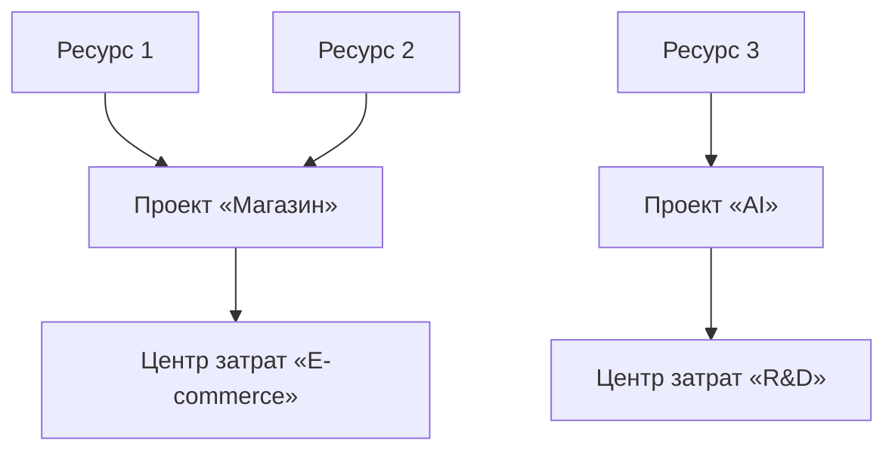

На уровне проектов удобно задавать **бюджеты и лимиты** — превысил лимит, получил алерт или автоблокировку.

## Часть 3. Инструменты мониторинга затрат
Теперь посмотрим, чем пользоваться на практике. Три главных инструмента — по одному на каждый большой провайдер.

### AWS Cost Explorer

**AWS Cost Explorer** — встроенная панель AWS для анализа и прогноза затрат.

- Отчёты **по времени, сервисам и тегам** (тут и пригождаются теги из части 2).
- **Прогноз будущих расходов** на основе истории.
- Построение **дашбордов и отчётов**.
- **Рекомендации по оптимизации** (rightsizing, переход на Reserved).
- Экспорт сырых данных в S3 через **Cost & Usage Report**.

Важно: Cost Explorer бесплатен как базовый инструмент, но показывает **прогноз** только по накопленным данным — сразу после старта он малоинформативен.

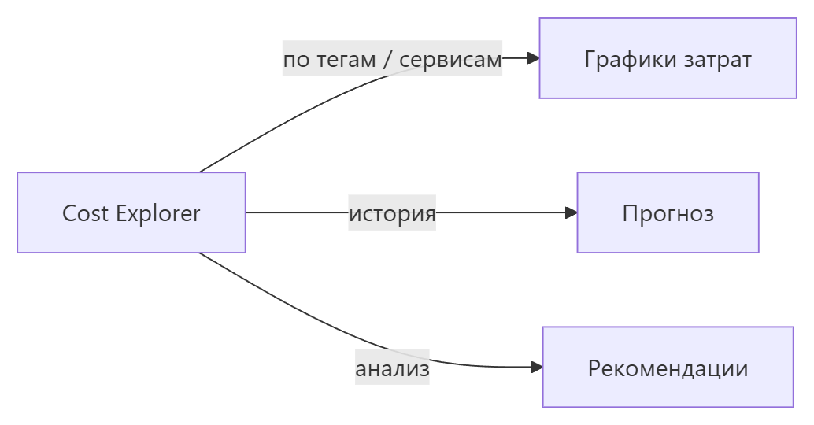

Исходник диаграммы (Mermaid)

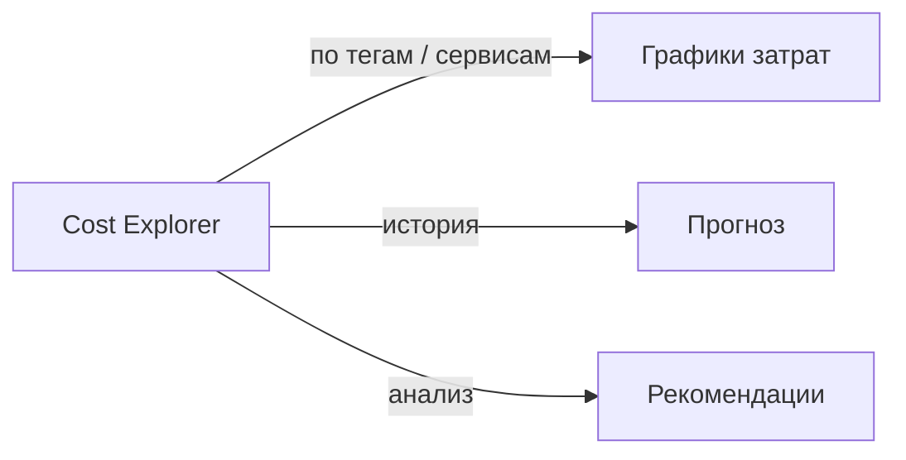

### Azure Cost Management

**Azure Cost Management** — аналог внутри Azure Portal.

- **Полная картина затрат** по подпискам, группам ресурсов, тегам.
- **Бюджеты и алерты** на порог расхода.
- Сравнение **факта с планом** (budget vs actual).
- **Рекомендации** по правам на инстансы и по резервированию.
- Интеграция с **Power BI** для продвинутой аналитики.

Отличительная черта Azure — очень гибкая система бюджетирования и алертов прямо в портале, без подключения внешних инструментов.

### Yandex Billing

**Yandex Billing** — инструмент для Yandex Cloud (и похожие в VK Cloud и других РФ-провайдерах).

- **Лицевой счёт** и агрегация всех затрат.
- Разбивка **по сервисам и проектам**.
- **Бюджеты, алерты, уведомления** на почту/телеграм.
- Выгрузка **отчётов и закрывающих документов** (акты, счета).
- **REST API** для автоматизации учёта.

Особенность РФ: важно учитывать не только цену в валюте, но и **документооборот и бухгалтерию** — Yandex Billing это закрывает.

### Сводное сравнение

| **Инструмент** | **Провайдер** | **Сильные стороны** |
| --- | --- | --- |
| **AWS Cost Explorer** | AWS | глубокий анализ, прогноз, C&UR-отчёт |
| **Azure Cost Management** | Azure | бюджеты, алерты, Power BI |
| **Yandex Billing** | Yandex / РФ | документооборот, API, проекты |

Главный принцип: **инструмент подбирается под провайдера.** Кросс-облачные сценарии решают внешними платформами (CloudHealth, Apptio), но это тема отдельной лекции. Независимо от инструмента, фундамент один — **единый каталог тегов и проектов** из части 2.

## Часть 4. Оптимизация затрат
Мы научились видеть затраты. Теперь — как их **снижать**. Три ключевых приёма.

### Rightsizing — подбор правильного размера

**Rightsizing** — подбор оптимального размера ВМ под реальную нагрузку, вместо «возьму повкуснее на всякий случай».

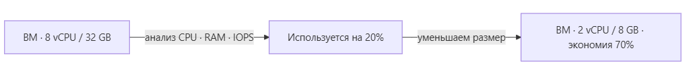

Исходник диаграммы (Mermaid)

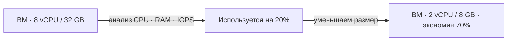

Правило: **никогда не увеличивай размер вслепую — сначала измерь.** Практик берёт метрики за 2–4 недели (CPU, RAM, IOPS, сеть) и выбирает размер, который закрывает реальный профиль. Типичный результат — экономия 20–40% без потери производительности. При этом удаляются и «забытые» инстансы, которые простаивают впустую.

### Auto-scaling — автоматическое масштабирование

**Auto-scaling** — автоматическое изменение числа инстансов под текущую нагрузку: больше запросов — больше ВМ, меньше — меньше.

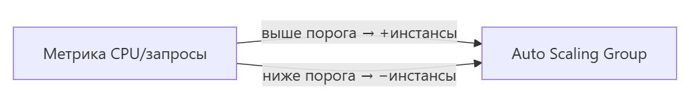

Исходник диаграммы (Mermaid)

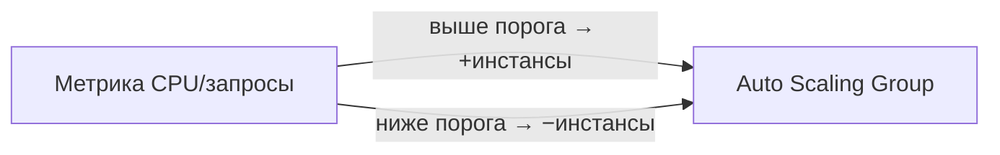

Что это даёт:

- покрывает **пики** без ручного вмешательства;
- **отключает избыток** в часы низкой активности (ночь, выходные);
- снижает стоимость при нестабильной нагрузке — не платите за простаивающие ВМ.

Оптимально комбинируется со Spot: основная «волна» — на дешёвых Spot, она и масштабируется.

### S3 Intelligent-Tiering

**S3 Intelligent-Tiering** — автоматический переход объектов между классами хранения по частоте доступа.

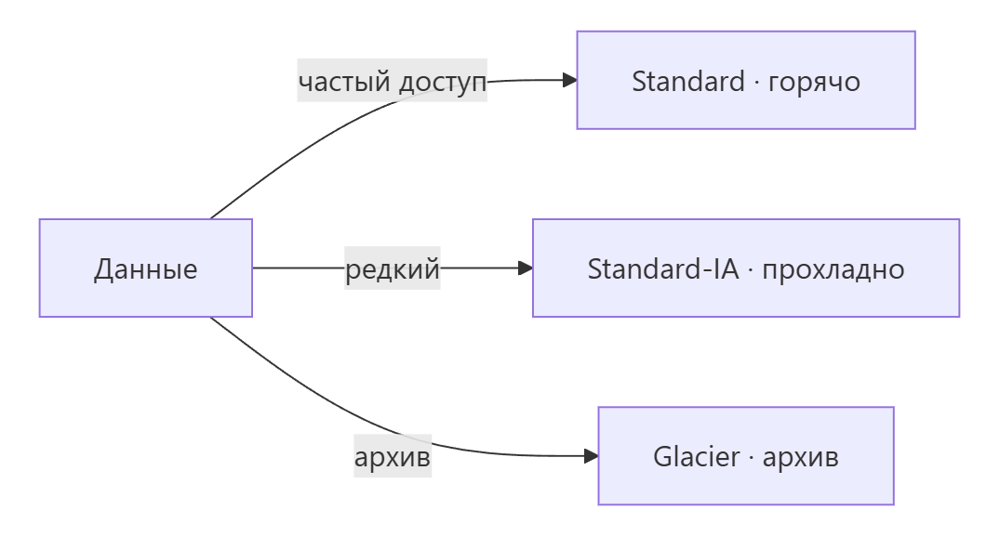

Исходник диаграммы (Mermaid)

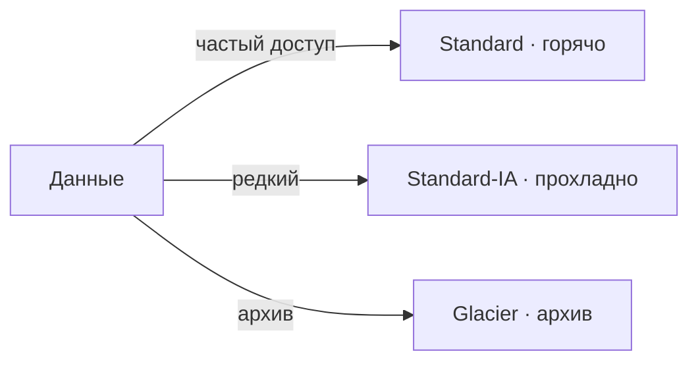

Суть: система мониторит обращения к объектам и сама перемещает их: редко используемые — в более дешёвый класс, часто используемые — возвращает в горячий. **Никакого ручного управления жизненным циклом** — всё автоматически. Экономия заметна при переменчивом доступе к большим объёмам данных. Аналог в Azure — hot/cool/cold tiers, в Yandex Cloud — cold storage.

Дополнительные приёмы: cold storage для архивов, сжатие и дедупликация, отключение «забытых» ресурсов, балансировка между моделями цены из части 1.

## Итоговый цикл FinOps и резюме
Теперь соберём всё в единый процесс. FinOps — это не разовая экономия, а непрерывный цикл из трёх фаз:

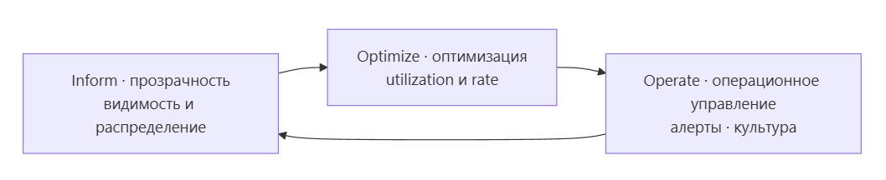

Исходник диаграммы (Mermaid)

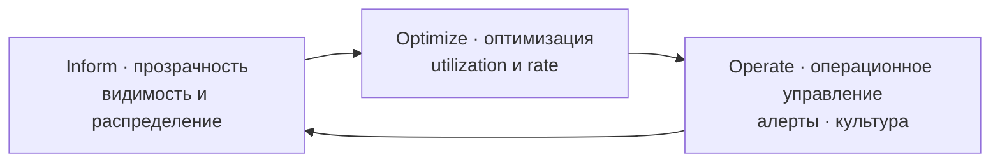

- **Inform** — прозрачность: видим, распределяем, классифицируем затраты (инструменты из части 3, теги из части 2).
- **Optimize** — оптимизация: улучшаем и **утилизацию** (rightsizing, auto-scaling), и **ставку** (Reserved, Spot).
- **Operate** — операционное управление: алерты, бюджеты, вовлекаем команды, закрепляем культуру.

Цикл повторяется постоянно. И главный вывод лекции: **FinOps — это культура и процессы, а не просто «нажать кнопку экономии».**

Ключевые тезисы на память:

- Комбинируйте **On-Demand / Reserved / Spot** под тип нагрузки.
- **Всегда распределяйте** затраты по тегам и проектам — иначе вы слепы.
- Используйте **инструменты провайдера** (Cost Explorer, Azure, Yandex).
- Проводите **rightsizing и auto-scaling** — не платите за воздух.
- Интеллектуальные хранилища (**Intelligent-Tiering**) сами двигают данные в дешёвые классы.

## Вопросы для самопроверки (раздать аудитории в конце)

- В чём разница между On-Demand, Reserved и Spot? Какую модель выберете для круглосуточной базы данных и почему?
- Как работает принцип «база — Reserved, пики — Spot»? Приведите пример нагрузки.
- Зачем нужны теги и проекты в Cost allocation? Что будет с отчётом без обязательных тегов?
- Какой инструмент подойдёт для AWS, для Azure, для Yandex Cloud? Назовите ключевую особенность каждого.
- Что такое rightsizing и какое главное правило при подборе размера ВМ?
- Как auto-scaling помогает экономить на нестабильной нагрузке?
- Что делает S3 Intelligent-Tiering и почему этим не нужно управлять вручную?
- Назовите три фазы цикла FinOps и коротко опишите, что происходит в каждой.
- В чём опасность «забытой» тестовой ВМ, оставленной на ночь в режиме On-Demand?
- Почему распределение затрат — обязательное условие любой оптимизации, а не «приятная опция»?
